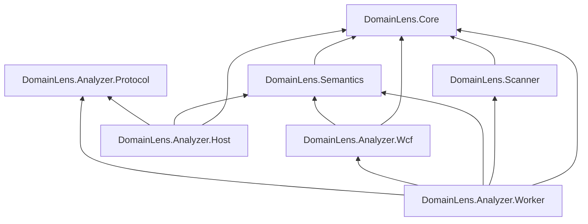

# Milestone 2 Classic WCF Discovery

## Purpose and acceptance status

This document is the implementation acceptance contract for Milestone 2. It defines a concrete,
bounded deterministic analyzer for classic WCF artifacts in captured legacy C#/.NET Framework
repositories.

Milestone 2 extends the canonical Evidence Graph. It does not perform business interpretation,
Reverse DDD reasoning, or any Milestone 3 relationship, persistence, or behavioral analysis.

> **Code establishes evidence. AI interprets evidence. The agent orchestrates the process.**

The accepted progression for this milestone is:

```text
Captured repository snapshot
        |
        +-- Milestone 1 structural Evidence Graph
        |
        +-- Milestone 0 controlled compiler foundation
        |
        v
Classic WCF analyzer
        |
        v
Normalized WCF observations
        |
        v
Validated canonical Evidence Graph
```

The rules below describe support only after their implementation, fixtures, provenance checks,
security regressions, graph validation, and determinism tests pass. A treatment marked
**V1 Supported** remains limited to the explicitly recognized forms in this contract; it never
means that every possible WCF, C#, configuration, hosting, framework, or deployment form is
understood.

## Scope

Milestone 2 establishes deterministic implementation evidence for:

- classic WCF contract, operation, fault, data-contract, and message-contract declarations;
- source classes and methods that compiler evidence relates to service contracts and operations;
- inert `.svc` `ServiceHost` directives;
- an allowlisted, inert `system.serviceModel` configuration subset;
- declarative relationships among configured services, endpoints, bindings, behaviors, and source
  declarations where the bounded rules can resolve them;
- direct, statically recognizable `ServiceHost`, `ChannelFactory<T>`, and `ClientBase<T>` source
  patterns; and
- explicit unresolved, ambiguous, partial, unsupported, malformed, and unavailable cases.

The analyzer answers implementation questions such as which source type declares a service
contract, which method declares an operation, which fault is declared, which source class appears
to implement the contract, and which captured configuration declaration names an endpoint or
binding. It does not establish effective deployed runtime behavior.

## Coverage vocabulary

Milestone 2 uses the treatment vocabulary from
[V1 Analysis Coverage](design/01-v1-analysis-coverage.md) without redefining it:

| Treatment | Milestone 2 meaning |
|---|---|
| **V1 Supported** | Deterministic extraction is required for every explicitly recognized form listed here. Unrecognized variants still reduce coverage. |
| **V1 Partial** | A bounded subset is required. Unhandled forms remain visible as partial, ambiguous, unresolved, or unsupported rather than being guessed. |
| **V1 Metadata/Detection Only** | The analyzer may record inert literal metadata or the presence of a construct but does not interpret its runtime semantics. |
| **Deferred** | Artifact-specific semantic analysis is outside Product V1; generic manifest inventory may still exist. |
| **Open Decision** | Milestone 2 does not authorize semantic coverage. The artifact must not be silently treated as analyzed when its presence creates a known limitation. |

These treatments describe deterministic extraction coverage, not semantic Support, Confidence,
Completeness, or business meaning. `Exact`, `Partial`, `Ambiguous`, and `Unresolved` are local
`ResolutionQuality` values and are defined separately below.

## Architecture and dependency direction

The concrete analyzer is implemented in the dedicated `DomainLens.Analyzer.Wcf` project with the
corresponding `DomainLens.Analyzer.Wcf.Tests` project.



`DomainLens.Analyzer.Wcf` may consume the language-neutral Evidence Graph contracts and a bounded
compiler-inspection abstraction owned by `DomainLens.Semantics`. It must not depend on
`DomainLens.Analyzer.Host`, UI, persistence, model, or reasoning components. Roslyn
`Compilation`, `SemanticModel`, `ISymbol`, and syntax objects remain in-process worker details and
must not cross the analyzer process protocol.

The worker performs the ordered composition:

1. scan the captured repository and create the Milestone 1 graph;
2. create the controlled semantic context from manifest-verified C# sources and the trusted
   reference profile;
3. run the Classic WCF analyzer against captured, manifest-bound source and configuration bytes;
4. compose WCF evidence without replacing structural evidence;
5. canonicalize and run `AnalysisGraphValidator`; and
6. emit the final graph through the existing worker result envelope.

The trusted Host validates output; it does not parse or analyze repository WCF content. A process
protocol version change is not required when the existing graph/result wire shape is unchanged.
If the wire shape changes, it must be versioned explicitly rather than accepted leniently.

This milestone implements only the concrete composition needed for WCF. It does not close the
open generalized analyzer packaging, registration, plug-in loading, contribution-contract,
kind-registry, merge-precedence, or compatibility decisions in the architecture baseline.

## Milestone 0 semantic and framework-profile boundary

Milestone 2 reuses the Milestone 0 controlled-compilation mechanism. The only trusted semantic
profile established by the approved baseline is:

`microsoft.netframework.referenceassemblies.net472/1.0.3`

The deployed catalog is tool-owned, content-committed, and validated. Repository packages,
assemblies, analyzers, generators, targets, tasks, and build outputs are never compiler inputs.

The compilation still contains every manifest-listed C# source in one flattened synthetic
`CSharpCompilation`. It does not reproduce effective project membership, project references,
target configuration, conditional items, preprocessor symbols, generated output, or repository
package types. Consequently:

- the identity of an allowlisted framework symbol resolved against the exact trusted catalog may
  be `Exact` within that catalog;
- a relationship between repository source symbols produced by the flattened compilation is
  `Partial`, even when Roslyn returns one candidate;
- an observation from a source that cannot be uniquely associated with a net472-compatible
  project remains `Partial` and produces a framework-profile diagnostic where applicable;
- a source declared only for another or unknown framework profile is not silently treated as
  semantically equivalent to net472; and
- missing or unsupported symbols remain explicit diagnostics or unresolved observations. They do
  not trigger restore, build, repository-binary loading, or reference acquisition.

The implemented compatibility check runs for each project-specific source node or programmatic
site retained as supported WCF semantic evidence, including contracts, data/message contracts,
implementations, `ClientBase<T>` declarations, `ServiceHost` sites, and `ChannelFactory<T>` sites.
It accepts exactly one selected-project target value equal to `net472` or `v4.7.2` (ordinal
case-insensitive). Multi-target, conditional, property-expanded, absent, or other framework
declarations produce `DL4001`. Extraction still uses the pinned net472 synthetic compilation: the
diagnostic prevents that result from being presented as proof of compatibility with the declared
framework, and makes the graph `PartialSuccess`; it does not acquire another reference profile.
Sources not correlated to a selected project cannot establish profile compatibility. A flattened
symbol that maps to multiple project-specific structural nodes is handled separately as
structural ambiguity;
a WCF-attributed declaration receives `DL4002`, while an unattributed source class remains a
candidate for later implementation, `.svc`, or configuration correlation. Retained candidates
tied to projects are checked against their own project profiles; the analyzer does not choose
one project merely to assign a profile. Additional framework profiles remain an **Open Decision**
unless separately added with tool-owned packaging, a version/content commitment, validation,
fixtures, resolution rules, and coverage diagnostics.

## Static attribute-value grammar

Milestone 2 does not execute attribute constructors or evaluate repository expressions at runtime.
It consumes Roslyn `AttributeData`, so an allowlisted property is captured when the controlled
compiler establishes the required typed constant: a string, Boolean or numeric value used by the
implemented property, or a type-valued constant such as `typeof(T)`. This includes compiler-folded
constant expressions such as string concatenation and references to `const` fields; they must not
be rejected merely because their source syntax is not a single literal token. The current rules do
not expose a general-purpose expression evaluator or a general enum/property catalog.

If Roslyn reports an error-valued constructor or named argument, the recognized framework
attribute remains recognized, the unavailable value is omitted, and `DL4003` is emitted. Method
calls, runtime property reads, reflection, environment values, configuration substitution, and
other values the compiler cannot establish as legal attribute constants are never executed or
guessed. Attribute suffix omission, explicit `Attribute` suffix, fully qualified names, global
qualification, and C# using aliases are supported through semantic type identity.

A repository-defined look-alike attribute is not WCF evidence, including one named
`ServiceContractAttribute` or `OperationContractAttribute`. When syntax resembles a WCF attribute
but framework identity is missing or ambiguous, the analyzer emits the applicable diagnostic and
does not upgrade the declaration to an exact WCF construct.

## Source-construct coverage

| Construct | Treatment | Required Milestone 2 evidence | Explicit boundary |
|---|---|---|---|
| `System.ServiceModel.ServiceContractAttribute` | **V1 Supported** | Existing source class or interface enriched as a service contract; CLR identity; compiler-established string constants for `Name`, `Namespace`, and `ConfigurationName`; type-valued `CallbackContract`. | The declaration is WCF implementation evidence, not a business capability, Domain Service, domain, subdomain, or bounded context. |
| `System.ServiceModel.OperationContractAttribute` | **V1 Supported** | Existing method enriched as an operation when it belongs to a uniquely selected service-contract or statically referenced callback-contract surface; containing surface; declared/configured operation name; parameters; return type; compiler-established values for `Action`, `ReplyAction`, `IsOneWay`, `AsyncPattern`, `IsInitiating`, and `IsTerminating`; declared/inherited relationship. | An operation is not automatically a command or use case. Runtime invocation is not established. |
| `System.ServiceModel.FaultContractAttribute` | **V1 Supported** | For a promoted WCF operation, operation-to-declared-detail-type relationship; compiler-established `Name`, `Namespace`, and `Action`; provenance and resolution. Multiple declarations on one operation are retained. | A declared fault does not prove that the fault is thrown on any or every runtime path and does not enumerate undeclared exceptions. |
| `System.Runtime.Serialization.DataContractAttribute` | **V1 Supported** | Existing source class, struct, or enum enriched with compiler-established `Name`, `Namespace`, and `IsReference`. | A data contract is not an Entity, Value Object, Aggregate, or ownership conclusion. Known types, surrogates, callbacks, and runtime serializer substitutions are not inferred. |
| `System.Runtime.Serialization.DataMemberAttribute` | **V1 Supported** | Existing field or property enriched as a member of a recognized data contract with compiler-established `Name`, `Order`, `IsRequired`, and `EmitDefaultValue`. | Runtime version compatibility and serializer behavior beyond declarations are not inferred. |
| `System.ServiceModel.MessageContractAttribute` | **V1 Supported** | Existing source class or struct enriched with compiler-established `IsWrapped`, `WrapperName`, and `WrapperNamespace`; operation-usage relationships where resolvable. | Custom formatters, inspectors, serializers, and runtime message mutation are outside the claim. |
| `System.ServiceModel.MessageHeaderAttribute` | **V1 Supported** | Existing field or property enriched as a header with compiler-established `Name`, `Namespace`, `Actor`, `MustUnderstand`, and `Relay`. | Header transport or security semantics are not inferred from declaration alone. |
| `System.ServiceModel.MessageBodyMemberAttribute` | **V1 Supported** | Existing field or property enriched as a body member with compiler-established `Name`, `Namespace`, and `Order`. | Runtime body serialization remains outside the declaration claim. |
| Callback-contract operation surface | **V1 Partial** | A uniquely selected source type referenced through `ServiceContractAttribute.CallbackContract` participates in operation and fault discovery even when the callback type does not itself declare `ServiceContract`. The callback relationship and contract-operation edges retain semantic provenance. | Callback participation does not add a service-contract marker to an otherwise unattributed callback type, and unavailable/ambiguous callback types are not guessed. |
| Service-contract inheritance | **V1 Partial** | Base/derived contract and inherited-operation relationships when compiler symbols are uniquely available. | Flattened source compilation and unavailable external interfaces prevent project-faithful exactness. |
| Service implementation | **V1 Partial** | Source class-to-contract relationship using compiler interface information, including inherited interfaces; operation-to-implementation method relationship through compiler interface-member implementation APIs, including explicit implementation where uniquely projectable. Shared implementation declarations emit one class-to-contract edge per project-specific candidate rather than being dropped. | Unique source-to-source semantic relationships remain `Partial`. When both implementation and contract have multiple project-specific nodes, each implementation edge has `ToNodeId = null`, retains the contract CLR identity in `UnresolvedTarget`, and is `Ambiguous`; implementation-method projection remains unavailable. Runtime activation, dependency injection, proxying, and external implementations are not established. |
| Operation parameter/return contract use | **V1 Partial** | Operation-to-source data/message-contract relationships for supported parameter and return types; signature text retained when the target is external or unavailable. | General data flow, runtime serialization, polymorphic known types, and externally generated types remain unavailable. |
| Checked-in proxy derives from `ClientBase<T>` | **V1 Partial** | Existing source class enriched as a WCF client/proxy and related to its client contract. If one physical declaration maps to multiple project-specific nodes, every candidate for that declaration is enriched with `Ambiguous` declaration evidence; an independent declaration with the same CLR identity is not enriched unless its own base syntax establishes `ClientBase<T>`. Client-contract edges retain resolved, ambiguous, or unresolved targets conservatively. General contract-operation implementation edges are emitted only when independently established through the normal compiler interface-implementation rule. | Constructor data flow, wrappers, unavailable base classes, implementation-method projection across ambiguous project nodes, and runtime endpoint selection remain unresolved. |
| Compiler-generated label | **V1 Metadata/Detection Only** | A checked-in `ClientBase<T>` source type may be labeled generated only when trusted semantic identity establishes `GeneratedCodeAttribute` or `CompilerGeneratedAttribute`. | Comments, file name, `Reference.cs`, namespaces, and class naming never establish generated status. Generation tools are never run. |
| Derived/custom look-alike attributes | **Open Decision** | No WCF observation unless the applied attribute itself has the exact allowlisted framework identity. | Name matching and inheritance guesses cannot establish WCF identity. |

Recognized `ServiceContract`, `DataContract`, and `MessageContract` attributes on unsupported type
kinds, and recognized data/message-member attributes outside their supported owner/member shape,
receive partial source evidence plus `DL4401`; the existing structural node is not promoted with a
WCF marker. Only an `OperationContract` on a method belonging to a uniquely selected recognized
service/callback surface or its resolved inherited interfaces contributes operation enrichment and
a contract-operation relationship. Trusted `OperationContract` and `FaultContract` declarations
outside those selected surfaces receive partial semantic evidence plus `DL4401` and are not
promoted. This includes operations on a source contract whose flattened compiler symbol maps to
multiple project-specific structural nodes.

Source-type correlation is partitioned first by physical declaration identity: repository-relative
path plus the Roslyn declaration start and length. A framework attribute, generated-status
attribute, declared interface base, or `ClientBase<T>` base recognized on one physical declaration
enriches only structural candidates for that declaration. An independent declaration with the same
CLR identity is not enriched by association. CLR-identity indexes still retain all candidates for
relationship resolution, while operation/member and implementation-method projection remains
conservative when a declaration cannot be selected uniquely.

## `.svc` coverage

`.svc` files are manifest-verified and parsed as inert text. Milestone 2 recognizes one statically
formed ASP.NET `ServiceHost` directive using quoted attribute values, including a multiline form:

```aspx
<%@ ServiceHost
    Language="C#"
    Service="Acme.Services.CustomerService"
    CodeBehind="CustomerService.svc.cs"
    Factory="Acme.Hosting.CustomerServiceHostFactory"
%>
```

| Construct | Treatment | Required behavior |
|---|---|---|
| Static `ServiceHost` directive | **V1 Partial** | Capture trimmed `Service`, `Factory`, `CodeBehind`, and `Language` quoted values. The source-backed evidence span covers the complete directive; the current graph does not create separate evidence records for individual values. Directive and supported attribute names are compared case-insensitively; ASP.NET/XML entity decoding is not attempted. |
| `.svc` service-to-source link | **V1 Partial** | Match the `Service` literal against exact source-class CLR identity. Resolve one candidate as `Partial`; retain multiple candidates as `Ambiguous`; retain no candidate as `Unresolved`. The relationship evidence reuses the complete directive span. |
| Factory metadata | **V1 Metadata/Detection Only** | Retain the bounded factory type string and provenance. Do not resolve, load, instantiate, or interpret the factory. |
| ASP.NET server comments | **V1 Supported (bounded lexical form)** | Treat text between `<%--` and `--%>` as inert and do not recognize directive-looking content inside it. An unterminated server comment conservatively consumes the remaining text, so no later directive-looking content is promoted. If no recognizable directive remains outside comments, the existing `DL4202` unsupported/no-static-directive diagnostic applies. |
| Dynamic expressions, inherited directives, multiple conflicting directives, unquoted values, or unsupported directive syntax | **V1 Partial** | Emit a typed diagnostic and retain only safely recognized literals. Do not invoke ASP.NET compilation or expression evaluation. |

`CodeBehind` is metadata only; it does not assert compilation or project membership. A `.svc`
declaration does not prove successful activation, deployed IIS state, or effective configuration.

## `system.serviceModel` configuration coverage

Applicable `web.config`, `app.config`, and generic `.config` bytes are parsed as untrusted XML with
DTD processing prohibited, `XmlResolver` set to `null`, no external entity or schema resolution,
and existing manifest/read bounds enforced. Runtime configuration APIs and configuration handlers
must not be used.

The allowlist is deliberately declarative:

| Configuration construct | Treatment | Captured declarations |
|---|---|---|
| `system.serviceModel` section | **V1 Partial** | The section selects the bounded WCF configuration analysis scope. Version `0.1.0` does not create a standalone node or evidence record merely for section presence; it records supported child declarations and limitations. It is not an effective deployed configuration model. |
| `services/service` | **V1 Partial** | Service `name`, `behaviorConfiguration`, contained supported endpoints, and an exact lexical service-to-endpoint containment edge within the captured document. |
| `client/endpoint` | **V1 Partial** | Client direction plus endpoint `name`, `address`, `contract`, `binding`, `bindingConfiguration`, and `behaviorConfiguration`. |
| Service `endpoint` | **V1 Partial** | Service direction plus endpoint `name`, `address`, `contract`, `binding`, `bindingConfiguration`, and `behaviorConfiguration`. |
| Endpoint identity | **V1 Metadata/Detection Only** | Presence of an allowlisted `certificate`, `dns`, `rsa`, `servicePrincipalName`, or `userPrincipalName` child kind, with evidence on that child's opening tag. Values are not normalized or interpreted as credentials or identity proof. |
| Standard binding family and binding declaration | **V1 Partial** | Allowlisted family name; optional binding `name`, including an explicit unnamed/default declaration; literal `messageEncoding`, `textEncoding`, and `transferMode`; nested `security` `mode`; nested `transport` and `message` `clientCredentialType` where present. Each supported nested security element contributes its own opening-tag evidence to the binding node. |
| Custom binding and extension declarations | **V1 Metadata/Detection Only** | `customBinding` is an allowlisted binding family, but nested custom binding elements outside the small `security` rule are unsupported. Allowlisted `extensions/*/add` declarations retain inert `name` and `type` strings. Extension use semantics are not resolved and extension types are never instantiated. |
| `serviceBehaviors/behavior` | **V1 Partial** | Named behavior and the sorted names of allowlisted children: `serviceMetadata`, `serviceDebug`, `serviceThrottling`, `serviceAuthorization`, `serviceCredentials`, and `dataContractSerializer`. Each supported child contributes opening-tag evidence to the behavior node. Child attributes are not normalized; they produce `DL4303`, with `externalMetadataLocation` explicitly retained as unsupported inert remote metadata. Nested descendants are recursively diagnosed as unsupported. |
| `endpointBehaviors/behavior` | **V1 Partial** | Named behavior and the sorted names of allowlisted children: `webHttp`, `clientCredentials`, `clientVia`, `callbackDebug`, and `dataContractSerializer`. Each supported child contributes opening-tag evidence to the behavior node. Child attributes and nested descendants are not normalized and produce recursive `DL4303` diagnostics. |
| `serviceHostingEnvironment/serviceActivations/add` | **V1 Partial** | `relativeAddress`, `service`, and `factory` literals; candidate link to a source service implementation. |
| `extensions` declarations | **V1 Metadata/Detection Only** | `behaviorExtensions`, `bindingExtensions`, `bindingElementExtensions`, and `endpointExtensions` `add` declarations with bounded `name` and `type` strings. |
| `configSource`, `file` indirection, inheritance, encrypted sections, machine configuration, or environment substitution | **V1 Metadata/Detection Only** | Detect supported external-reference limitations and emit a typed diagnostic. Do not read, decrypt, inherit, expand, or fetch external configuration. |
| XML Document Transform (XDT) metadata | **V1 Metadata/Detection Only** | Detect an element or attribute in `http://schemas.microsoft.com/XML-Document-Transform`, retain span-backed inert evidence, and emit `DL4307`. The transform is never applied, and no service, endpoint, binding, behavior, activation, or extension declaration from that `system.serviceModel` section is promoted. |
| Other namespace-qualified metadata | **V1 Metadata/Detection Only** | Namespace-qualified attributes are diagnosed as inert unsupported metadata; namespace-qualified elements encountered by the allowlisted traversal are unsupported. Non-XDT namespace metadata does not hide otherwise supported unqualified declarations. Namespace declarations themselves are not interpreted. |
| Configuration traversal limits | **V1 Partial** | Use iterative traversal with a 4,096-element namespace/XDT preflight limit and a 256-element limit for each unsupported behavior subtree traversal. Emit span-backed `DL4306` when a limit is reached. If the namespace/XDT preflight is incomplete, analysis stops that section before external-reference traversal or declaration promotion; the bounded `DL4306` evidence and diagnostic are the complete result for that section. An unsupported-behavior traversal stops only at its local limit. |
| Unknown or unsupported `system.serviceModel` child | **V1 Partial** | Emit a stable unsupported-element diagnostic with path and location. Do not infer semantics from its name. |

The allowed standard binding families are `basicHttpBinding`, `wsHttpBinding`,
`ws2007HttpBinding`, `wsDualHttpBinding`, `wsFederationHttpBinding`, `netTcpBinding`,
`netNamedPipeBinding`, `netMsmqBinding`, `msmqIntegrationBinding`, `webHttpBinding`, and
`customBinding`. An unknown family is detected but not interpreted.

No configuration value is contacted, executed, expanded, decrypted, or treated as proof of the
effective runtime. Endpoint addresses are inert captured literals. Passwords, private keys,
certificate material, and unrestricted extension payloads are not extracted as WCF evidence.

## Configuration relationship rules

Relationship indexes use only supported identifiers:

- source CLR qualified identity;
- explicitly declared `ServiceContractAttribute.ConfigurationName`;
- source implementation CLR identity;
- names scoped to the same captured configuration document for binding and behavior declarations;
- literal `.svc` `Service` values; and
- literal service-activation `service` values.

Resolution follows these rules:

| Candidate result | Required representation |
|---|---|
| A service endpoint lexically contained by one configured service | Resolved `WcfConfiguredServiceEndpoint` edge; `DeclarativeConfiguration` / `Exact` within that captured document. |
| One same-document binding or behavior declaration with the requested supported name | Resolved `ToNodeId`; `DeclarativeConfiguration` / `Exact` for the declaration-to-declaration link within that captured document. An endpoint that names only a binding family resolves to an explicit unnamed/default declaration of that family when one exists; absence of such a declaration remains unresolved rather than assuming runtime defaults. This does not claim that the file is the effective deployed configuration. |
| One supported source candidate for a `.svc`, configured service, endpoint contract, activation, `ChannelFactory<T>`, or `ClientBase<T>` relationship | Resolved `ToNodeId`; normally `Partial` because project selection, effective configuration, and runtime activation are not reproduced. |
| More than one supported candidate | `ToNodeId = null`, stable `UnresolvedTarget`, `Ambiguous`, and a typed diagnostic. Candidate count and stable candidate identities may be retained in diagnostic/resolution details. |
| No supported candidate | `ToNodeId = null`, the stable literal or compiler display identity in `UnresolvedTarget`, `Unresolved`, and a typed diagnostic where the missing link affects supported coverage. Declarative `.svc`/configuration targets passed through the source-correlation resolver are capped at 512 characters; compiler display identities and same-file configuration targets remain bounded by accepted inputs rather than a separate per-value cap. |

Names are compared using the documented ordinal rules for the corresponding CLR or configuration
identifier. Fuzzy, suffix, filename, namespace-fragment, or case-folded guessing is prohibited.
Configuration relationships never use an address to infer a contract or service.

## Programmatic hosting and client coverage

| Pattern | Treatment | Required Milestone 2 behavior | Unsupported forms |
|---|---|---|---|
| `new ServiceHost(typeof(TService))` and the same direct first-argument form with additional constructor arguments | **V1 Partial** | Verify the constructed type as trusted `System.ServiceModel.ServiceHost`; create a site node backed by the complete creation span and assign its selected containing project when determinable; relate the site to `TService` when the `typeof` target is available. No site-to-enclosing-method edge is emitted. | Variables holding the type, reflection, DI/factories, custom host subclasses, interprocedural values, and runtime endpoint construction. |
| Direct `new ChannelFactory<TContract>()` | **V1 Partial** | Verify trusted generic framework identity; capture the creation span and contract; record a candidate outbound WCF dependency. | Generic type chosen dynamically, wrappers, factories, reflection, and general data flow. |
| Direct `new ChannelFactory<TContract>("endpointName")` | **V1 Partial** | Additionally retain the endpoint-name parameter, supplied positionally or by name, when Roslyn establishes it as a string constant. The current analyzer does not link that name to a configured client endpoint. | Runtime/computed endpoint names, endpoint-name data flow, and configuration-to-site resolution. |
| Direct nested `EndpointAddress` constructor in a recognized `ChannelFactory<T>` constructor | **V1 Partial** | Retain the inert address when the constructor parameter and nested object both resolve to trusted `EndpointAddress` identity and Roslyn establishes its first argument as a string constant. | Variable, method-returned, configuration-expanded, discovered, or otherwise runtime-computed addresses. |
| Source class deriving from `ClientBase<TContract>` | **V1 Partial** | Verify trusted generic framework identity, enrich every project-specific candidate for the declaration, and link each candidate conservatively to `TContract`. Ambiguous declarations use `Ambiguous` evidence and emit `DL4401`. General implementation-operation relationships exist only when the compiler independently establishes that the class implements the recognized contract interface. | Unavailable inheritance chains, custom proxy wrappers, ambiguous implementation-method projection, runtime channel selection, and generated output absent from the snapshot. |

The analyzer does not call `Open`, `CreateChannel`, a service method, an endpoint, metadata exchange,
or discovery. It does not build a general call graph or follow values across statements or methods.

## Evidence Graph representation

WCF facts are contributions to the existing `AnalysisDocument`; there is no parallel WCF graph.

### Existing source nodes

When the WCF construct is the same declaration as an existing structural node, Milestone 2 keeps
the existing `Kind`, `LogicalId`, `NodeId`, name, qualified name, and project identity. Where the
bounded rule classifies that declaration, it deterministically adds WCF marker attributes,
evidence IDs backed by resolved framework identity, and `wcf.*` properties. Contracts, operations,
proxy classes, data/message contract types, and supported contract members are enriched this way.
Ordinary service-implementation classes and methods remain existing structural nodes referenced by
WCF relationship edges; they are not duplicated or given a marker merely because they implement a
contract.

This rule preserves existing Milestone 1 node and edge IDs for unchanged structural evidence. WCF
enrichment changes the final document hash, but it must not change an existing identity recipe.

### WCF-specific node kinds

The analyzer emits the following stable kinds for observations that have no natural structural
source node:

- `WcfFaultDeclaration` for each declared `FaultContract` on an operation;
- `WcfHostingDeclaration` for each recognized `.svc` `ServiceHost` directive;
- `WcfConfiguredService` for a `services/service` declaration;
- `WcfEndpoint` for a service or client endpoint declaration;
- `WcfBinding` for an allowlisted binding declaration, including a default/unnamed declaration;
- `WcfBehavior` for a named or unnamed service or endpoint behavior;
- `WcfServiceActivation` for a supported service activation declaration;
- `WcfExtensionDeclaration` for an inert allowlisted extension declaration;
- `WcfServiceHostSite` for a semantically recognized direct `ServiceHost` creation; and
- `WcfChannelFactorySite` for a semantically recognized direct `ChannelFactory<T>` creation.

The persisted `QualifiedName` recipes are analyzer-owned and repository-relative:

- fault: `<operation-qualified-name>#fault:<ordinal>:<detail-display-identity>`;
- `.svc`: `wcf-svc|<path>|<service-or-placeholder>|<directive-start-offset>`;
- configuration: `wcf-config|<path>|<declaration-scope>|<name-or-placeholder>|<opening-tag-start-offset>`;
- programmatic host/client site: `WcfServiceHostSite|<path>|source|<creation-start-offset>` or
  `WcfChannelFactorySite|<path>|source|<creation-start-offset>`.

Core then derives the logical and snapshot-specific node IDs from the persisted project identity,
kind, and qualified name. Names do not replace offsets in the current `.svc` or configuration
recipes, so duplicate declarations remain distinct. No absolute path, timestamp, random job ID,
process ID, or machine value enters a logical, node, evidence, or edge identity.

### WCF edge kinds

The analyzer owns these stable relationship kinds:

- `WcfContractOperation`;
- `WcfCallbackContract`;
- `WcfDeclaresFault`;
- `WcfFaultDetailType`;
- `WcfUsesDataContract`;
- `WcfUsesMessageContract`;
- `WcfDataMember`;
- `WcfMessageHeader`;
- `WcfMessageBodyMember`;
- `WcfImplementsContract`;
- `WcfImplementsOperation`;
- `WcfHostsService`;
- `WcfConfiguredServiceImplementation`;
- `WcfConfiguredServiceEndpoint`;
- `WcfEndpointContract`;
- `WcfEndpointBinding`;
- `WcfEndpointBehavior`;
- `WcfServiceBehavior`;
- `WcfServiceActivationImplementation`; and
- `WcfClientContract`.

`WcfClientContract` is the emitted contract relationship for both `ChannelFactory<T>` sites and
`ClientBase<T>` source classes. Although `WcfChannelFactoryContract` and `WcfClientBaseContract`
constants are reserved in the vocabulary catalog, version `0.1.0` does not emit either kind.
Parameter and return roles that share a usage edge kind remain distinguishable through their rule
IDs. Header, body, and data members use the three dedicated member edge kinds above. An unresolved
or ambiguous edge always has `ToNodeId = null` and a stable `UnresolvedTarget`.

### Property governance

WCF property names use a centralized `wcf.` namespace, including these families:

- `wcf.serviceContract.*`;
- `wcf.operationContract.*`;
- `wcf.faultContract.*`;
- `wcf.dataContract.*` and `wcf.dataMember.*`;
- `wcf.messageContract.*`, construct-specific `wcf.messageHeader.*`, and
  `wcf.messageBodyMember.*` (separate keys prevent contradictory header/body annotations on one
  source member from colliding);
- `wcf.endpoint.*`, `wcf.binding.*`, and `wcf.behavior.*`;
- `wcf.hosting.*`; and
- `wcf.client.*` and `wcf.config.*`.

Identifier strings live in one analyzer-owned catalog. Raw strings must not be scattered across
extractors. The core remains language and framework neutral and does not enumerate WCF kinds.

## Extractor and rule versioning

Milestone 2 uses:

- `ExtractorId`: `domainlens.classic-wcf`
- `ExtractorVersion`: `0.1.0`

The minimum stable rule catalog is:

| Rule ID | Observation |
|---|---|
| `wcf.source.service-contract` | Recognized service-contract declaration and allowlisted metadata. |
| `wcf.source.operation-contract` | Recognized operation-contract declaration and allowlisted metadata. |
| `wcf.source.fault-contract` | Declared fault detail and allowlisted metadata. |
| `wcf.source.data-contract` | Recognized data-contract declaration. |
| `wcf.source.data-member` | Recognized data member. |
| `wcf.source.message-contract` | Recognized message-contract declaration. |
| `wcf.source.message-header` | Recognized message header. |
| `wcf.source.message-body-member` | Recognized message body member. |
| `wcf.source.contract-operation` | Contract-to-operation relationship. |
| `wcf.source.callback-contract` | Service-to-callback contract relationship. |
| `wcf.source.operation-parameter-contract` | Operation parameter use of a data/message contract. |
| `wcf.source.operation-return-contract` | Operation return use of a data/message contract. |
| `wcf.source.implements-contract` | Source implementation-to-contract relationship. |
| `wcf.source.implements-operation` | Implementation method-to-contract operation relationship. |
| `wcf.source.service-host` | Direct `ServiceHost` construction. |
| `wcf.source.channel-factory` | Direct `ChannelFactory<T>` construction. |
| `wcf.source.client-base` | `ClientBase<T>` inheritance relationship. |
| `wcf.svc.service-host-directive` | Static `.svc` directive and literal metadata. |
| `wcf.svc.service-link` | `.svc` service-to-source relationship. |
| `wcf.config.service` | Configured service declaration. |
| `wcf.config.endpoint` | Configured service/client endpoint declaration. |
| `wcf.config.service-endpoint` | Exact lexical containment of an endpoint by a configured service. |
| `wcf.config.endpoint-identity` | Allowlisted endpoint identity child-kind metadata. |
| `wcf.config.binding` | Named or explicit unnamed/default binding declaration. |
| `wcf.config.binding-security` | Allowlisted nested binding `security`, `transport`, or `message` declaration. |
| `wcf.config.behavior` | Named or unnamed service/endpoint behavior declaration. |
| `wcf.config.behavior-element` | Allowlisted service/endpoint behavior child-kind metadata. |
| `wcf.config.traversal-limit` | First unvisited element when a bounded configuration traversal stops. |
| `wcf.config.transform` | Inert XDT element/attribute metadata that is detected but not applied. |
| `wcf.config.external-reference` | Inert `configSource`/`file` reference that is detected but never followed. |
| `wcf.config.unsupported-attribute` | Non-allowlisted configuration attribute retained as partial diagnostic evidence. |
| `wcf.config.unsupported-element` | Non-allowlisted configuration element retained as partial diagnostic evidence. |
| `wcf.config.service-activation` | Service activation declaration. |
| `wcf.config.extension` | Inert extension declaration metadata. |
| `wcf.config.service-link` | Configured service-to-source relationship. |
| `wcf.config.endpoint-contract` | Endpoint-to-contract relationship. |
| `wcf.config.endpoint-binding` | Endpoint-to-binding relationship. |
| `wcf.config.endpoint-behavior` | Endpoint-to-behavior relationship. |
| `wcf.config.service-behavior` | Service-to-behavior relationship. |
| `wcf.config.activation-link` | Activation-to-source relationship. |

Changing the meaning, recognized grammar, identity recipe, or emitted fields of a rule requires an
extractor/rule version change and regression review. Reordering implementation code does not.

## Provenance and source spans

Every source-backed WCF observation carries:

- the current snapshot ID;
- a normalized repository-relative manifest path;
- the exact manifest content hash;
- a structurally valid `SourceSpan`;
- extractor ID, extractor version, and a specific rule ID; and
- `ResolutionBasis`, `ResolutionQuality`, and explanatory details where useful.

Span rules are:

- C# declaration and relationship evidence uses the exact Roslyn syntax span that establishes the
  claim;
- WCF attribute metadata uses the complete applied `AttributeSyntax` span; individual named
  arguments do not receive separate evidence records in version `0.1.0`;
- object-creation evidence uses the complete `ServiceHost` or `ChannelFactory<T>` object-creation
  expression; related type, endpoint-name, and address properties share that evidence;
- XML declaration evidence uses the complete opening-tag span for the configured service,
  endpoint, binding, behavior, activation, or extension declaration;
- supported nested binding `security`, `transport`, and `message` declarations, endpoint-identity
  child kinds, and allowlisted behavior children each receive rule-specific evidence on their own
  opening tag; their normalized metadata and evidence IDs are then attached to the parent binding,
  endpoint, or behavior node;
- the configured-service-to-contained-endpoint edge receives rule-specific evidence using the
  endpoint opening-tag span;
- same-document binding/behavior and config-to-source relationship evidence reuses the referencing
  parent declaration span, rather than claiming a separate attribute-value span;
- unsupported XML elements use their opening-tag spans, while unsupported or external-reference
  attributes use attribute spans;
- traversal-limit evidence uses the opening tag of the first unvisited element, and XDT evidence
  uses the detected transform element's opening tag or transform attribute span;
- `.svc` declaration and `.svc`-to-source relationship evidence both use the complete directive
  span; supported quoted values do not receive separate evidence records; and
- synthetic summaries never receive invented source spans.

Offsets and lengths are zero-based UTF-16 code-unit positions. Lines and columns are one-based with
exclusive end coordinates, as required by the existing Evidence Graph. Fixture tests must slice
the captured text using the recorded span and verify that it identifies the claimed construct;
`AnalysisGraphValidator` alone is not sufficient proof of locator correctness.

## Resolution basis and quality

Milestone 2 preserves the existing language-neutral basis vocabulary:

- `Manifest` for captured-file presence and bounded identity;
- `DeclarativeConfiguration` for `.svc` and XML declarations and their supported direct links;
- `Syntax` for a bounded source pattern established without a compiler target;
- `Semantic` for trusted compiler symbol identity or source-symbol relationships;
- `Metadata` for the trusted framework catalog or inert extension/generated metadata;
- `Composite` when a claim requires more than one of these bases; and
- `Unknown` only when no more precise basis is genuinely available.

Version `0.1.0` emits `Semantic` for C# attribute, symbol-relationship, and recognized
object-creation evidence; `DeclarativeConfiguration` for `.svc` and XML declarations plus
same-document configuration links; and `Composite` for declarative `.svc`/configuration strings
correlated to source symbols. It does not currently emit WCF evidence with `Manifest`, `Syntax`,
`Metadata`, or `Unknown`; those values remain part of the shared language-neutral model rather than
being repurposed inaccurately.

Quality is assigned conservatively:

| Quality | Milestone 2 rule |
|---|---|
| `Exact` | The supported rule established the observation within its declared scope, such as trusted framework attribute identity or a unique same-document named configuration declaration. It does not mean behaviorally or operationally complete. |
| `Partial` | The observation is useful but project selection, target profile, effective configuration, runtime selection, external types, or synthetic-compilation scope is incomplete. Unique source-to-source semantic and config-to-source links normally fall here. |
| `Ambiguous` | More than one supported target remains possible. No candidate is selected by ordering or naming preference. |
| `Unresolved` | The declaration or relationship was observed but no supported target could be established. The stable textual target is retained. |

`Exact` framework identity does not upgrade a source-to-source relationship to `Exact`. Likewise,
an exact configuration string does not prove that the captured file is selected at runtime.
Resolution Quality is not Confidence, semantic Support, Coverage, or Completeness.

When one physical declaration's flattened compiler symbol maps to multiple project-specific
structural nodes, the analyzer retains every candidate node and does not select a project by
ordering. It first partitions declarations with the same CLR identity by repository-relative path
and declaration span. Therefore a WCF attribute, generated-status attribute, or recognized base
syntax enriches only the candidate nodes belonging to the physical declaration that contains that
syntax; it does not fan out to an independent declaration with the same CLR identity. Within one
ambiguous physical-declaration group, framework identity may still be known while source-node
correlation is `Semantic` / `Ambiguous`, but operation/member projection is not promoted without a
uniquely selected surface.

All CLR-identity candidates, including unattributed source classes, remain available for bounded
relationship resolution. A `.svc` or configured service name that matches multiple candidates is
therefore `Composite` / `Ambiguous` with `ToNodeId = null` instead of being silently unresolved or
arbitrarily selected. Declarative endpoint correlation to multiply selected contract nodes is
handled the same way. For a shared implementation declaration, the analyzer emits
`WcfImplementsContract` from each project-specific implementation candidate. If the contract also
has multiple project-specific targets, each edge is `Semantic` / `Ambiguous`, has
`ToNodeId = null`, and retains the contract CLR identity as `UnresolvedTarget`; `DL4102` records that
implementation-method projection was not attempted across the ambiguous project mapping.

An `Exact` WCF declaration says that the bounded rule recognized that declaration in the captured
artifact. A direct `ServiceHost` or `ChannelFactory<T>` construction can therefore have `Exact`
semantic creation evidence while its edge to a selected repository type is `Partial`. A binding or
behavior link can be `Exact` only inside the same captured configuration file. Config-to-source and
`.svc`-to-source links use `Composite` / `Partial` for a unique candidate, `Composite` /
`Ambiguous` for multiple candidates, and `Composite` / `Unresolved` for none.

## Deterministic graph composition

Composition preserves every accepted Milestone 1 node, edge, and evidence record. It applies these
minimal rules:

1. evidence IDs, node IDs, logical IDs, and edge IDs must be unique and recomputable;
2. an enrichment may reference an existing source node only when its node identity and structural
   identity fields match exactly;
3. attributes and evidence IDs are set-unioned and sorted ordinally;
4. a new property is added only when absent or byte-for-byte equal to the existing value;
5. conflicting values for the same property, conflicting node identity fields, duplicate logical
   nodes, or incompatible resolved/unresolved endpoints reject composition rather than using
   last-writer-wins;
6. new edges use the existing canonical edge identity recipe and sorted evidence IDs;
7. diagnostics are sorted by stable canonical fields; and
8. the complete document is normalized, hashed, and passed through `AnalysisGraphValidator` before
   it can cross the worker boundary.

These rules are sufficient for the built-in Milestone 2 analyzer. They do not claim to solve the
open generalized cross-analyzer conflict, precedence, migration, or plug-in-contribution design.

## Diagnostics and partial-coverage policy

The analyzer owns a stable diagnostic family. The minimum codes are:

| Code | Condition |
|---|---|
| `DL4001` | Unsupported, mismatched, conditional, multi-target, or unknown framework semantic profile affects WCF resolution. |
| `DL4002` | WCF-looking source attribute syntax had unresolved/ambiguous semantic identity, or a trusted WCF-attributed flattened source symbol mapped to multiple project-specific structural nodes. No project context is guessed. |
| `DL4003` | A recognized WCF attribute contains an argument/property value that Roslyn reports as an error-valued constant. Compiler-established constant expressions remain supported. |
| `DL4004` | A callback contract could not be resolved. |
| `DL4005` | A generated or external source type needed for a supported relationship is unavailable. |
| `DL4101` | A service implementation target is unresolved. |
| `DL4102` | A service implementation maps to multiple project-specific structural nodes. Per-candidate contract edges are retained, while implementation-method projection remains limited. |
| `DL4103` | An endpoint contract is unresolved. |
| `DL4104` | An endpoint contract is ambiguous. |
| `DL4105` | A referenced binding configuration is unresolved or ambiguous. |
| `DL4106` | A referenced behavior configuration is unresolved or ambiguous. |
| `DL4201` | A `.svc` directive is malformed. |
| `DL4202` | A `.svc` directive form or expression is unsupported. |
| `DL4203` | A `.svc` service target is unresolved or ambiguous. |
| `DL4301` | `system.serviceModel` XML is malformed. |
| `DL4302` | A DTD or external-entity construct was rejected. |
| `DL4303` | A configuration element, attribute, binding family, or behavior declaration is unsupported. |
| `DL4304` | `configSource`, `file` indirection, or another supported external-configuration reference was detected but not resolved. |
| `DL4305` | A custom WCF extension registration declaration was detected and retained only as inert metadata. Unsupported custom behavior/extension use outside that registration grammar receives `DL4303`. |
| `DL4306` | The 4,096-element namespace/XDT preflight or 256-element unsupported-behavior traversal limit was reached; remaining metadata was not interpreted. |
| `DL4307` | XDT control metadata was retained as inert evidence, the transform was not applied, and declarations from that `system.serviceModel` section were not promoted. |
| `DL4401` | A recognized WCF attribute has unsupported source placement—including an operation/fault outside a uniquely selected service/callback operation surface—an otherwise supported source declaration such as `ClientBase<T>` maps ambiguously to project nodes, or a dynamic, reflective, wrapper, factory, or interprocedural WCF source pattern is outside the bounded rule set. |
| `DL4501` | A manifest-listed `.svc` or `.config` file failed path, length, hash, presence, or bounded-read validation. |

Diagnostics tied to one captured artifact include a repository-relative path and may include stable
properties such as an element, attribute, target text, candidate count, or offset. A small number
of relationship diagnostics are bound through evidence IDs without duplicating a path. Diagnostic
messages do not include absolute workspace paths. Declarative `.svc`/configuration targets passed
through the source-correlation resolver are capped before persistence; compiler display identities
and configuration literals otherwise remain constrained by accepted-input bounds and must continue
to be treated as untrusted inert data.

Analysis status follows the implemented composition policy:

- the WCF contribution starts as `Success`;
- any WCF warning/error diagnostic, or any emitted `Ambiguous`/`Unresolved` WCF edge, changes the
  contribution to `PartialSuccess`;
- an ordinary `Partial` edge does not by itself change the repository status, because `Partial` is
  the documented reliability ceiling for successful flattened-compilation source relationships;
- `AnalysisDocumentComposer` preserves `PartialSuccess` from either the baseline scanner or the WCF
  contribution;
- an input baseline already marked `Failure` is returned unchanged; and
- invalid baseline binding/hash, manifest/context mismatch, conflicting graph composition, or final
  graph/hash failure throws and causes the worker to emit its failed terminal envelope rather than
  accepting a new graph.

One unresolved relationship does not fail the repository. A fake look-alike attribute that binds
successfully to a repository type is simply not a WCF construct and does not by itself reduce WCF
coverage. Finding no supported WCF construct is not evidence that the application does not use WCF
and must not be reported as such.

`DL4306` and `DL4307` are bounded-degradation warnings and make the result `PartialSuccess`.
`DL4307`, and `DL4306` from an incomplete namespace/XDT preflight, suppress declaration promotion
for the affected `system.serviceModel` section. An incomplete preflight stops before the separate
external-reference traversal; only the bounded traversal-limit evidence and `DL4306` diagnostic are
emitted for that section. `DL4306` from an unsupported-behavior traversal stops only that local
walk; the supported parent behavior can still be retained. Neither condition turns otherwise
trustworthy repository evidence into `Failure`.

Where a denominator is deterministically enumerable, the analyzer may report counts of candidates,
handled constructs, degraded constructs, unsupported constructs, and resolution outcomes. It does
not invent a global coverage percentage. Coverage measurements and diagnostics describe the
analysis; they are not source Evidence Graph facts.

## Security invariants

Repository content remains untrusted data. Milestone 2 must never:

- restore or build the analyzed repository;
- evaluate repository-controlled MSBuild or `MSBuildWorkspace` as the analysis mechanism;
- execute repository targets, tasks, build events, scripts, custom tools, analyzers, generators,
  T4 templates, or checked-in binaries;
- load repository assemblies or instantiate repository types;
- instantiate WCF factories, behaviors, bindings, serializers, inspectors, providers, extension
  types, or configuration handlers;
- invoke ASP.NET compilation or hosting;
- contact an endpoint, metadata exchange service, package feed, database, queue, or discovery
  service;
- resolve XML external entities or fetch schemas, WSDL, remote imports, or external configuration;
  or
- use repository documentation, comments, strings, configuration, or `.svc` content as DomainLens
  instructions.

All `.cs`, `.svc`, and `.config` bytes used by the analyzer must be present in the accepted manifest
and must be read through a bounded mechanism that verifies repository-relative containment, exact
captured length, and SHA-256 before parsing. Cancellation is checked between files and source sites,
and manifest reads are cancellable. Bounded synchronous XML/text parsing may not observe
cancellation until the current file parse or bounded traversal completes; the worker-host deadline
remains the hard stop. The analyzer must not reopen an arbitrary path supplied by an Evidence Graph
or configuration value.

The existing M0 claims do not change: process separation is proven for the tested topology, while
least-privileged OS identity, filesystem confinement, kernel resource limits, detached-descendant
containment, and OS-enforced network denial are **NOT PROVEN**. A test demonstrating that no WCF
code path intentionally performs network access is workflow evidence, not proof of a no-egress
operating-system boundary.

Security tests must assert denied side effects. A repository-defined custom behavior/extension or
analyzer/generator whose constructor writes a marker remains inert, and the marker must remain
absent after analysis. No generated `bin`, `obj`, package, or assets output may appear in the
analyzed repository or staged snapshot.

## Determinism and result validation

For the same snapshot, analyzer version, rule catalog, trusted reference profile, and analyzer
configuration, Milestone 2 must produce:

- identical normalized graph JSON and canonical hash;
- identical evidence, node, logical-node, and edge IDs;
- stable node, edge, evidence, property, attribute, and diagnostic ordering;
- identical resolution outcomes; and
- no absolute machine path, timestamp, process ID, random value, or operational job ID in canonical
  graph content or identities.

Creation and discovery order must not affect output. The final document must pass canonical-hash
verification and `AnalysisGraphValidator`. The trusted Host continues to enforce strict JSON,
protocol/job/PID correlation, snapshot binding, staged-repository integrity, graph and semantic
validation, result SHA-256 checks, result-file safety, deadline/cancellation acceptance, and cleanup.
Milestone 2 must not weaken or bypass any result gate.

## Fixture and automated-proof matrix

Purpose-built fixtures should remain small and focused. The acceptance suite includes at least:

| Fixture group | Required proof |
|---|---|
| Basic service | `ServiceContract`, `OperationContract`, source implementation, `FaultContract`, `DataContract`, and `DataMember` observations and links. |
| Rich contract | Callback contract, callback-interface operations without a callback-side `ServiceContract`, overloads, configured contract/operation metadata, message contract, header/body members, and operation usage. |
| Inheritance and implementation | Inherited contract operations, inherited class implementation, explicit interface implementation, multiple source implementations retained independently, and conservative resolution. |
| `.svc` hosting | Valid multiline directive, unique source resolution, unresolved target, factory metadata, whole-directive span checks, terminated ASP.NET server-comment exclusion, and conservative suppression of directive-looking text after an unterminated server comment. |
| `system.serviceModel` | Services, exact service-endpoint containment, client/service endpoints, explicit and unnamed/default binding resolution, service/endpoint behaviors, service activation, supported relationship resolution, nested evidence spans, and recursive unsupported-metadata diagnostics. |
| Programmatic host/client | Direct `ServiceHost`, `ChannelFactory<T>` endpoint-name/address forms, `ClientBase<T>`, compiler-generated metadata, and a hand-written `Reference.cs` negative case. Dynamic source selection remains a documented limitation of the bounded rule. |
| Ambiguous/unresolved/profile | Missing external type, multiple source candidates, unknown contract, non-net472 or unknown framework profile—including a programmatic/client-only project—and stable unresolved target text. |
| Shared source/project ambiguity | One WCF-attributed contract and one unattributed implementation class selected by two projects remain represented by both structural nodes; contract operations remain unpromoted with `DL4401`; each implementation candidate retains an ambiguous `WcfImplementsContract` edge and `DL4102`; endpoint and `.svc` correlations are `Ambiguous`; and no project context is guessed. Additional regression cases cover ambiguous callback, fault-detail, data-contract, `ServiceHost`, `ChannelFactory<T>`, and `ClientBase<T>` targets. Independent declarations sharing one CLR identity prove that WCF attributes and `ClientBase<T>` base syntax enrich only the path/span partition that contains them, while operation/member projection remains conservative. |
| Hostile configuration | DTD/XXE rejection, malformed XML, external configuration declaration, custom extension type, malicious-looking type/address strings, and no side effect or fetch. |
| Configuration hardening | Iterative 256-element unsupported-behavior traversal limit, inert XDT detection with declaration suppression, and non-XDT namespace metadata diagnostics without hiding supported unqualified declarations. The 4,096-element namespace/XDT preflight proves that an incomplete scan stops before external-reference reporting and declaration promotion, leaving only bounded `DL4306` evidence for that section. |

Source-attribute tests cover fully qualified names, omitted and explicit `Attribute` suffixes, using
aliases, repository-defined look-alikes, unavailable semantic types, unsupported attribute
placements—including operation/fault declarations outside selected surfaces—and multiple
compiler/project candidates. Look-alikes produce no exact WCF observation, and unsupported
placements produce diagnostics without WCF node enrichment.

Relationship tests cover:

- service contract to operation and callback contract, plus callback surface to callback operation;
- operation to fault detail and parameter/return data or message contract;
- source implementation to contract and implementation method to operation;
- shared implementation candidates to an ambiguous contract CLR target without arbitrary
  implementation-method projection;
- `.svc` and configured service/activation to source implementation;
- configured service to its lexically contained endpoint;
- endpoint to contract, binding, and behavior;
- service to service behavior; and
- source client/proxy/channel site to service contract.

Representative unresolved and ambiguous relationship tests assert `ToNodeId = null`, stable
`UnresolvedTarget`, and the expected basis/quality.

Provenance tests recompute representative evidence, logical-node, node, and edge identities; match
content hashes to the manifest; assert repository-relative paths; validate extractor/rule versions
and basis/quality; and slice source text to prove spans locate the claimed C#, XML, or `.svc`
construct.

Determinism tests run analysis twice, vary contribution creation order where practical, compare
canonical JSON/hash/IDs/diagnostics, and assert that no absolute workspace path appears. Integration
tests validate the final graph and hash through the real worker and trusted Host result boundary.

Security regression retains every Milestone 0 and Milestone 1 hostile-repository test and adds the
custom WCF extension and repository-build marker assertions, DTD/XXE rejection, malformed XML,
external-config non-resolution, and a checked-in remote-import WSDL that remains outside the WCF
analyzer's selected `.cs`/`.config`/`.svc` inputs. Existing scanner limits bound accepted file
size. Tests do not modify a global firewall or claim OS-enforced egress denial.

## Negative semantic boundary

Milestone 2 emits WCF implementation evidence only. Given:

```csharp
[ServiceContract]
public interface IOrderService
{
    [OperationContract]
    OrderResponse Submit(OrderRequest request);
}
```

the Evidence Graph may record a WCF service-contract declaration, a WCF operation, signature types,
and supported relationships. It must not record or imply that:

- `Order` is a Domain or Subdomain;
- `IOrderService` is a Domain Service, Application Service, or business capability;
- `Submit` is a Use Case or Command;
- the service is a Bounded Context;
- `OrderRequest` or `OrderResponse` is an Entity, Value Object, or Aggregate member; or
- a message or fault is a Domain Event, business rule, invariant, policy, or runtime exception path.

At least one regression test scans all M2 node kinds, edge kinds, properties, attributes, and rule
IDs and rejects business/DDD classification vocabulary. Exact declarations remain Observed
implementation evidence; domain purpose remains a later `Inferred` or `Proposed` finding.

## Explicit non-goals

Milestone 2 does not implement:

- business-capability, actor, Use Case, Domain, Subdomain, or Domain Vocabulary inference;
- Bounded Context, context-map, Aggregate, Aggregate Root, Entity, Value Object, Domain Service,
  Repository, Factory, Command, Domain Event, or Handler inference;
- business-rule, invariant, workflow, lifecycle, decision, or security-policy reconstruction;
- general call graphs, control flow, data flow, exception-flow, mutation, transaction, persistence,
  authorization, scheduling, or side-effect analysis;
- effective runtime WCF configuration, IIS topology, machine configuration, application of
  configuration transforms, runtime-created endpoints, service discovery, metadata exchange, or
  deployment validation;
- WSDL or general XSD semantic parsing;
- ContextPack generation, LLM reasoning, Finding Graph, Domain Knowledge Model, Decomposition
  Analysis, modernization, or target architecture;
- generalized automatic Technology Discovery or generated Analysis Plans;
- a dynamic analyzer plug-in registry, repository-supplied analyzer loading, MCP, A2A, or dynamic
  agents;
- public Git intake, private repository access, web/UI/persistence services, or production Azure
  deployment; or
- a claim that every .NET Framework or WCF version is semantically supported.

Milestone 3 remains responsible for the approved Relationship / persistence / behavioral evidence
capability. An M2 operation, message, declared fault, client, endpoint, or security-related literal
is an entry point for that later work, not a substitute for it.

## Remaining limitations

Even after Milestone 2 acceptance:

- compiler relationships remain constrained by the flattened repository-wide synthetic
  compilation and net472-only trusted catalog;
- project-faithful configuration, conditional compilation, generated output, repository package
  types, and third-party implementations remain unavailable;
- WCF source patterns using reflection, dependency injection, wrapper factories, custom hosts,
  custom channels, interprocedural values, or dynamic types remain partial or unresolved;
- `.svc` custom factories and ASP.NET compilation are not interpreted; server-comment handling is
  limited to the bounded lexical `<%-- ... --%>` form, and an unterminated comment suppresses the
  remaining directive scan;
- only the allowlisted `system.serviceModel` subset is parsed; defaults, inheritance,
  `configSource`, transforms, encrypted sections, machine configuration, custom extensions, and
  code-created runtime changes prevent an effective-configuration claim;
- XDT and other namespace-qualified metadata are detection-only; XDT suppresses section
  declaration promotion, while an incomplete bounded namespace preflight stops the section before
  external-reference traversal and declaration promotion and emits only bounded `DL4306` evidence;
  the 256-element unsupported-behavior limit may leave deeper unsupported metadata uninspected;
- synchronous per-file XML and `.svc` parsing is bounded by accepted input size and traversal caps
  but is not independently preemptible; cancellation may be observed after the current parse while
  the worker-host deadline remains the hard stop;
- local WSDL/XSD semantics and remote imports remain open/unsupported;
- generated-proxy origin is detection-only and absent generated sources are unavailable;
- service, contract, binding, behavior, address, and activation declarations do not prove runtime
  availability, reachability, authentication, authorization, transport protection, or deployment;
- no whole-repository coverage percentage is defined; and
- production worker containment, identity, network denial, resource governance, authenticated
  transport, Azure compute placement, and operational policy remain open beyond the M0 process
  feasibility boundary.

## Milestone 3 handoff

After acceptance, Milestone 3 may consume deterministic IDs and relationships for:

- service contracts, operations, callbacks, declared faults, signature types, and data/message
  shapes;
- source implementation types and supported operation implementations;
- `.svc`, configured service, endpoint, binding, behavior, activation, and programmatic host/client
  sites;
- candidate inbound service entry points and outbound WCF dependencies; and
- explicit partial, ambiguous, unresolved, unsupported, external, dynamic, and profile limitations.

Milestone 3 must add its own approved method/call, condition, validation, mutation, exception,
message, transaction, persistence, security-check, state, side-effect, scheduling, and coupling
rules before it interprets behavior. It must not relabel M2 declarations as commands, use cases,
domain events, policies, workflows, ownership, or DDD boundaries.

## Acceptance checklist

Milestone 2 is complete only when:

1. a concrete Classic WCF analyzer exists inside the worker dependency boundary;
2. every implemented WCF fact is in the canonical Evidence Graph rather than an auxiliary graph;
3. existing Milestone 1 evidence and identities remain intact;
4. supported framework attributes are recognized by trusted semantic identity and look-alikes are
   rejected;
5. source contracts, operations, faults, data/message contracts, and their supported relationships
   pass fixture tests;
6. implementation and explicit-interface relationships use conservative source resolution;
7. `.svc` and allowlisted configuration parsing are inert, bounded, hardened, and span-backed;
8. configured services, endpoints, bindings, behaviors, activations, and relationship outcomes are
   deterministic;
9. bounded `ServiceHost`, `ChannelFactory<T>`, and `ClientBase<T>` rules pass positive and negative
   tests;
10. unsupported, malformed, unavailable, ambiguous, and unresolved cases produce stable typed
    diagnostics and appropriate `PartialSuccess` behavior;
11. every source-backed observation has valid manifest provenance and a tested source span;
12. canonical repeatability, identity recomputation, graph validation, and hash verification pass;
13. all M0/M1 protocol, staging, semantic-read, hostile-repository, process, result-gate, scanner,
    CLI, and evidence-ID regressions pass;
14. repository code, build logic, binaries, custom WCF types, endpoints, databases, external XML,
    and remote metadata remain inert and uncontacted;
15. the negative DDD/semantic regression passes;
16. documentation reports the implemented subset and limitations without upgrading M0 security or
    framework-profile claims; and
17. the clean-checkout restore, Release build/test, format, diff, documentation-link/table/Mermaid,
    workspace-cleanup, and Windows CI validations pass.

## Related documentation

- [Product Overview](01-product-overview.md)
- [V1 Scope](02-v1-scope.md)
- [Functional Requirements](03-functional-requirements.md)
- [Analysis and Evidence Model](05-analysis-model.md)
- [Roadmap](10-roadmap.md)
- [Repository Structure Scanner 0.1](11-milestone-1-repository-scanner.md)
- [Milestone 0 Feasibility Report](12-milestone-0-deployment-security-feasibility.md)
- [V1 Analysis Coverage](design/01-v1-analysis-coverage.md)
- [Knowledge Requirement to Evidence Traceability](design/02-knowledge-evidence-traceability.md)
- [Logical Architecture](architecture/02-logical-architecture.md)
- [Analysis Pipeline](architecture/04-analysis-pipeline.md)
- [Evidence Architecture](architecture/05-evidence-architecture.md)
- [Security Architecture](architecture/09-security-architecture.md)
- [Extensibility Architecture](architecture/11-extensibility-architecture.md)
- [ADR-002: Modular Architecture with an Isolated Analyzer Worker](adr/002-modular-architecture-with-isolated-analyzer-worker.md)
- [ADR-003: Separate the Evidence Graph from the Finding Graph](adr/003-separate-evidence-graph-from-finding-graph.md)
- [ADR-004: Separate Deterministic Evidence from AI Interpretation](adr/004-separate-deterministic-evidence-from-ai-interpretation.md)
- [ADR-006: Language- and Framework-Neutral Analyzer Architecture](adr/006-language-and-framework-neutral-analyzer-architecture.md)
