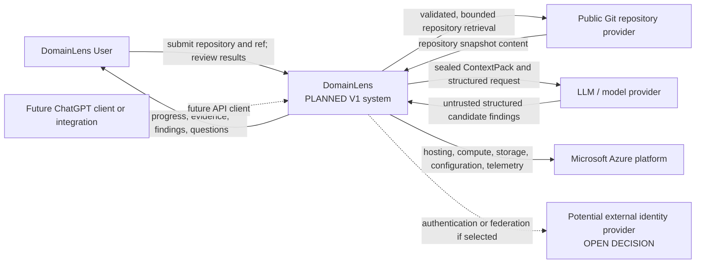

# System Context

## Status and scope

This document defines the boundary of DomainLens and its relationships with people and external systems.
It does not define the internal component or deployment topology; those are covered by the
[logical architecture](02-logical-architecture.md) and
[deployment architecture](10-deployment-architecture.md).

The following status terms apply throughout this document:

- **CURRENT — Milestone 1:** the implemented Repository Structure Scanner 0.1 is a local .NET 10 CLI and library set. It accepts a local repository path and emits a deterministic Evidence Graph as canonical JSON.
- **PLANNED — Product V1:** the approved end-to-end, Azure-hosted experience for public Git repositories, legacy C#/.NET Framework/WCF analysis, evidence-backed reasoning, human review, and a persistent Domain Knowledge Model.
- **FUTURE:** clients, analyzer families, and operating models beyond the approved V1 scope.
- **OPEN DECISION:** an architectural choice that has not been approved and must not be inferred from this baseline.

The governing rule at every boundary is:

> **Code establishes evidence. AI interprets evidence. The agent orchestrates the process.**

> **Source-model neutrality:** DomainLens shall not require or assume that an analyzed application was originally designed using Domain-Driven Design. DDD concepts may be recovered, inferred, or proposed from implementation evidence even when corresponding DDD constructs do not explicitly exist in the source system.

## System responsibility

DomainLens reconstructs architecture and domain knowledge from existing software while preserving
traceability to the analyzed repository snapshot. The analyzed application may be N-tier,
transaction-script based, anemic, service-oriented, procedural, a tightly coupled monolith,
partially domain-oriented, or explicitly designed with DDD. Source constructs named
`AggregateRoot`, `Entity`, `ValueObject`, `DomainEvent`, or `BoundedContext` are neither required
nor sufficient. DomainLens owns the analysis workflow and the results it produces. It does not own
the submitted repository, the Git provider, the model provider, or the user's downstream
modernization process.

Reverse DDD answers two connected questions: **what domain knowledge can be reconstructed from
the existing system and business, and how can that domain be represented using DDD?** The first
produces Recovered Domain Knowledge; the second may produce Proposed DDD Design. Neither question
is Decomposition Analysis or future-state modernization.

The durable flow is:

`Source Code -> Evidence Graph -> Semantic Findings -> Domain Knowledge Model { Recovered Domain Knowledge + Proposed DDD Design } -> Decomposition Analysis -> Modernization Model -> Target Architecture`

Only deterministic repository scanning and Evidence Graph output are CURRENT. The remaining V1
steps are PLANNED; decomposition and modernization analysis are later stages and must never be
folded into deterministic evidence.

## Context diagram

The diagram treats DomainLens as one system. Names such as Web UI, Pipeline Coordinator, Evidence
Kernel, and Analyzer Worker describe internal responsibilities and do not imply independently
deployed services.

## Actors and external systems

| Actor or system | Status | Interaction with DomainLens | Boundary constraints |
|---|---|---|---|
| DomainLens User | PLANNED V1 | Supplies a public repository URL and ref, starts an analysis, monitors progress, answers clarification questions, explores evidence and findings, and accepts, rejects, or challenges interpretations. | Human review changes finding/review state; it never rewrites deterministic source evidence or promotes an inference to an observed fact. |
| Local CLI operator | CURRENT | Supplies a local repository path and optional solution, runs `scan`, and uses `inspect` against the resulting analysis artifact. | The CLI has no remote Git intake, web experience, persistence service, model invocation, or DDD reasoning. |
| Public Git repository provider | PLANNED V1 | Supplies repository content for a validated public URL and selected branch, tag, or commit. | The URL, redirects, resolved addresses, size, and content are untrusted. Repository files are data, never instructions. |
| LLM/model provider | PLANNED V1 | Receives a bounded, task-specific ContextPack and returns a structured candidate analysis result. | The model has no unrestricted repository access. Its output is untrusted until schema, evidence, and policy validation succeeds, and it cannot create Observed evidence. |
| Microsoft Azure | PLANNED V1 | Provides the target operating environment for application hosting, isolated analysis, persistence, temporary workspace, model connectivity, configuration, secrets, and observability. | Azure is an accepted platform choice, not a decision for any particular Azure service or SKU. |
| ChatGPT or another API client | FUTURE | Uses stable DomainLens APIs to start or explore analyses. | DomainLens is not architecturally constrained to ChatGPT Sites, Apps, or any single client channel. |
| External identity provider | OPEN DECISION | May authenticate users or federate organizational identity if the approved access model requires it. | V1 has not selected whether authentication is required, an identity model/provider, tenancy, roles/permissions, sharing, or anonymous-access policy. |

## Primary V1 interactions

### Submit and analyze

The user submits a public Git URL and optional ref. DomainLens validates the request, captures an
identifiable snapshot, and dispatches the configured, approved legacy C#/.NET Framework/WCF
analyzer capabilities. A bounded deterministic qualification check may reject a repository that
the V1 analyzer path cannot support; this is not generalized technology discovery or automatic
Analysis Plan generation. Those capabilities remain FUTURE, and the initial workload does not
define the platform's architectural boundary.

### Interpret and validate

DomainLens constructs a bounded ContextPack from validated evidence and invokes an approved
reasoning skill. Candidate findings remain separate from the Evidence Graph and retain supporting
and counterevidence. Recovered claims about the existing system are tagged separately from proposed
DDD representations that may not exist in that system. Deterministic validation and, where needed,
human review precede projection into the persistent Domain Knowledge Model.

### Explore and challenge

The user navigates from domain concepts and findings back to evidence and source locations. A
challenge creates a new reasoning/review revision; it does not destroy previous revisions or alter
the repository snapshot.

### Reuse downstream

The persistent Domain Knowledge Model is the single canonical intermediate asset for later
decomposition and modernization analysis. It exposes Recovered Domain Knowledge and Proposed DDD
Design as distinct semantic views with shared provenance and revision semantics. Generated prose
and Markdown are views, not the canonical model, and presentation must not make a DDD proposal look
like an as-is source-system construct.

## Trust statements

- Repository paths, source code, project files, comments, documentation, and repository-local agent instructions are untrusted data.
- Only trusted deterministic application code may establish Observed evidence.
- Model responses and human assertions may contribute to Inferred or Proposed findings and review state, but not Observed source facts. Human acceptance does not change an `Inferred` or `Proposed` classification.
- External actions require deterministic authorization and validation; model output alone is not authority.
- Source-code egress and retention must be explicitly governed before model or storage integration is enabled.
- The logical “DomainLens User” does not imply an authenticated user or tenant. Access decisions must follow the approved identity/ownership policy; anonymous operation is allowed only if that future policy explicitly permits it.

See the [runtime architecture](03-runtime-architecture.md),
[agent and reasoning architecture](07-agent-reasoning-architecture.md), and
[security architecture](09-security-architecture.md) for the enforcing boundaries.

## Open decisions

The following choices are deliberately not made by this baseline:

- **OPEN DECISION — public Git compatibility:** the initial host allowlist, accepted URL forms, ref semantics, redirect policy, and treatment of submodules and Git LFS.
- **OPEN DECISION — product identity and access:** whether Product V1 requires authentication; the authentication provider and user/ownership identity model; whether anonymous access is allowed; tenancy; roles/permissions; sharing; and any applicable protocols.
- **OPEN DECISION — client API:** the public API style, versioning policy, and notification mechanism used by the native UI and future clients.
- **OPEN DECISION — model boundary:** the model provider, deployment region, data-retention terms, and permitted source-code egress policy.

These decisions belong to later threat modeling and component design. They must not be resolved by
selecting a convenient cloud product in this context document.

## Related requirements and architecture

- [Product Overview](../01-product-overview.md)
- [V1 Scope](../02-v1-scope.md)
- [Functional Requirements](../03-functional-requirements.md)
- [Logical Architecture](02-logical-architecture.md)
- [Analysis Pipeline](04-analysis-pipeline.md)
- [Security Architecture](09-security-architecture.md)
- [Deployment Architecture](10-deployment-architecture.md)

Related accepted decisions: [ADR-001](../adr/001-azure-primary-deployment-platform.md),
[ADR-004](../adr/004-separate-deterministic-evidence-from-ai-interpretation.md), and
[ADR-006](../adr/006-language-and-framework-neutral-analyzer-architecture.md).
