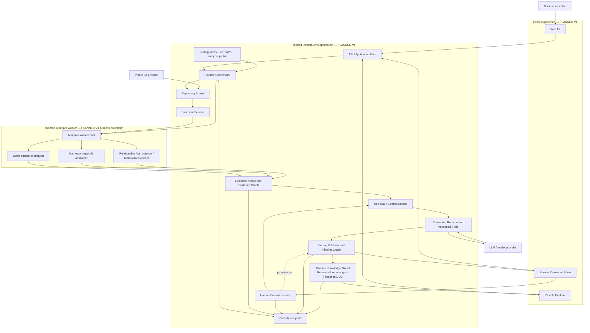

# Logical Architecture

## Status and scope

DomainLens uses a **modular application architecture with an isolated analyzer-worker execution
boundary**. This document assigns logical responsibilities and dependency direction. A named
component is not automatically a process, service, container, repository project, or Azure
resource.

- **CURRENT — Milestones 0 and 1:** `DomainLens.Core`, `DomainLens.Scanner`, and
  `DomainLens.Cli` implement Repository Structure Scanner 0.1. The M0 feasibility projects add a
  local child-process host/worker and narrow net472 semantic enrichment, without claiming a
  production containment boundary.
- **PLANNED — Product V1:** the end-to-end web/API, pipeline, analyzer-worker, reasoning, review, and persistence capabilities described below.
- **FUTURE:** decomposition/modernization capabilities, additional client channels, richer orchestration, generalized automatic technology discovery and generated Analysis Plans, and analyzer families beyond legacy .NET/WCF.

The only separately isolated runtime boundary required by the approved V1 architecture is the
untrusted Repository Analyzer Worker. The remaining logical components should default to cohesive
modules and may be co-deployed until operational evidence justifies another boundary.

## Architectural layers

The platform preserves six different kinds of records and knowledge:

1. **Deterministic Evidence** — source-backed observations established by trusted analyzers.
2. **Human Context** — attributable, versioned human-supplied domain statements that may inform reasoning but are not deterministic evidence, model interpretations, or review decisions.
3. **Semantic Findings** — Inferred or Proposed interpretations with separate Evidence and Human Context references where applicable.
4. **Domain Knowledge Model** — one persistent, queryable asset with explicitly tagged **Recovered Domain Knowledge** and **Proposed DDD Design** projections, each retaining finding, evidence, and Human Context lineage.
5. **Decomposition Analysis** — later analysis of possible separation or modernization boundaries.
6. **Modernization Model** — future target-state and migration knowledge.

These layers have different producers, validators, lifecycles, and authority. A downstream layer
may reference an upstream layer, but it may not rewrite or masquerade as that layer.

The architecture is neutral to the source application's design style. Deterministic analyzers
extract supported structure and behavior from layered, transaction-script, anemic, service-oriented,
procedural, monolithic, partially domain-oriented, and explicitly DDD systems. They never require
DDD marker types or naming conventions before domain reasoning can occur.

## Component view

Arrows express information or control dependencies, not a mandated transport. For example, the
arrow from Pipeline Coordinator to Analyzer Worker does not decide whether the implementation uses
an in-process dispatcher, durable queue, or another job transport. The configured analyzer profile
records the approved V1 .NET/WCF capabilities and versions; it is not an automatically generated
Analysis Plan.

## Current implementation mapping

| Current project | Implemented responsibility | Boundary relative to planned V1 |
|---|---|---|
| `DomainLens.Core` | Language-neutral Evidence Graph records, canonical identities, deterministic JSON normalization/hashing, and graph/provenance validation. | Forms the first implemented part of the planned Evidence Kernel. It contains no Finding Graph or Domain Knowledge Model. |
| `DomainLens.Scanner` | Safe local inventory, content manifest and snapshot identity, solution/project parsing without MSBuild evaluation, Roslyn syntax extraction, declared relationships, diagnostics, and status. | Supplies the first structural analyzer implementation and is invoked by the M0 child worker; the CLI can still invoke it in process. |
| `DomainLens.Semantics` | Flattens manifest-verified repository C# into one synthetic compilation against the exact tool-owned net472 catalog, declares `Partial` resolution, and provides deterministic path-free result serialization and validation. | A feasibility result separate from the Evidence Graph; it does not reproduce effective project configuration, evaluate MSBuild, restore/build/emit the repository, or establish full behavioral evidence. |
| `DomainLens.Analyzer.Host` | Bounded staging, allowlisted child launch, worker-lifetime/result-acceptance deadline and cancellation, process-tree termination for a running worker, strict result correlation/validation, and typed cleanup. | Demonstrates the required process protocol locally. It does not provide least-privileged identity, detached-descendant containment, network denial, trusted-postprocessing preemption, or production resource containment. |
| `DomainLens.Analyzer.Worker` | Runs the scanner and semantic feasibility analyzer inside the child and atomically emits a versioned result envelope. | A trusted executable prototype, not a selected Azure worker service or completed Product V1 analyzer profile. |
| `DomainLens.Cli` | Local `scan` and artifact-only `inspect` commands, canonical JSON output, exit-code mapping, and evidence display. | A Milestone 1 host and diagnostic surface, not the planned Web UI or Product V1 API. |
| `DomainLens.Scanner.Tests` | Fixture-backed acceptance, security, determinism, identity, provenance, path-hardening, CLI, and graph-integrity tests. | Establishes current contracts; it is not a runtime component. |

For exact current behavior and limitations, see
[Repository Structure Scanner 0.1](../11-milestone-1-repository-scanner.md) and the
[Milestone 0 Feasibility Report](../12-milestone-0-deployment-security-feasibility.md).

## Planned logical responsibilities

| Logical component | Responsibility | Inputs and outputs | Explicit exclusions |
|---|---|---|---|
| Web UI | Starts analyses, presents progress, clarification, review, and exploration experiences. | API commands and query views. | Does not parse repositories, call models directly, or own canonical analysis state. |
| API / Application Core | Exposes use cases, enforces authorization and input policy, and coordinates application services. | Client requests and validated application results. | Does not execute repository-controlled code. |
| Pipeline Coordinator | Drives the allowlisted, durable workflow; records stage transitions; dispatches configured work; handles cancellation, retries, and review pauses. | Configured V1 analyzer profile/job, stage results, diagnostics, Human Context revisions, and human review decisions. | Does not infer domain meaning itself, dynamically generate agents, or ask a model to select analyzers. |
| Repository Intake | Validates repository/ref requests and safely obtains public repository content under intake policy. | Public URL/ref; bounded repository content or rejection. | Does not trust repository metadata, redirects, documentation, or project files. |
| Snapshot Service | Produces an identifiable, immutable manifest and snapshot boundary. | Captured repository bytes and revision metadata where safely available. | Does not treat a mutable checkout path as durable identity. |
| Configured V1 Analyzer Profile | Identifies the approved legacy C#/.NET Framework/WCF structural and WCF analyzers plus the Relationship / Persistence / Behavioral Evidence capability, including its supported security evidence, and records their versions/configuration for reproducible dispatch. | Trusted deployed configuration; bounded worker job description. | Does not discover technologies or select across analyzer families from repository content. |
| Analyzer Worker | Hosts deterministic analysis against untrusted content within resource, filesystem, network, credential, and time limits. | Snapshot plus fixed configured .NET/WCF job; evidence contributions and diagnostics. | Does not perform domain interpretation, automatically choose analyzer families, or use model output as source facts. |
| Static Analysis | Extracts language-level structure and relationships with explicit resolution quality. | Source/project artifacts; normalized evidence. | Does not infer business or DDD semantics from names alone and does not require DDD-named source constructs. |
| Framework-specific analyzers | Extract framework facts such as WCF contracts, operations, implementations, endpoints, bindings, and hosting configuration. | Applicable snapshot artifacts; normalized evidence. | Does not add framework-specific types to the core evidence contract without normalization. |
| Relationship / Persistence / Behavioral Evidence | Establishes deterministic calls, conditions, comparisons, validation, exceptions, mutations, data relationships/access, transactions, workflows/state changes, operations, messages, security checks, external calls, side effects, scheduled behavior, dependencies, coupling, configuration, and other supported implementation facts. | Analyzer-supported code/configuration; normalized evidence and explicit coverage diagnostics. | Does not turn technical coupling, a class name, or a framework convention into a DDD conclusion, and cannot claim behavior hidden in unsupported artifacts. |
| Evidence Kernel / Evidence Graph | Owns normalized evidence contracts, canonical identity/provenance rules, graph validation, and immutable evidence views. | Deterministic analyzer output; validated Evidence Graph. | Rejects model-authored Observed evidence and never stores proposals as source facts. |
| Retrieval / Context Builder | Selects minimal, provenance-preserving typed inputs for one reasoning objective. | Evidence Graph, prior findings, counterevidence, limitations, separately versioned Human Context, task recipe, and budget. | Does not give the model unrestricted repository access, collapse Human Context into source evidence, or require vector retrieval in V1. |
| Reasoning Runtime | Invokes fixed, versioned skills through a provider adapter and receives structured candidate results. | Sealed ContextPack and reasoning contract; untrusted structured output. | Does not parse the repository or authorize external actions. |
| Reasoning Skills | Recover existing business/system meaning and, separately, infer or propose DDD representations using required evidence recipes, output schemas, support rubrics, and repair policy. | Versioned reasoning request; candidate findings/explanations tagged with semantic view and classification. | Are not source analyzers, arbitrary prompts, dynamic agents, or license to assume DDD from source names. |
| Finding Validator / Finding Graph | Validates schema, separate Evidence and Human Context references against the sealed pack, semantic view, classification, support, counterevidence, contradictions, and revision lineage. | Candidate findings plus referenced records; validated finding revisions. | Never mutates the Evidence Graph, treats Human Context as Observed evidence, reclassifies an inference as Observed, or presents Proposed DDD Design as recovered knowledge. |
| Domain Knowledge Model | Provides one persistent business/domain asset with separately queryable Recovered Domain Knowledge and Proposed DDD Design views. | Validated finding revisions; versioned concepts and relationships with view, classification, Evidence and Human Context provenance, assumptions, Support, Coverage, Completeness, linked Resolution Quality, alternatives, review state, lineage, and calibrated Confidence only when its readiness and exposure gate is met. | Is not two independent stores, a Markdown report, or a container for decomposition recommendations. |
| Human Review workflow | Records domain clarification as Human Context separately from challenge, acceptance, rejection, and requests for re-analysis. | Reviewable findings and questions; durable Human Context revisions, auditable review decisions, and new finding revisions. | Acceptance changes review status, not epistemic classification; Human Context does not become source evidence. |
| Results Explorer | Projects source, coverage/limitations, evidence, Human Context provenance, findings, recovered knowledge, proposed DDD design, and review history with bidirectional navigation and “Why does DomainLens think this?” explanations. | Query models from persistence with visible semantic-view, classification, Support/Coverage/Completeness, Resolution Quality, review-state labels, and calibrated Confidence only when available and approved for exposure. | Does not become the canonical store, treat metrics or Human Context as deterministic evidence, or silently blend a proposal into an as-is view. |
| Persistence | Stores repository/snapshot/run state, evidence, Human Context revisions, findings/revisions, review decisions, the single Domain Knowledge Model and its view discriminators, diagnostics, and producer versions behind application-owned ports. | Versioned durable records and mutable operational state. | Does not make generated prose the canonical model, collapse Human Context into evidence or review state, erase semantic-view/classification distinctions, or couple the core directly to a database product. |

### FUTURE — generalized analyzer selection

The language-neutral contracts permit a later deterministic Technology Discovery component and
Analysis Planner to select applicable capabilities from a trusted analyzer catalog. Neither is a
Product V1 logical requirement. Their future contracts, selection policy, and capability/worker
negotiation must be approved before they appear in a runtime flow.

## Dependency and ownership rules

1. Client components depend on application contracts, not analyzer or persistence implementations.
2. The Pipeline Coordinator invokes fixed application capabilities; it does not contain analyzer logic or model prompts.
3. Analyzer implementations depend on the normalized Evidence Kernel contract. The language-neutral core does not depend on WCF, Roslyn, Java, Spring, database, or messaging analyzers.
4. Only deterministic analyzers can contribute Observed evidence, and every contribution must carry snapshot-scoped provenance and resolution.
5. The Context Builder reads validated evidence, finding state, and specific Human Context revisions through bounded retrieval operations. It preserves their distinct types and does not expose an unrestricted checkout or general-purpose filesystem tool to a model.
6. The Reasoning Runtime can produce candidate Inferred or Proposed findings only. It tags recovered/as-is meaning separately from proposed DDD design, and the Finding Validator owns acceptance into the Finding Graph.
7. The Domain Knowledge Model is derived from validated, revisioned findings and retains semantic view, classification, review state, and links back through findings to evidence, Human Context revisions where used, and the snapshot. Acceptance never changes `Proposed` to `Inferred` or `Observed`, and superseding Human Context does not rewrite historical findings.
8. Decomposition Analysis consumes a versioned Domain Knowledge Model in a later stage. Proposed DDD Design is not Decomposition Analysis, and neither stage annotates or modifies deterministic source evidence.
9. Azure, model, Git, persistence, and telemetry products sit behind adapters so application rules do not depend directly on vendor SDKs.

## Control flow and data flow

The Pipeline Coordinator owns control flow: starting stages, recording state, dispatching jobs,
handling cancellation/retry, and pausing for human input. Evidence, Human Context records, findings,
review decisions, and producer/model versions are versioned data flow. Keeping these separate allows a stage to be repeated or repaired without silently
changing earlier evidence or losing lineage.

The [analysis pipeline](04-analysis-pipeline.md) defines stage behavior. The
[runtime architecture](03-runtime-architecture.md) assigns the mandatory process boundary, and the
[persistence architecture](08-persistence-architecture.md) defines which state is immutable,
versioned, or operationally mutable.

## Open decisions

- **OPEN DECISION — module contracts:** the exact projects/packages and public interfaces for the remaining planned V1 modules beyond the current scanner and Milestone 0 feasibility projects.
- **OPEN DECISION — co-deployment:** which trusted logical modules initially share a host process and what measured operational need would justify separation.
- **OPEN DECISION — job transport:** how the Coordinator dispatches and resumes isolated analyzer work.
- **OPEN DECISION — query boundary:** the API/query shape used by Results Explorer across Evidence, Human Context, Finding, Recovered Domain Knowledge, and Proposed DDD Design views while preserving their mandatory distinction.
- **OPEN DECISION — Human Context contract:** the final name (`Human Context` versus `Domain Assertion`), schema, status/validation vocabulary, conflict policy, and rules for how it may affect Support. Identity fields remain conditional on the approved identity model.
- **OPEN DECISION — production V1 analyzer-job contract:** M0 proves a local versioned
  process protocol; the durable configured profile/job representation, analyzer-version policy,
  authenticated transport, bounded qualification result, replay behavior, and
  unsupported-repository diagnostics remain open for the known .NET/WCF path.
- **FUTURE DECISION — generalized discovery and planning:** the technology-observation, automatic analyzer-selection, and generated Analysis Plan contracts are deferred until that future capability is approved.

These open choices must preserve the accepted modular architecture and isolated-worker boundary;
they are implementation decisions, not permission to collapse the evidence, finding, or domain
knowledge layers.

## Related architecture

- [System Context](01-system-context.md)
- [Runtime Architecture](03-runtime-architecture.md)
- [Analysis Pipeline](04-analysis-pipeline.md)
- [Evidence Architecture](05-evidence-architecture.md)
- [Domain Knowledge Architecture](06-domain-knowledge-architecture.md)
- [Agent and Reasoning Architecture](07-agent-reasoning-architecture.md)
- [Persistence Architecture](08-persistence-architecture.md)
- [Extensibility Architecture](11-extensibility-architecture.md)

Related accepted decisions: [ADR-002](../adr/002-modular-architecture-with-isolated-analyzer-worker.md),
[ADR-003](../adr/003-separate-evidence-graph-from-finding-graph.md),
[ADR-004](../adr/004-separate-deterministic-evidence-from-ai-interpretation.md),
[ADR-005](../adr/005-persist-domain-knowledge-model-as-canonical-intermediate-asset.md), and
[ADR-010](../adr/010-separate-decomposition-from-domain-knowledge-reconstruction.md).
