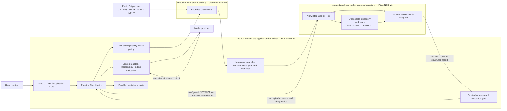
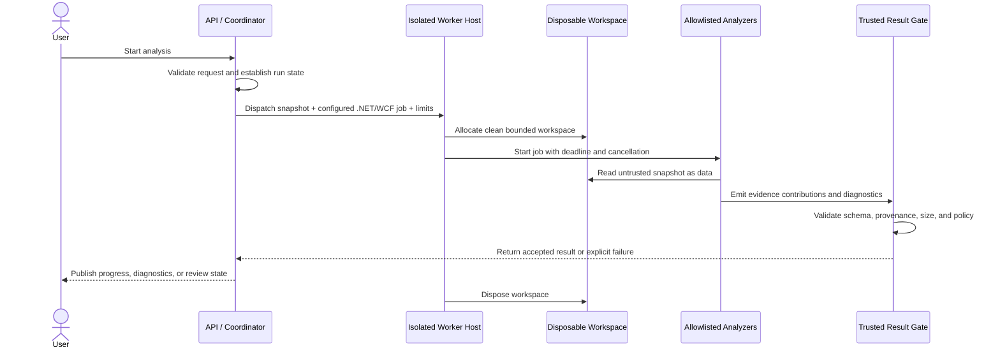

# Runtime and Process Architecture

## Status and scope

This document defines where DomainLens code runs and how trusted application processing is
separated from analysis of untrusted repositories. It does not select Azure services; the
[deployment architecture](10-deployment-architecture.md) assigns conceptual deployment roles
without deciding products.

- **CURRENT — Milestone 0 feasibility:** a trusted local host stages a bounded repository copy,
  launches an allowlisted analyzer in a separate child process, gates its result, enforces a
  deadline/cancellation, and cleans the job workspace. This is **PROVEN process separation**, not
  production OS containment.
- **CURRENT — Milestone 1:** Repository Structure Scanner 0.1 also remains directly available as a
  local CLI/library in the caller's process.
- **PLANNED — Product V1:** Web/API/Application Core processing runs outside a separately isolated Windows-capable Repository Analyzer Worker.
- **FUTURE:** Linux worker families, worker pools, queues, and container or cluster scheduling when supported analyzer workloads and scale justify them.

The production worker boundary is mandatory before DomainLens exposes untrusted public-repository
analysis as a hosted product. Neither Milestone 1's local CLI nor Milestone 0's child-process spike
is evidence that OS identity, network, filesystem, or resource containment is optional. See the
[Milestone 0 Feasibility Report](../12-milestone-0-deployment-security-feasibility.md).

## Runtime boundaries

The location of bounded Git retrieval is an open decision. Regardless of placement, URL validation
and network policy are trusted control-plane responsibilities, and every retrieved byte remains
untrusted repository data.

## Trust zones

### Trusted application zone

The Web/API/Application Core, Coordinator, validation code, and persistence adapters run trusted
DomainLens code. They may hold application identity, storage, or model credentials needed for
their approved operations. They must not load repository assemblies, execute build targets, or
interpret repository content as DomainLens instructions.

### Untrusted-content worker zone

The worker receives only the selected snapshot, a fixed configured V1 .NET/WCF analyzer job,
bounded configuration, a run/job correlation value, and cancellation/deadline information. Its
analyzer binaries and rules are trusted, deployed DomainLens artifacts; repository-supplied
analyzers, generators, build tasks, scripts, plugins, and instructions are not trusted capabilities.

The worker returns normalized Evidence Graph contributions and diagnostics through an output gate.
It does not receive persistence, model, source-control, or application-user credentials. Any
network access must be denied by default and explicitly justified by the selected worker design.

### Model zone

The model is outside both the worker and application trust boundaries. Trusted application code
selects and seals a ContextPack; the model never receives a checkout path, arbitrary filesystem
access, repository credentials, or a tool that can execute repository content. Model output is
untrusted until validation.

## Worker lifecycle

Milestone 0 proves typed cancellation/timeout rejection, `Kill(entireProcessTree: true)`, worker
reaping, and `finally`-path cleanup for the tested topology. The tree-kill test covers a descendant
while its worker parent remains alive; detached descendants after the parent exits are **NOT
PROVEN**. Production guarantees still depend on the selected containment technology: .NET also
documents that parent-process exit observation does not prove every descendant has exited and that
inaccessible descendants may be skipped. Cleanup after machine/host failure, secure disposal, and
operational verification remain open.

## Isolation contract

| Concern | PLANNED V1 boundary requirement | CURRENT M0/M1 evidence and limit |
|---|---|---|
| Process | Untrusted-content analysis runs outside the Web/API/Core process. A worker failure must not compromise the application host. | **PROVEN:** scanner execution occurs under a different PID and crash is contained as a typed result. **NOT PROVEN:** the child still uses the host account and is not an OS containment boundary. |
| Filesystem | Each job receives a dedicated temporary root. Paths must remain inside it; cross-job and host filesystem access is denied. The workspace is disposable. | **PROVEN:** unique staging; total-entry materialization bounded before sort plus file-count, depth, and byte limits; initial reparse rejection; job-scoped CWD/temp paths; snapshot-ID binding; full staged-repository-tree rehash after worker exit; Windows no-follow/single-link result-handle validation; and ordinary bounded iterative cleanup across tested outcomes. **NOT PROVEN:** atomic/race-safe directory traversal, a cancellable result open or portable equivalent for future non-Windows workers, read-only enforcement or detection of a transient change restored before recapture, ACL confinement from the rest of the host, cleanup-failure injection, adversarial cleanup races, encrypted scratch space, secure erasure, and crash scavenging. |
| Repository execution | Repository binaries, build targets, tasks, generators, analyzers, scripts, and project-defined commands are inert data. | **PROVEN for fixtures:** structural parsing and exact-catalog Roslyn `SemanticModel` analysis do not evaluate MSBuild or admit repository compiler/build inputs. The real worker also rejects a currently loaded managed assembly whose location is inside the staged repository. Repository build/restore is **PROHIBITED**; repository-controlled MSBuild evaluation is **REJECTED** as the V1 default. |
| Network | Worker egress is denied or tightly allowlisted according to the selected job profile. Repository content cannot request network access. | **NOT PROVEN:** the spike performs no intended analyzer network operation but applies no OS firewall, namespace, or deny policy. |
| Credentials | The worker receives no repository, persistence, model, user, or broad Azure credentials. Any job identity is least-privileged and scoped to required input/output operations. | **PROVEN:** inherited environment is cleared and a named sentinel secret is absent. **NOT PROVEN:** a distinct/restricted OS identity and denial of non-environment credential sources. |
| Resources | File count, entry traversal, individual file size, aggregate bytes, memory, CPU, process count, disk, and wall-clock time are bounded at the appropriate layer. | **PROVEN:** staging file/entry/depth/byte, retained-output, result-file byte, and worker-lifetime/result-acceptance deadline bounds. **NOT PROVEN:** a hard memory/allocation ceiling during result hashing/decoding/validation, CPU, handles, process count, complete worker-written disk quotas, or independent preemption of synchronous trusted postprocessing. |
| Cancellation | Coordinator cancellation propagates to the worker. The host enforces a deadline independently of cooperative analyzer cancellation. | **PROVEN:** deadline and caller cancellation force result rejection; a still-running worker is tree-killed/reaped and cleanup follows in the tested cases. Synchronous trusted validation is checked before acceptance but is not independently preempted. Detached/post-parent descendant containment is **NOT PROVEN**. |
| Output | Only bounded, versioned, provenance-bearing results cross from the worker to trusted application processing. Malformed or invalid output is rejected; structurally valid output is normalized before validation and acceptance. | **PROVEN:** protocol/job/PID correlation, trusted staging-snapshot binding, post-run staged-repository-tree integrity, bounded capture/result, Windows no-follow result opening, JSON hashes, strict decoding, pinned-content and exact-descriptor semantic-reference validation, Evidence Graph validation, and typed rejection. Hashes do not authenticate a worker. |
| Cleanup | Workspaces and transient credentials are invalidated after success, failure, cancellation, or timeout according to retention policy. | **PROVEN for normal tested paths:** bounded iterative cleanup runs from `finally`, typed cleanup status and diagnostics are surfaced, and cleanup failure prevents success acceptance. Cleanup-failure injection, production retention, host-crash recovery, and deletion verification are **OPEN**. |

## Windows-first worker profile

The initial workload is legacy C#/.NET Framework/WCF. The first worker family is therefore
Windows-oriented so later milestones can use appropriate framework reference assemblies and
trusted analysis tooling where safe. This is a worker-profile decision, not a language restriction
on the Evidence Kernel or Application Core.

Milestone 1 remains deliberately syntax-first. Milestone 0 demonstrates a narrow compiler-backed
enrichment: every manifest-listed C# source is flattened into one synthetic Roslyn compilation,
using the exact tool-owned `Microsoft.NETFramework.ReferenceAssemblies.net472` catalog, and queried
through `SemanticModel`. The result declares repository-manifest compilation scope and `Partial`
resolution because it does not preserve effective project membership, project references, target
configuration, conditional items, or preprocessor settings. It does not evaluate repository
MSBuild, restore packages, build or emit the repository, admit repository binaries as metadata, or
run repository analyzers/generators. This is **FEASIBLE WITH CONSTRAINTS**, not blanket authority
to compile an effective repository project.

Linux worker profiles are FUTURE capabilities for Java, Spring, modern cross-platform stacks, and
other analyzers whose toolchains do not require the Windows legacy environment. A FUTURE generated
Analysis Plan may declare required worker capabilities rather than hard-code an operating system in
the language-neutral core; Product V1 does not require that planner.

## Failure, partial success, and recovery

The worker must distinguish:

- **job failure**, where no trustworthy stage result can be accepted;
- **partial analyzer coverage**, where valid evidence exists but diagnostics identify exclusions,
  ambiguity, or unsupported constructs; and
- **pipeline interruption**, where a retry, cancellation, or later resumption decision is required.

These are not interchangeable. Milestone 1's `Success`, `PartialSuccess`, and `Failure` values
describe one deterministic analysis document. Product V1 pipeline state and worker-attempt state
will have their own durable representation while preserving the underlying analysis status and
diagnostics.

## Open decisions

- **OPEN DECISION — Git retrieval placement:** whether bounded clone/fetch runs in a dedicated intake process, in a worker profile, or in another isolated boundary.
- **OPEN DECISION — Windows containment technology:** the production combination of host,
  restricted identity, filesystem/ACL boundary, resource/job control, network boundary, and
  termination mechanisms. M0's plain child process is not sufficient by itself.
- **OPEN DECISION — work dispatch:** in-process scheduling, a durable queue, or another transport, including delivery and lease semantics.
- **OPEN DECISION — resource profiles:** default and maximum CPU, memory, process, disk, file, byte, and wall-clock budgets per configured analyzer job.
- **OPEN DECISION — network policy:** whether any analyzer profile requires egress and how destinations, DNS, redirects, and rebinding are controlled.
- **OPEN DECISION — workspace lifecycle:** encryption, secure disposal, debugging retention, and cleanup verification.
- **OPEN DECISION — production cancellation guarantees:** grace period, platform-level descendant
  termination proof including detached/post-parent descendants, trusted-postprocessing preemption,
  orphan recovery, and operational handling. M0 rejects output after a locally observed
  cancellation or deadline but does not impose a hard upper bound on all host postprocessing.
- **OPEN DECISION — worker routing:** capability matching and isolation differences between future Windows and Linux worker pools.

## Related architecture

- [Logical Architecture](02-logical-architecture.md)
- [Analysis Pipeline](04-analysis-pipeline.md)
- [Security Architecture](09-security-architecture.md)
- [Deployment Architecture](10-deployment-architecture.md)
- [Extensibility Architecture](11-extensibility-architecture.md)
- [Repository Structure Scanner 0.1](../11-milestone-1-repository-scanner.md)
- [Milestone 0 Feasibility Report](../12-milestone-0-deployment-security-feasibility.md)

Related accepted decisions: [ADR-002](../adr/002-modular-architecture-with-isolated-analyzer-worker.md)
and [ADR-006](../adr/006-language-and-framework-neutral-analyzer-architecture.md).
