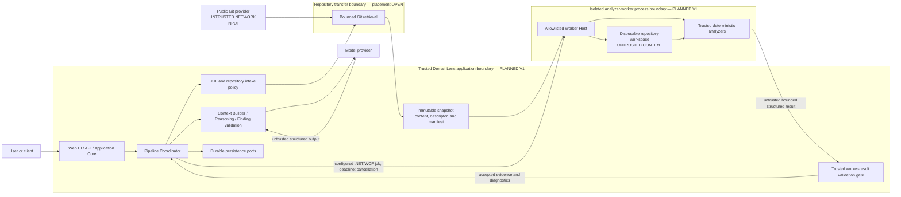
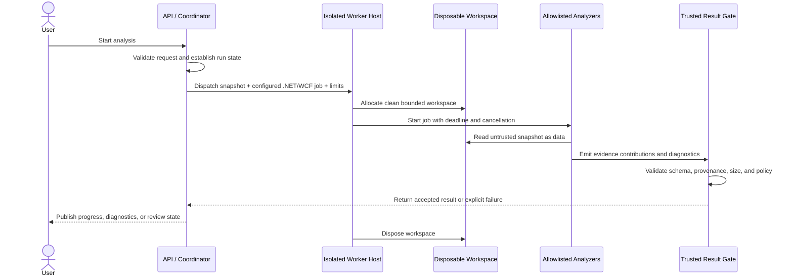

# Runtime and Process Architecture

## Status and scope

This document defines where DomainLens code runs and how trusted application processing is
separated from analysis of untrusted repositories. It does not select Azure services; the
[deployment architecture](10-deployment-architecture.md) assigns conceptual deployment roles
without deciding products.

- **CURRENT — Milestone 1:** Repository Structure Scanner 0.1 runs as a local CLI/library in the caller's process. It implements bounded, non-executing repository reads but is not yet hosted in the production isolation boundary.
- **PLANNED — Product V1:** Web/API/Application Core processing runs outside a separately isolated Windows-capable Repository Analyzer Worker.
- **FUTURE:** Linux worker families, worker pools, queues, and container or cluster scheduling when supported analyzer workloads and scale justify them.

The planned worker boundary is mandatory before DomainLens exposes untrusted public-repository
analysis as a hosted product. Milestone 1's local CLI is a development artifact, not evidence that
process isolation is optional.

## Runtime boundaries

The location of bounded Git retrieval is an open decision. Regardless of placement, URL validation
and network policy are trusted control-plane responsibilities, and every retrieved byte remains
untrusted repository data.

## Trust zones

### Trusted application zone

The Web/API/Application Core, Coordinator, validation code, and persistence adapters run trusted
DomainLens code. They may hold application identity, storage, or model credentials needed for
their approved operations. They must not load repository assemblies, execute build targets, or
interpret repository content as DomainLens instructions.

### Untrusted-content worker zone

The worker receives only the selected snapshot, a fixed configured V1 .NET/WCF analyzer job,
bounded configuration, a run/job correlation value, and cancellation/deadline information. Its
analyzer binaries and rules are trusted, deployed DomainLens artifacts; repository-supplied
analyzers, generators, build tasks, scripts, plugins, and instructions are not trusted capabilities.

The worker returns normalized Evidence Graph contributions and diagnostics through an output gate.
It does not receive persistence, model, source-control, or application-user credentials. Any
network access must be denied by default and explicitly justified by the selected worker design.

### Model zone

The model is outside both the worker and application trust boundaries. Trusted application code
selects and seals a ContextPack; the model never receives a checkout path, arbitrary filesystem
access, repository credentials, or a tool that can execute repository content. Model output is
untrusted until validation.

## Worker lifecycle

If cancellation, timeout, resource exhaustion, analyzer failure, or output validation failure
occurs, the worker must terminate the affected job, return a typed outcome where safe, and dispose
the workspace. Exact kill guarantees and cleanup verification depend on the selected isolation
technology and remain open design work.

## Isolation contract

| Concern | PLANNED V1 boundary requirement | CURRENT Milestone 1 position |
|---|---|---|
| Process | Untrusted-content analysis runs outside the Web/API/Core process. A worker failure must not compromise the application host. | Scanner code runs in the local CLI process; production isolation is not implemented. |
| Filesystem | Each job receives a dedicated temporary root. Paths must remain inside it; cross-job and host filesystem access is denied. The workspace is disposable. | The scanner rejects a reparse-point repository root, does not follow reparse points, normalizes repository-relative paths, and enforces root containment for referenced paths. |
| Repository execution | Repository binaries, build targets, tasks, generators, analyzers, scripts, and project-defined commands are data only unless a later explicitly sandboxed capability is approved. | No `Microsoft.Build`, restore, build, or process launch is used. Roslyn syntax APIs and hardened XML reads are used. The malicious-build fixture verifies an `Exec` target remains inert. |
| Network | Worker egress is denied or tightly allowlisted according to the selected job profile. Repository content cannot request network access. | The local scanner contains no remote intake or analyzer network workflow. Host-process network isolation is not provided by the CLI. |
| Credentials | The worker receives no repository, persistence, model, user, or broad Azure credentials. Any job identity is least-privileged and scoped to required input/output operations. | The scanner requires no repository or model credentials for local input. |
| Resources | File count, entry traversal, individual file size, aggregate bytes, memory, CPU, process count, disk, and wall-clock time are bounded at the appropriate layer. | File count, traversal entries, individual file size, aggregate bytes, bounded reads, and cancellation are implemented. Host-level memory/CPU/process/disk/wall-clock enforcement is not. |
| Cancellation | Coordinator cancellation propagates to the worker. The host enforces a deadline independently of cooperative analyzer cancellation. | `CancellationToken` is propagated through scan operations, but the standalone CLI has no independent OS deadline. |
| Output | Only bounded, versioned, provenance-bearing results cross from the worker to trusted application processing. Invalid output is rejected, not repaired into evidence. | The scanner validates schema, canonical identities, references, provenance, and canonical document hash before returning a successful graph. |
| Cleanup | Workspaces and transient credentials are invalidated after success, failure, cancellation, or timeout according to retention policy. | The scanner does not provision or manage a production temporary workspace. |

## Windows-first worker profile

The initial workload is legacy C#/.NET Framework/WCF. The first worker family is therefore
Windows-oriented so later milestones can use appropriate framework reference assemblies and
trusted analysis tooling where safe. This is a worker-profile decision, not a language restriction
on the Evidence Kernel or Application Core.

Milestone 1 remains deliberately syntax-only. Any future MSBuild or semantic compilation
capability must be explicitly designed so repository-controlled targets, tasks, generators,
analyzers, and build events do not execute. The phrase “semantic analysis” is not blanket authority
to build an analyzed repository.

Linux worker profiles are FUTURE capabilities for Java, Spring, modern cross-platform stacks, and
other analyzers whose toolchains do not require the Windows legacy environment. A FUTURE generated
Analysis Plan may declare required worker capabilities rather than hard-code an operating system in
the language-neutral core; Product V1 does not require that planner.

## Failure, partial success, and recovery

The worker must distinguish:

- **job failure**, where no trustworthy stage result can be accepted;
- **partial analyzer coverage**, where valid evidence exists but diagnostics identify exclusions,
  ambiguity, or unsupported constructs; and
- **pipeline interruption**, where a retry, cancellation, or later resumption decision is required.

These are not interchangeable. Milestone 1's `Success`, `PartialSuccess`, and `Failure` values
describe one deterministic analysis document. Product V1 pipeline state and worker-attempt state
will have their own durable representation while preserving the underlying analysis status and
diagnostics.

## Open decisions

- **OPEN DECISION — Git retrieval placement:** whether bounded clone/fetch runs in a dedicated intake process, in a worker profile, or in another isolated boundary.
- **OPEN DECISION — Windows isolation technology:** the concrete host, sandbox, filesystem, job-control, and termination mechanisms for the first worker.
- **OPEN DECISION — work dispatch:** in-process scheduling, a durable queue, or another transport, including delivery and lease semantics.
- **OPEN DECISION — resource profiles:** default and maximum CPU, memory, process, disk, file, byte, and wall-clock budgets per configured analyzer job.
- **OPEN DECISION — network policy:** whether any analyzer profile requires egress and how destinations, DNS, redirects, and rebinding are controlled.
- **OPEN DECISION — workspace lifecycle:** encryption, secure disposal, debugging retention, and cleanup verification.
- **OPEN DECISION — cancellation guarantees:** grace period, forced termination, output acceptance after cancellation, and recovery from an unresponsive worker.
- **OPEN DECISION — worker routing:** capability matching and isolation differences between future Windows and Linux worker pools.

## Related architecture

- [Logical Architecture](02-logical-architecture.md)
- [Analysis Pipeline](04-analysis-pipeline.md)
- [Security Architecture](09-security-architecture.md)
- [Deployment Architecture](10-deployment-architecture.md)
- [Extensibility Architecture](11-extensibility-architecture.md)
- [Repository Structure Scanner 0.1](../11-milestone-1-repository-scanner.md)

Related accepted decisions: [ADR-002](../adr/002-modular-architecture-with-isolated-analyzer-worker.md)
and [ADR-006](../adr/006-language-and-framework-neutral-analyzer-architecture.md).
