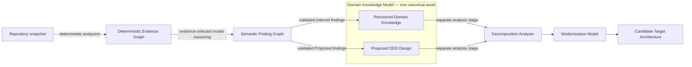
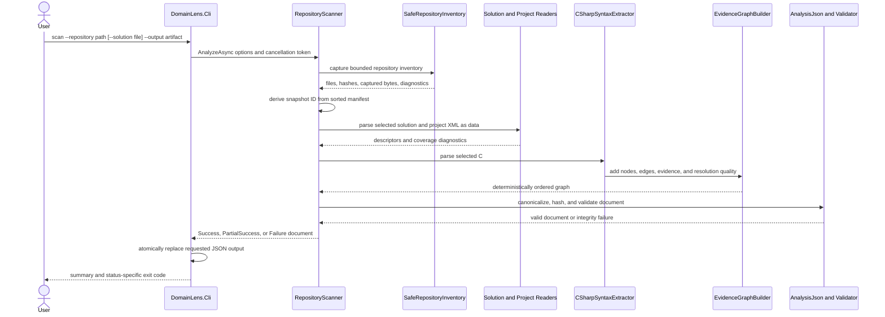
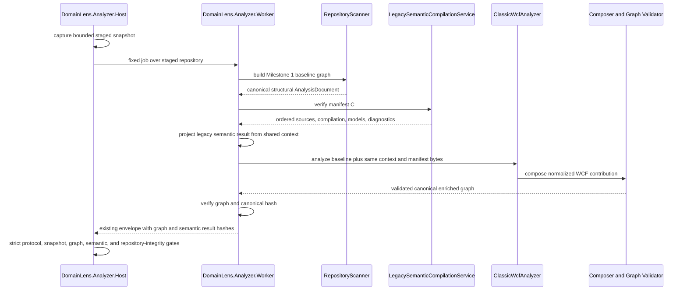
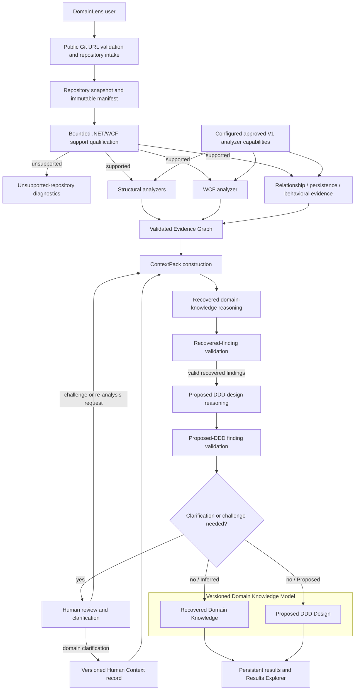
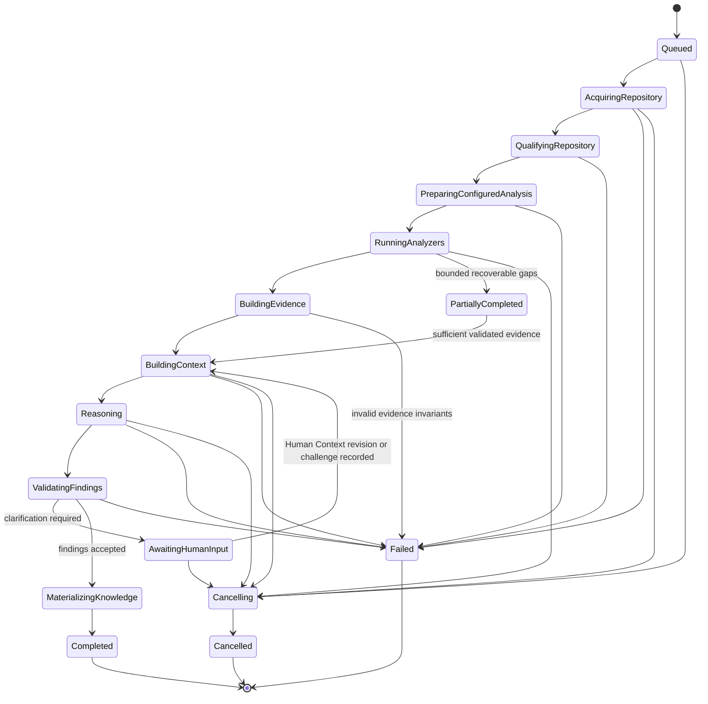
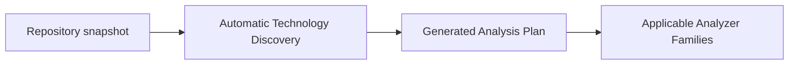

# Analysis Pipeline

## Purpose and status vocabulary

The DomainLens pipeline turns source code into progressively more interpretive
architecture knowledge while preserving the governing separation:

> **Code establishes evidence. AI interprets evidence. The agent orchestrates
> the process.**

This chapter uses three explicit status labels:

- **CURRENT — Milestone 1** means behavior implemented by Repository Structure Scanner 0.1 and
  its standalone CLI path.
- **CURRENT — Milestones 0 and 2** means the tested local Host/Worker boundary, shared net472
  semantic context, and bounded Classic WCF graph enrichment. It does not mean production worker
  containment or the complete Product V1 pipeline.
- **PLANNED — Product V1** means an approved direction or requirement that is
  not implemented yet. Component and state names in this section are logical
  design boundaries, not promises of separate services or a frozen API.
- **FUTURE** means an extension beyond Product V1.

The current implementation details are also summarized in
[Repository Structure Scanner 0.1](../11-milestone-1-repository-scanner.md), the
[Milestone 0 Feasibility Report](../12-milestone-0-deployment-security-feasibility.md), and the
[Milestone 2 Classic WCF Discovery contract](../13-milestone-2-wcf-discovery.md).
The persistent semantic result is described in
[Domain Knowledge Architecture](06-domain-knowledge-architecture.md), and the
reasoning boundary is described in
[Agent and Reasoning Architecture](07-agent-reasoning-architecture.md).

## Information-stage invariant

Each pipeline stage may add information only to the layer it owns. Later
interpretation never rewrites earlier evidence into a stronger category.

The Evidence Graph is the only CURRENT layer in this diagram. Finding,
knowledge, decomposition, and modernization models are PLANNED or FUTURE. In
particular, a proposed aggregate, bounded context, or decomposition is not a
source-code fact.

## Source-model neutrality

The pipeline must work whether the analyzed application is layered, transaction-script based,
anemic, service-oriented, procedural, monolithic, partly domain-oriented, or explicitly DDD. No
stage may require source constructs named `AggregateRoot`, `Entity`, `ValueObject`, `DomainEvent`,
or `BoundedContext`. Such names are deterministic declaration evidence when present, but are not
sufficient proof of semantics and are not required for semantic reasoning.

Deterministic analysis instead establishes supported facts about behavior, rules, invariants, data
relationships, mutation paths, transaction boundaries, workflows, state transitions, service
operations, persistence, messages, security controls, dependencies, and coupling. Reasoning can
then reconstruct existing domain knowledge or propose a DDD representation without confusing the
two results.

## CURRENT — Milestone 1 local scan

Milestone 1 is a synchronous, in-process library and CLI flow. It accepts a
local directory and an optional repository-relative solution path. It does not
clone a repository, discover Git revision metadata, run a job coordinator,
persist a run, call a model, or pause for human input.

### Current stages and boundaries

1. **Inventory and capture.** The scanner enumerates the requested root without
   following reparse points. It hashes the bounded bytes of included files and
   retains bytes in memory for `.sln`, `.csproj`, `.cs`, `.props`, `.targets`,
   and `.config` files. The manifest includes other readable file types too,
   although Milestone 1 does not interpret them.
2. **Snapshot identity.** The scanner creates a content-derived snapshot from
   sorted repository-relative manifest path, SHA-256 hash, and byte-length
   tuples. `Revision` is currently `null`; this is a captured content manifest,
   not a Git-consistent or atomic filesystem snapshot.
3. **Solution selection.** With no selection, every captured C# project is in
   scope and all discovered solution files are represented. With an explicit
   solution, that solution's projects and resolvable project-reference scope
   are selected. A unique solution filename may be used as a shortcut; an
   ambiguous filename or a missing/unsafe selection fails safely.
4. **Declarative project reading.** Project XML is read with DTD processing
   prohibited and external resolution disabled. Literal target frameworks,
   project identity, source items, project references, assembly references,
   and package references are collected. MSBuild is not evaluated. Conditions,
   imports, globs, expressions, targets, and repository-wide build files cause
   explicit partial-coverage diagnostics where relevant.
5. **Syntax extraction.** Roslyn parses C# syntax without compilation or a
   semantic model. It records namespaces, supported type/member declarations,
   attributes, base declarations, and declared signature-type dependencies.
   A conservative source-name resolver can connect a type only within the
   current project or an eligible direct project reference. Unresolved and
   ambiguous targets remain explicit graph edges rather than guesses.
6. **Graph construction.** The scanner builds language-neutral evidence
   records, nodes, and resolved or unresolved edges. It records source spans,
   file hashes, extractor/rule versions, and resolution basis/quality.
7. **Canonicalization and validation.** Collections and JSON object properties
   receive stable ordering; canonical identities and the document hash are
   computed. The graph validator verifies internal provenance, references,
   identities, schema version, and hash consistency before the result is
   accepted.
8. **Artifact output and inspection.** `scan` writes canonical JSON using a
   temporary file followed by replacement. `inspect` verifies the artifact and
   resolves a node by node ID, logical ID, qualified name, or unambiguous name.
   It displays provenance already in the artifact and does not follow artifact
   paths back to source files.

Milestone 1 does **not** analyze method bodies, call graphs, WCF behavior,
configuration semantics, persistence, runtime behavior, or DDD concepts. It
also does not provide progress checkpoints or resume a terminated scan.

## CURRENT — Milestones 0 and 2 isolated WCF analysis

The local isolated path stages the repository, launches the fixed Worker executable, and retains
the existing strict result envelope. Milestone 2 changes the graph produced inside the Worker; it
does not move parsing into the trusted Host or change the process-protocol wire shape.

The WCF stage deterministically:

1. recognizes allowlisted WCF framework attributes through trusted semantic identity and enriches
   existing source nodes;
2. adds supported contract, operation, fault, data/message, implementation, `.svc`, configuration,
   hosting, and client relationships;
3. reads `.svc` and `.config` only through the manifest-verified reader, parses configuration with
   DTD/external resolution disabled, and uses capped iterative walks for namespace and unsupported
   behavior metadata;
4. retains XDT controls as `Partial` evidence without applying them, suppresses declaration
   promotion for the affected `system.serviceModel` section, and emits explicit `Exact`, `Partial`,
   `Ambiguous`, or `Unresolved` results plus typed placement/traversal/transform diagnostics;
5. preserves every accepted structural record while the language-neutral composer rejects
   conflicting identity reuse or property values and repeated reference lists; and
6. returns only normalized evidence—never Roslyn objects, runtime WCF objects, findings, or DDD
   classifications.

The standalone CLI still invokes only the Milestone 1 scanner. The local Host/Worker API is an
executable analysis boundary and test surface, not the Product V1 intake, coordinator, persistence,
or UI pipeline.

## CURRENT — deterministic analysis states and CLI contract

The `AnalysisDocument.Status` values describe deterministic coverage, not the
future orchestration lifecycle:

| Status | Current meaning | Typical causes |
|---|---|---|
| `Success` | Analysis completed without a known coverage loss. Informational diagnostics may still exist. | Fully supported literal structure and WCF forms; an inert `Exec` observation is informational. |
| `PartialSuccess` | Trustworthy evidence exists, but at least one deterministic analyzer warning or error indicates reduced coverage. | Missing files/references, unevaluated MSBuild, conditional compilation, syntax/XML errors, unsupported WCF placements/forms, inert XDT controls, bounded traversal exhaustion, profile mismatch, ambiguity, unresolved targets, or resource exclusions. |
| `Failure` | No acceptable graph could be produced for the requested scope, or a graph invariant failed. | Invalid root/selection, capture limit failure, no analyzable C# project, unhandled safe failure, or graph-integrity failure. |

The Milestone 1 CLI maps these statuses to `0`, `2`, and `1` respectively. It additionally
uses `3` for an unmatched or ambiguous inspection query and `64` for invalid
command usage. These codes should not be reused as the future persisted job
state model. The Host/Worker path instead uses its versioned process outcome and embeds the final
`AnalysisDocument.Status`; one unresolved WCF relationship does not by itself fail the repository.

Cancellation is accepted through a .NET `CancellationToken`. The CLI does not
currently impose its own wall-clock deadline, persist cancellation state, or
resume work.

## PLANNED — Product V1 end-to-end pipeline

Product V1 extends the deterministic slice into an orchestrated analysis of a
public repository. The diagram shows ordered responsibility, not required
deployment topology.

### Planned stage responsibilities

- **Repository intake** validates a supported public Git URL, applies SSRF and
  size controls, captures the selected revision, and transfers it into an
  isolated worker workspace. Branch/tag/commit selection and redirect policy
  are not yet designed.
- **V1 support qualification** may deterministically establish only whether the repository can use
  the known legacy C#/.NET Framework/WCF path and produce explicit unsupported or partial-coverage
  diagnostics. It does not inventory arbitrary technologies, choose among analyzer families, or
  generate an Analysis Plan.
- **Configured analyzer invocation** uses the trusted, approved V1 structural and WCF analyzers plus
  the Relationship / persistence / behavioral evidence capability, including supported security
  evidence. Their identities, versions,
  ordering, and bounded configuration are retained with the run so retry or resume does not
  silently change tools.
- **Structural and framework analysis** extend the Evidence Graph. The current local Worker already
  supplies the bounded Milestone 1/Milestone 2 structural and classic WCF slice. Product V1 must
  deploy and orchestrate that capability with the remaining configured analyzers; subsequent
  analyzers must use the same evidence/provenance contract.
- **Coverage accounting** records the declared scope, analyzed and excluded artifacts, unsupported
  constructs, resolution-quality distribution, diagnostics, and known limitations for every
  analyzer stage. Coverage metadata describes the analysis and is not source evidence.
- **Context construction** selects a bounded, versioned `ContextPack` through
  graph traversal and lexical retrieval. It keeps deterministic evidence, prior findings,
  counterevidence, limitations, and specific Human Context revisions as separately typed inputs.
  Repository content remains quoted data. Unrestricted repository access is not given to the
  model, and V1 does not require a vector database.
- **Recovered domain discovery** produces `Inferred` findings about the business and existing
  system from supported implementation evidence. It does not require DDD constructs or names, and
  it may recover an existing DDD pattern only when behavior and relationships support that claim.
- **Proposed DDD design** produces `Proposed` findings that recommend how recovered concepts could
  be represented with DDD. A proposal never asserts that the corresponding construct already
  exists in the source. Both reasoning activities produce semantic findings, never Evidence Graph
  records, and retain separate Evidence and Human Context references, assumptions, alternatives,
  Support, Coverage, Completeness, linked Resolution Quality, and unresolved questions. Calibrated
  Confidence is optional and may be populated only after the evaluation-readiness and product-
  exposure gate is met; raw model self-confidence and renamed Support are prohibited.
- **Finding validation** follows each reasoning activity and applies schema validation,
  evidence-reference checks, semantic-view/classification rules, policy checks, and deterministic
  consistency rules before a finding can enter review or be supplied to downstream reasoning.
- **Human interaction** may accept, reject, challenge, provide domain clarification, or request
  re-analysis. A clarification used by reasoning becomes a durable, versioned Human Context record,
  separate from review-state actions and source evidence. A challenge creates a new reasoning
  attempt and revision; neither operation mutates the historical evidence snapshot, prior context
  revision, or earlier sealed ContextPack.
- **Knowledge materialization** projects validated findings into one versioned Domain Knowledge
  Model with separate Recovered Domain Knowledge and Proposed DDD Design views. Every projected
  record retains its source findings, separate Evidence and Human Context references where used,
  semantic view, classification, assumptions, Support, Coverage, Completeness, linked Resolution
  Quality, alternatives, review state, and revision history. It includes calibrated Confidence only
  when available under the approved gate. Human review decisions govern state; they are not domain
  content projected into the model. Generated
  Markdown is a view, not its canonical persistence format.

## PLANNED — orchestration state and resumability

The following is a conceptual state machine. Exact persisted names, transition
commands, retry counts, and queue technology are OPEN DECISIONS.

Human review followed by eventual entry into `MaterializingKnowledge` changes review state or
creates a revised finding; it does not change epistemic classification. An accepted `Proposed` DDD
design remains `Proposed`, and an accepted `Inferred` recovery never becomes `Observed`.

Resumability requires durable stage inputs and outputs rather than replaying an
opaque agent conversation. At a minimum, a future checkpoint must identify the
repository snapshot, configured V1 analyzer profile/job and analyzer versions, bounded
configuration, evidence schema and hash, ContextPack version, exact Human Context revisions where
used, model/skill/prompt versions, findings revision, and human review decisions. A stage may be retried only when its input identities
match; otherwise a new analysis run or explicit revision is required.

`PartialSuccess` at the analyzer level may still permit semantic analysis if
coverage gaps are visible in the ContextPack and findings. It must never be
silently promoted to complete coverage. A fatal evidence-integrity error blocks
reasoning for that artifact.

The decision to proceed must keep Coverage, Support, Confidence, Completeness and deterministic
Resolution Quality conceptually distinct. This does not require a populated Confidence value before
its calibration and exposure gate is met. Thresholds for automatic continuation, review or
rejection are **OPEN DECISIONS** governed by the
[Quality and Evaluation Strategy](../quality/01-evaluation-strategy.md).

## Deterministic/model/human control flow

| Concern | Deterministic application code | Model reasoning | Human |
|---|---|---|---|
| Repository bytes and source spans | Captures and verifies | Receives only selected excerpts/evidence | Chooses repository and scope |
| Evidence Graph | Creates and validates | Read-only input; cannot create `Observed` evidence | May report missing or incorrect evidence |
| Human Context | Persists typed, versioned records and validates references to the sealed pack | May use only supplied revisions as attributable context, never source evidence | Supplies/corrects domain statements separately from review decisions; supersession does not rewrite history |
| Findings | Validates schema, separate Evidence/Human Context links, semantic view, and classification | Produces `Inferred` recovered-knowledge or `Proposed` DDD-design candidates | Accepts, rejects, or challenges without changing classification |
| Domain Knowledge Model | Materializes one versioned asset and preserves the two semantic views | Suggests semantic content through findings only | Reviews each explicitly labeled view; cannot turn a proposal into recovered knowledge |
| Pipeline | Enforces state, authorization, retry, and budgets | Cannot advance state directly | Starts, cancels, and resumes authorized work |

Agent orchestration chooses predefined tools and skills under application
policy. It does not grant the model arbitrary process, filesystem, network, or
state-transition authority. Product V1 does not require dynamic agent creation,
MCP, A2A, or autonomous sub-agent composition.

## Failure, retry, and repair principles

- A deterministic analyzer should emit partial evidence and diagnostics when a
  bounded omission does not invalidate the evidence it did establish.
- Invalid graph identity or provenance is fatal for that artifact. Reasoning
  must not consume it.
- A model response that fails its requested schema or cites unavailable
  evidence may be rejected and repaired within a bounded retry policy. A retry
  is a new finding attempt, not new source evidence.
- Human clarification used in reasoning is a durable Human Context record with a stable ID, time,
  scope, eliciting question/request, statement, revision/supersession lineage, and an actor/session/
  principal reference only when available under the approved identity model. It remains separate
  from review state and source evidence; a correction creates a new revision.
- Operational retries must be idempotent with respect to immutable snapshot and
  versioned-stage identities. Partial writes must not become canonical state.
- Cancellation must propagate to workers and model calls, terminate work after
  a bounded grace period, and leave a diagnosable terminal or resumable state.

## FUTURE — post-V1 pipeline evolution

Later releases may add decomposition analysis, modernization modeling,
additional language/framework worker pools, semantic or vector retrieval when
evaluation demonstrates value, and richer multi-agent coordination. These
stages consume a versioned Domain Knowledge Model; they do not bypass or alter
the deterministic Evidence Graph. Proposed DDD Design remains part of Reverse
DDD: Decomposition separately asks how the existing application could be
separated or reorganized, while modernization asks what future implementation
architecture should be built.

Generalized automatic technology discovery and generated Analysis Plans also remain FUTURE:

If approved later, this selection remains deterministic, policy-controlled, and constrained to a
trusted analyzer catalog. It is not delegated to a model and does not change the configured V1
.NET/WCF path retroactively.

## Open decisions

1. **Pipeline state contract:** exact state names, transition API, checkpoint
   granularity, and terminal-state rules.
2. **Retry policy:** retryability taxonomy, per-stage limits, idempotency keys,
   backoff, and poison-work handling.
3. **Partial-analysis threshold:** policy for when evidence coverage is
   sufficient to proceed to reasoning versus requiring human action.
4. **Snapshot acquisition:** Git implementation, revision selection semantics,
   submodule and Git LFS policy, and treatment of repositories that change
   during acquisition.
5. **Configured V1 analyzer-job contract:** approved capability versions, fixed dependency/order
   rules, bounded configuration, support-qualification outcomes, and compatibility rules. Generalized
   analyzer selection and generated Analysis Plans are a FUTURE decision.
6. **Human review transitions:** which decisions are editable, who can approve
   them, and how accepted findings are superseded.
7. **Human Context contract:** final name (`Human Context` versus `Domain Assertion`), physical
   schema, validation/status vocabulary, conflicting statements, rules for effects on Support,
   whether context alone may support a finding, and stale-marking after supersession. Identity
   attribution remains conditional on the approved identity model.
8. **Structured output repair:** schema, bounded retry count, and escalation to
   a human when model output remains invalid.
9. **Progress model:** durable progress units and estimates without coupling
   clients to analyzer internals.
10. **Retention and replay:** how long snapshots, ContextPacks, model exchanges,
   and intermediate artifacts remain available.
11. **Decomposition entry criteria:** the explicit approval and knowledge-model
    completeness needed before post-V1 decomposition analysis begins.
