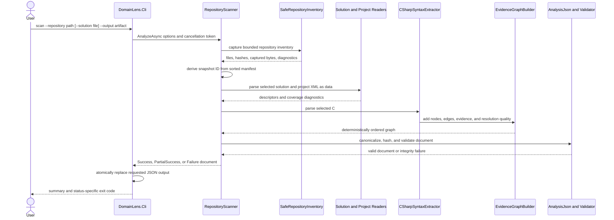
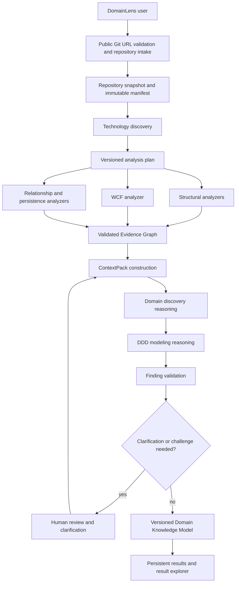
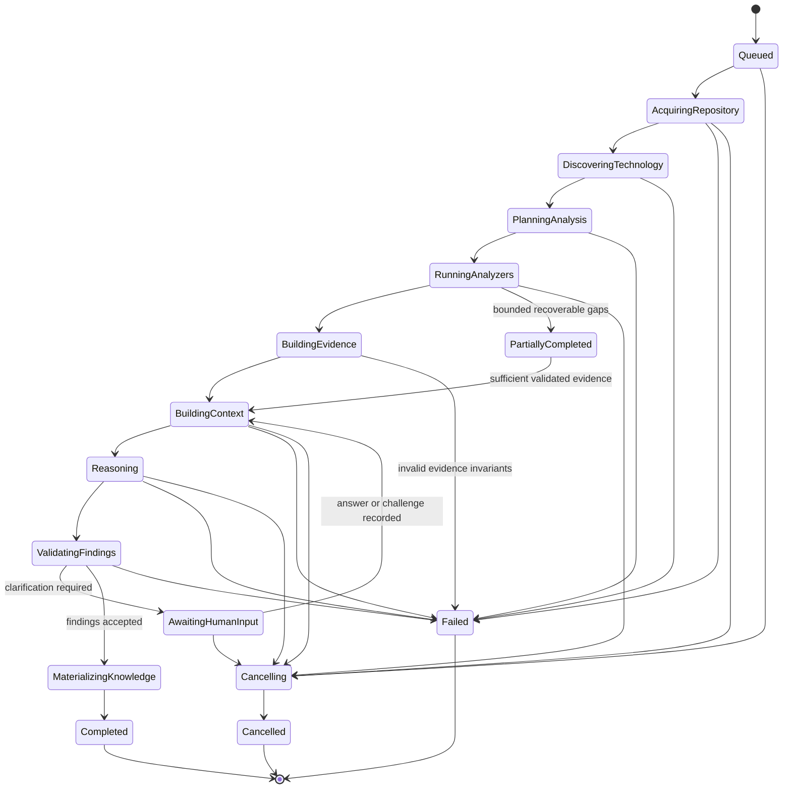

# Analysis Pipeline

## Purpose and status vocabulary

The DomainLens pipeline turns source code into progressively more interpretive
architecture knowledge while preserving the governing separation:

> **Code establishes evidence. AI interprets evidence. The agent orchestrates
> the process.**

This chapter uses three explicit status labels:

- **CURRENT — Milestone 1** means behavior implemented on the `development`
  branch by Repository Structure Scanner 0.1.
- **PLANNED — Product V1** means an approved direction or requirement that is
  not implemented yet. Component and state names in this section are logical
  design boundaries, not promises of separate services or a frozen API.
- **FUTURE** means an extension beyond Product V1.

The current implementation details are also summarized in
[Repository Structure Scanner 0.1](../11-milestone-1-repository-scanner.md).
The persistent semantic result is described in
[Domain Knowledge Architecture](06-domain-knowledge-architecture.md), and the
reasoning boundary is described in
[Agent and Reasoning Architecture](07-agent-reasoning-architecture.md).

## Information-stage invariant

Each pipeline stage may add information only to the layer it owns. Later
interpretation never rewrites earlier evidence into a stronger category.

```mermaid
flowchart LR
    Source[Repository snapshot]
    Evidence[Deterministic Evidence Graph]
    Findings[Semantic Finding Graph]
    Knowledge[Domain Knowledge Model]
    Decomposition[Decomposition Analysis]
    Modernization[Modernization Model]
    Target[Candidate Target Architecture]

    Source -->|deterministic analyzers| Evidence
    Evidence -->|evidence-selected model reasoning| Findings
    Findings -->|validation and human decisions| Knowledge
    Knowledge -->|separate analysis stage| Decomposition
    Decomposition --> Modernization
    Modernization --> Target
```

The Evidence Graph is the only CURRENT layer in this diagram. Finding,
knowledge, decomposition, and modernization models are PLANNED or FUTURE. In
particular, a proposed aggregate, bounded context, or decomposition is not a
source-code fact.

## CURRENT — Milestone 1 local scan

Milestone 1 is a synchronous, in-process library and CLI flow. It accepts a
local directory and an optional repository-relative solution path. It does not
clone a repository, discover Git revision metadata, run a job coordinator,
persist a run, call a model, or pause for human input.

### Current stages and boundaries

1. **Inventory and capture.** The scanner enumerates the requested root without
   following reparse points. It hashes the bounded bytes of included files and
   retains bytes in memory for `.sln`, `.csproj`, `.cs`, `.props`, `.targets`,
   and `.config` files. The manifest includes other readable file types too,
   although Milestone 1 does not interpret them.
2. **Snapshot identity.** The scanner creates a content-derived snapshot from
   sorted repository-relative manifest path, SHA-256 hash, and byte-length
   tuples. `Revision` is currently `null`; this is a captured content manifest,
   not a Git-consistent or atomic filesystem snapshot.
3. **Solution selection.** With no selection, every captured C# project is in
   scope and all discovered solution files are represented. With an explicit
   solution, that solution's projects and resolvable project-reference scope
   are selected. A unique solution filename may be used as a shortcut; an
   ambiguous filename or a missing/unsafe selection fails safely.
4. **Declarative project reading.** Project XML is read with DTD processing
   prohibited and external resolution disabled. Literal target frameworks,
   project identity, source items, project references, assembly references,
   and package references are collected. MSBuild is not evaluated. Conditions,
   imports, globs, expressions, targets, and repository-wide build files cause
   explicit partial-coverage diagnostics where relevant.
5. **Syntax extraction.** Roslyn parses C# syntax without compilation or a
   semantic model. It records namespaces, supported type/member declarations,
   attributes, base declarations, and declared signature-type dependencies.
   A conservative source-name resolver can connect a type only within the
   current project or an eligible direct project reference. Unresolved and
   ambiguous targets remain explicit graph edges rather than guesses.
6. **Graph construction.** The scanner builds language-neutral evidence
   records, nodes, and resolved or unresolved edges. It records source spans,
   file hashes, extractor/rule versions, and resolution basis/quality.
7. **Canonicalization and validation.** Collections and JSON object properties
   receive stable ordering; canonical identities and the document hash are
   computed. The graph validator verifies internal provenance, references,
   identities, schema version, and hash consistency before the result is
   accepted.
8. **Artifact output and inspection.** `scan` writes canonical JSON using a
   temporary file followed by replacement. `inspect` verifies the artifact and
   resolves a node by node ID, logical ID, qualified name, or unambiguous name.
   It displays provenance already in the artifact and does not follow artifact
   paths back to source files.

Milestone 1 does **not** analyze method bodies, call graphs, WCF behavior,
configuration semantics, persistence, runtime behavior, or DDD concepts. It
also does not provide progress checkpoints or resume a terminated scan.

## CURRENT — completion states and CLI contract

The `AnalysisDocument.Status` values describe deterministic coverage, not the
future orchestration lifecycle:

| Status | Current meaning | Typical causes |
|---|---|---|
| `Success` | Analysis completed without a known coverage loss. Informational diagnostics may still exist. | Fully supported literal structure; an inert `Exec` observation is informational. |
| `PartialSuccess` | Trustworthy evidence exists, but at least one scanner warning or error indicates reduced coverage. | Missing files/references, unevaluated MSBuild, conditional compilation, syntax errors, or resource exclusions. |
| `Failure` | No acceptable graph could be produced for the requested scope, or a graph invariant failed. | Invalid root/selection, capture limit failure, no analyzable C# project, unhandled safe failure, or graph-integrity failure. |

The CLI maps these statuses to `0`, `2`, and `1` respectively. It additionally
uses `3` for an unmatched or ambiguous inspection query and `64` for invalid
command usage. These codes should not be reused as the future persisted job
state model.

Cancellation is accepted through a .NET `CancellationToken`. The CLI does not
currently impose its own wall-clock deadline, persist cancellation state, or
resume work.

## PLANNED — Product V1 end-to-end pipeline

Product V1 extends the deterministic slice into an orchestrated analysis of a
public repository. The diagram shows ordered responsibility, not required
deployment topology.

### Planned stage responsibilities

- **Repository intake** validates a supported public Git URL, applies SSRF and
  size controls, captures the selected revision, and transfers it into an
  isolated worker workspace. Branch/tag/commit selection and redirect policy
  are not yet designed.
- **Technology discovery** establishes analyzable languages and frameworks
  deterministically. It must not infer a technology merely because the model
  expects it.
- **Analysis planning** selects versioned analyzers and their dependencies from
  discovered facts and requested scope. The plan is persisted so a resumed run
  does not silently change tools.
- **Structural and framework analysis** extend the Evidence Graph. The first
  workload adds legacy .NET Framework and WCF analysis; subsequent analyzers
  must use the same evidence/provenance contract.
- **Context construction** selects a bounded, versioned `ContextPack` through
  graph traversal and lexical retrieval. Repository content remains quoted
  data. Unrestricted repository access is not given to the model, and V1 does
  not require a vector database.
- **Domain discovery and DDD modeling** produce structured semantic findings,
  never Evidence Graph records. Findings distinguish `Inferred` from
  `Proposed`, link supporting and contradictory evidence, state confidence,
  and retain unresolved questions.
- **Finding validation** applies schema validation, evidence-reference checks,
  policy checks, and deterministic consistency rules before a finding can
  enter review.
- **Human review** may accept, reject, challenge, provide clarification, or
  request re-analysis. A challenge creates a new reasoning attempt and
  revision; it does not mutate the historical evidence snapshot.
- **Knowledge materialization** projects validated findings and human decisions
  into a versioned Domain Knowledge Model. Generated Markdown is a view, not
  its canonical persistence format.

## PLANNED — orchestration state and resumability

The following is a conceptual state machine. Exact persisted names, transition
commands, retry counts, and queue technology are OPEN DECISIONS.

Resumability requires durable stage inputs and outputs rather than replaying an
opaque agent conversation. At a minimum, a future checkpoint must identify the
repository snapshot, analysis plan, analyzer versions, evidence schema and
hash, ContextPack version, model/skill/prompt versions, findings revision, and
human decisions. A stage may be retried only when its input identities match;
otherwise a new analysis run or explicit revision is required.

`PartialSuccess` at the analyzer level may still permit semantic analysis if
coverage gaps are visible in the ContextPack and findings. It must never be
silently promoted to complete coverage. A fatal evidence-integrity error blocks
reasoning for that artifact.

## Deterministic/model/human control flow

| Concern | Deterministic application code | Model reasoning | Human |
|---|---|---|---|
| Repository bytes and source spans | Captures and verifies | Receives only selected excerpts/evidence | Chooses repository and scope |
| Evidence Graph | Creates and validates | Read-only input; cannot create `Observed` evidence | May report missing or incorrect evidence |
| Findings | Validates schema and evidence links | Produces `Inferred` or `Proposed` candidates | Accepts, rejects, clarifies, or challenges |
| Domain Knowledge Model | Applies versioned transitions and constraints | Suggests semantic content through findings | Owns material decisions |
| Pipeline | Enforces state, authorization, retry, and budgets | Cannot advance state directly | Starts, cancels, and resumes authorized work |

Agent orchestration chooses predefined tools and skills under application
policy. It does not grant the model arbitrary process, filesystem, network, or
state-transition authority. Product V1 does not require dynamic agent creation,
MCP, A2A, or autonomous sub-agent composition.

## Failure, retry, and repair principles

- A deterministic analyzer should emit partial evidence and diagnostics when a
  bounded omission does not invalidate the evidence it did establish.
- Invalid graph identity or provenance is fatal for that artifact. Reasoning
  must not consume it.
- A model response that fails its requested schema or cites unavailable
  evidence may be rejected and repaired within a bounded retry policy. A retry
  is a new finding attempt, not new source evidence.
- Human clarification is a durable input with author, time, scope, and revision
  provenance. It is not rewritten into source evidence.
- Operational retries must be idempotent with respect to immutable snapshot and
  versioned-stage identities. Partial writes must not become canonical state.
- Cancellation must propagate to workers and model calls, terminate work after
  a bounded grace period, and leave a diagnosable terminal or resumable state.

## FUTURE — post-V1 pipeline evolution

Later releases may add decomposition analysis, modernization modeling,
additional language/framework worker pools, semantic or vector retrieval when
evaluation demonstrates value, and richer multi-agent coordination. These
stages consume a versioned Domain Knowledge Model; they do not bypass or alter
the deterministic Evidence Graph.

## Open decisions

1. **Pipeline state contract:** exact state names, transition API, checkpoint
   granularity, and terminal-state rules.
2. **Retry policy:** retryability taxonomy, per-stage limits, idempotency keys,
   backoff, and poison-work handling.
3. **Partial-analysis threshold:** policy for when evidence coverage is
   sufficient to proceed to reasoning versus requiring human action.
4. **Snapshot acquisition:** Git implementation, revision selection semantics,
   submodule and Git LFS policy, and treatment of repositories that change
   during acquisition.
5. **Analyzer plan contract:** dependency ordering, capability negotiation,
   version selection, and compatibility rules.
6. **Human review transitions:** which decisions are editable, who can approve
   them, and how accepted findings are superseded.
7. **Structured output repair:** schema, bounded retry count, and escalation to
   a human when model output remains invalid.
8. **Progress model:** durable progress units and estimates without coupling
   clients to analyzer internals.
9. **Retention and replay:** how long snapshots, ContextPacks, model exchanges,
   and intermediate artifacts remain available.
10. **Decomposition entry criteria:** the explicit approval and knowledge-model
    completeness needed before post-V1 decomposition analysis begins.
