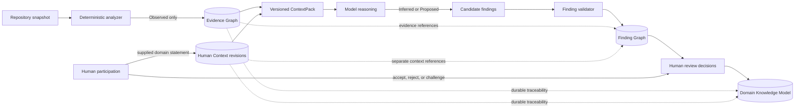
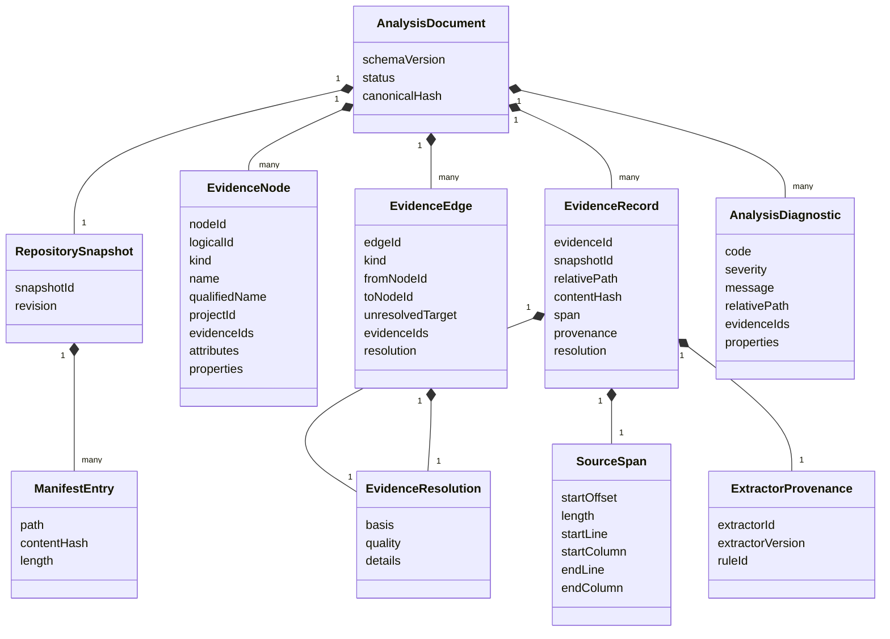
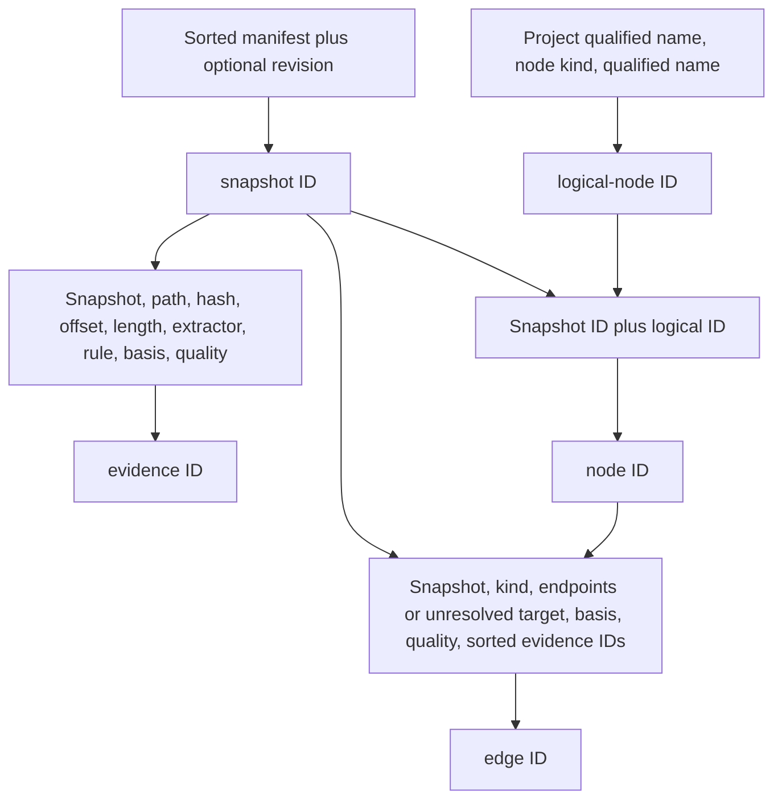

# Evidence Architecture

## Purpose and non-negotiable boundary

The Evidence Graph is DomainLens's record of what deterministic analyzers can
establish from a specific repository snapshot. It exists so every later claim
can be traced to stable source provenance without asking a model to parse or
remember an entire repository.

> **Code establishes evidence. AI interprets evidence. The agent orchestrates
> the process.**

The current implementation is the authority for the Milestone 1/Milestone 2 wire model.
Milestone 0 also contains a separate legacy-semantic feasibility artifact; it does not alter
`domainlens.evidence.v1` or automatically turn every compiler binding into an Evidence Graph
record. Milestone 2 reuses that in-process compiler context and projects only its documented WCF
observations into the same graph. These boundaries are summarized in the
[Milestone 0 Feasibility Report](../12-milestone-0-deployment-security-feasibility.md) and the
[Milestone 2 Classic WCF Discovery contract](../13-milestone-2-wcf-discovery.md).
This chapter labels unimplemented designs as **PLANNED — Product V1** or
**FUTURE**. See [Analysis Pipeline](04-analysis-pipeline.md) for stage ordering
and [Repository Structure Scanner 0.1](../11-milestone-1-repository-scanner.md)
for the scanner-specific summary.

## Evidence, findings, and knowledge are different records

These words have precise architectural meanings:

| Classification | Meaning | Who may create it |
|---|---|---|
| **Observed** | A deterministic statement tied to captured source/configuration bytes and an analyzer rule. It may be exact, partial, ambiguous, or unresolved. | Deterministic analyzer application code only. |
| **Inferred** | A semantic interpretation supported under the applicable reasoning policy, with reasoning, counterevidence, and limitations. Deterministic source support and Human Context support are referenced separately. | The reasoning runtime may propose it; validators and humans govern acceptance. Whether Human Context alone may support a finding remains an open policy decision. |
| **Proposed** | A recommendation or target interpretation that is not claimed to describe the source as fact. | The reasoning runtime or a human may propose it. |

`ResolutionQuality` is not this classification. For example, an unresolved
declared type reference is still an **Observed** fact about source syntax; it is
not an AI inference. Conversely, a strongly supported bounded-context candidate is
still **Inferred** or **Proposed**, never Observed.

Milestones 1 and 2 implement only the Evidence Graph. Its schema does not yet carry
an `Observed` field because every graph record created by the scanner is
or WCF analyzer is deterministic by construction. The Finding Graph and its explicit
classification contract are PLANNED.

### Model-output prohibition

An LLM/model response cannot create, update, or relabel an Evidence Graph
record as Observed. It may cite immutable evidence IDs in a structured finding.
If a semantic review exposes missing evidence, the coordinator may schedule a
deterministic analyzer; only that analyzer can add new evidence for a versioned
snapshot. Human-entered domain statements used in reasoning are durable, versioned Human Context
records with their own provenance and identifiers. They remain distinct from source evidence,
model interpretation, epistemic classification, and human review decisions. The final name
(`Human Context` versus `Domain Assertion`) and physical schema remain open.

## CURRENT — Milestone 1 and 2 evidence document

The current schema identifier is `domainlens.evidence.v1`. The implementation
uses immutable-style C# records and canonical JSON; it does not publish a
separate JSON Schema artifact yet.

### Repository snapshot and manifest

`RepositorySnapshot` contains a `SnapshotId`, an optional `Revision`, and a
sorted manifest. Each `ManifestEntry` stores:

- a normalized repository-relative path using `/` separators;
- the lowercase SHA-256 digest of the exact bytes read; and
- the number of bytes read.

Milestone 1 hashes every included readable file, not only C# files. It retains
file bytes for selected solution/project/source/configuration extensions so
they can be parsed without reopening them. Default inventory bounds are
100,000 files, 16 MiB per file, 1 GiB total bytes read, and a traversal bound
of the greater of 10,000 entries or four times the file-count limit.

The current scanner deliberately sets `Revision` to `null`. The manifest is the
authoritative identity of what it captured. It must not be described as a Git
commit snapshot, an atomic filesystem snapshot, or proof that files did not
change during enumeration. Git revision selection and acquisition are PLANNED.

### Source evidence and provenance

An `EvidenceRecord` binds one deterministic observation to:

- the snapshot ID;
- a repository-relative manifest path and matching content hash;
- a `SourceSpan`;
- extractor ID, extractor version, and rule ID; and
- resolution basis, quality, and optional explanatory details.

Offsets and lengths are zero-based UTF-16 code-unit positions in the decoded
text. Lines and columns are one-based, with exclusive end coordinates. The
content hash always covers original file bytes, not normalized text.

Current extractors identify themselves as
`domainlens.repository-structure@0.1.0` and
`domainlens.csharp-syntax@0.1.0`. Milestone 2 adds
`domainlens.classic-wcf@0.1.0` with rule IDs under the `wcf.source.*`, `wcf.svc.*`, and
`wcf.config.*` namespaces. The version identifies extraction behavior;
the rule ID identifies the particular observation, such as a project
declaration, source membership, type declaration, method parameter type, WCF contract declaration,
or configured endpoint relationship.

### Resolution basis and quality

The language-neutral basis vocabulary is:

- `Unknown`
- `Manifest`
- `DeclarativeConfiguration`
- `Syntax`
- `Semantic`
- `Metadata`
- `Composite`

Milestone 1 emits `DeclarativeConfiguration` and `Syntax`. Milestone 2 additionally uses
`Semantic` and `Composite` for the bounded rule that established each WCF observation
or relationship. `Semantic` means deterministic compiler binding inside the controlled Worker; it
does not mean free-form LLM reasoning. A unique same-file configuration declaration can be
`DeclarativeConfiguration/Exact`; configuration-to-source matching is `Composite/Partial` even
when one source candidate exists because effective project and runtime selection remain unknown.

The quality vocabulary is:

- `Exact` — the supported deterministic rule resolved the observation within
  its stated scope;
- `Partial` — the observation is useful but known coverage or selection is
  incomplete;
- `Ambiguous` — more than one supported target is possible; and
- `Unresolved` — a declaration was observed but no supported target could be
  established.

Exact does not mean globally or behaviorally complete. An exact syntax
observation says the supported source construct was read exactly; it does not
assert runtime behavior, semantic compilation success, or business meaning.

### Coverage is not resolution or evidence

Resolution Quality describes one deterministic observation or relationship. Coverage describes
how much of a declared artifact/evidence space an analyzer could examine. A run can therefore
contain exact observations while having low coverage, or broad coverage containing ambiguous and
unresolved relationships.

Coverage measurements, attempted-unit counts and quality metrics describe DomainLens analysis;
they are not Observed facts about the analyzed business and must not be inserted into the Evidence
Graph as domain evidence. Analyzer diagnostics and versioned analysis metadata must retain enough
information to explain:

- the declared scope and analysis dimension;
- eligible, attempted, analyzed, excluded, unsupported and failed units;
- the measurement basis and analyzer/rule versions;
- unknown or unavailable denominator material; and
- the effect of omissions on downstream reasoning.

Artifact coverage, parser/analyzer coverage, semantic-finding Support, calibrated Confidence when
available,
analysis Completeness and Resolution Quality remain separate dimensions. Their conceptual
definitions and evaluation rules are specified in the
[Quality and Evaluation Strategy](../quality/01-evaluation-strategy.md). Physical records and
numeric thresholds remain **OPEN DECISIONS**.

### Evidence nodes

An `EvidenceNode` contains canonical and logical identities, an analyzer-owned
stable `Kind`, display and qualified names, optional project scope, evidence
references, syntactic attribute names, and a string property bag. The core is
not WCF- or C#-specific; it does not enumerate allowed node kinds.

Milestone 1 currently emits these categories:

- repository structure: `Repository`, `Solution`, `Project`,
  `AssemblyReference`, and `PackageReference`;
- syntax containers/types: `Namespace`, `Class`, `Interface`, `Struct`,
  `Record`, `RecordStruct`, `Enum`, and `Delegate`; and
- members: `Constructor`, `Destructor`, `Method`, `Property`, `Indexer`,
  `Field`, `Event`, `Operator`, `ConversionOperator`, and `EnumMember`.

Generic type arity is represented in canonical qualified/metadata identities,
for example `Box` followed by `` `1 ``. Instance and static constructors use
`.ctor(...)` and `.cctor()` identities. Partial declarations merge source
evidence into one node when their stable key is the same.

Milestone 2 enriches an existing source type, method, field, or property when the WCF observation
is unambiguously the same declaration. Stable source-node attributes include
`wcf.service-contract`, `wcf.operation-contract`, `wcf.data-contract`, `wcf.data-member`,
`wcf.message-contract`, `wcf.message-header`, `wcf.message-body-member`, and `wcf.client-base`.
Allowlisted static metadata is stored under analyzer-owned `wcf.*` property keys.

When no structural declaration naturally represents the observation, Milestone 2 adds these node
kinds:

- `WcfFaultDeclaration`;
- `WcfConfiguredService`, `WcfEndpoint`, `WcfBinding`, and `WcfBehavior`;
- `WcfHostingDeclaration`, `WcfServiceActivation`, and `WcfExtensionDeclaration`; and
- `WcfServiceHostSite` and `WcfChannelFactorySite`.

These are implementation observations. They are not business capabilities, commands, domain
events, domain services, entities, value objects, aggregates, bounded contexts, or any other DDD
classification.

The repository node is synthetic and currently has no source evidence. This is
valid and explicitly displayed as such by `inspect`. Architecture claims
should therefore say source-backed observations are traceable, not that every
node necessarily points to a source span.

### Evidence edges

Every edge has a source node and exactly one of:

- `ToNodeId` for a resolved target; or
- `UnresolvedTarget` for the stable textual target that could not be resolved.

It also carries evidence references and resolution. Milestone 1 emits:

- `Contains`
- `ReferencesProject`
- `ReferencesAssembly`
- `ReferencesPackage`
- `Inherits`
- `Implements`
- `DeclaredTypeDependency`

Declared type dependencies cover supported declaration signatures and base
lists. They are not a method-body call graph, data flow, runtime dependency
graph, or proof that an external type binds successfully.

Milestone 2 adds the following bounded WCF relationship kinds:

- contract/shape: `WcfContractOperation`, `WcfCallbackContract`, `WcfDeclaresFault`,
  `WcfFaultDetailType`, `WcfUsesDataContract`, `WcfUsesMessageContract`, `WcfDataMember`,
  `WcfMessageHeader`, and `WcfMessageBodyMember`;
- source implementation/client: `WcfImplementsContract`, `WcfImplementsOperation`,
  and `WcfClientContract` (used for both `ChannelFactory<T>` and `ClientBase<T>` contract links); and
- hosting/configuration: `WcfHostsService`, `WcfConfiguredServiceImplementation`,
  `WcfConfiguredServiceEndpoint`, `WcfEndpointContract`, `WcfEndpointBinding`,
  `WcfEndpointBehavior`, `WcfServiceBehavior`, and `WcfServiceActivationImplementation`.

For an ambiguous or unresolved target, `ToNodeId` remains `null` and `UnresolvedTarget` retains the
bounded stable textual target. An exact framework attribute identity does not upgrade a
source-to-source, configuration-to-source, or runtime-selection relationship beyond the quality
supported by its own rule.

### Diagnostics and analysis status

`AnalysisDiagnostic` represents coverage loss, degradation, informational
security observations, or fatal failures. It has a stable code, severity,
message, optional manifest path, optional evidence IDs, and properties. The
core model permits diagnostic evidence references; the Milestone 1 scanner's
converted diagnostics currently use paths, line/column properties, and
`subjectPath` where applicable rather than populating evidence IDs.

`Success`, `PartialSuccess`, and `Failure` summarize deterministic analysis
coverage as described in [Analysis Pipeline](04-analysis-pipeline.md). They are
not Finding Graph acceptance states.

Milestone 2 diagnostics use stable `DL4xxx` codes for framework-profile mismatch, unresolved
attribute identity/value, source/configuration relationship degradation, malformed or unsupported
`.svc` and XML forms, external configuration, inert custom extensions, unsupported source patterns,
and manifest-read failure. `DL4401` also covers trusted `OperationContract`/`FaultContract`
attributes outside the selected contract/operation surface; their source-backed evidence remains
`Partial` and the structural node is not promoted. Configuration-specific hardening adds
`wcf.config.traversal-limit`/`DL4306` for a capped walk and
`wcf.config.transform`/`DL4307` for inert XDT controls. Any XDT control under the captured
`system.serviceModel` section suppresses configuration node/edge promotion for that section;
DomainLens never applies the transform. A namespace preflight is capped at 4,096 elements and
unsupported behavior-subtree inspection at 256; reaching a cap produces `Partial` evidence and a
typed diagnostic rather than an unbounded walk. Meaningful M2 exclusions, ambiguity, unsupported
constructs, or unavailable information produce `PartialSuccess` when trustworthy evidence remains.
Finding no WCF construct in supported scope is not evidence that the application does not use WCF.

## CURRENT — canonical identity

Canonical identities are application-owned strings with a type prefix and a
lowercase SHA-256 digest. Dedicated CLR wrapper types are not implemented. The
hash input uses NFC-normalized strings, an explicit null/value marker, and a
four-byte big-endian length before each UTF-8 value; this avoids delimiter and
component-boundary ambiguity.

The prefixes are `snapshot:`, `evidence:`, `logical-node:`, `node:`, and
`edge:`. A logical node ID is intended to remain stable across snapshots when
the persisted project scope, kind, and qualified name remain stable. A node ID
is snapshot-specific. Edges and evidence are snapshot-specific.

Important precision points:

- Evidence identity includes offset and length but not human-readable
  line/column values or resolution details.
- Edge identity includes sorted evidence IDs and resolution basis/quality but
  not resolution details.
- Node identity does not include its display name, attributes, evidence IDs,
  or property bag.
- The graph validator recomputes identities from exactly these persisted
  identity fields. The document hash still covers the complete normalized
  document, including non-identity fields.

Changing an identity recipe is therefore a schema/versioning event, even when
the JSON field shapes remain the same.

## CURRENT — canonical JSON and document hash

Serialization normalizes the document before writing:

- manifest entries, evidence, nodes, edges, and diagnostics use stable ordinal
  ordering;
- evidence-reference lists and attributes are sorted;
- property dictionaries and every JSON object's properties are sorted
  ordinally;
- paths and hexadecimal hashes are normalized;
- property names and string enum values use camel case; and
- `canonicalHash` itself is set to `null` while its digest is computed.

The resulting `CanonicalHash` is lowercase SHA-256 over the unindented
normalized JSON bytes. Pretty printing does not change it. This is a
DomainLens canonical representation; it is not claimed to implement RFC 8785
or another external canonical-JSON standard.

The hash detects changes within the artifact. It is not a digital signature,
does not authenticate who produced the artifact, and does not revalidate files
in a repository.

## CURRENT — graph validation

`AnalysisGraphValidator` rejects an artifact when internal invariants fail. It
currently verifies:

- supported schema version and defined analysis status;
- presence of a snapshot and correctly derived snapshot ID;
- canonical, unique manifest paths; SHA-256 formats; and nonnegative lengths;
- unique evidence IDs, matching snapshot/path/hash, structurally valid spans,
  nonempty provenance, defined resolution values, and derived evidence IDs;
- unique node IDs, required node identity fields, resolvable project/evidence
  references, and derived logical/node IDs;
- unique edge IDs, valid source and resolved target references, exactly one
  resolved or unresolved target, defined resolution, valid evidence
  references, and derived edge IDs;
- valid diagnostic fields, severities, paths, and evidence references; and
- presence, format, and correctness of the canonical document hash.

Scanner output is canonicalized and validated before it is returned. The
`inspect` command verifies both the document hash and graph before displaying a
node.

Validation is deliberately internal. It does **not** reopen source files,
recompute manifest hashes from a repository, verify that source spans fit the
actual captured text, prove that a statement is semantically correct, enforce
that status matches diagnostics, authenticate the producer, or provide a
malware verdict. Those must not be implied by the word "validated."

## CURRENT — deterministic type-linking scope

The C# syntax extractor uses a conservative, analyzer-local name resolver. It
considers lexical namespace/nesting, visible ordinary/global using directives,
using aliases, generic arity, and source types in the current project or an
eligible **direct** literal project reference. Conditional references,
dependency selection affected by unevaluated MSBuild, references with
`ReferenceOutputAssembly` other than `true`, and alias-only references without
`global` are not treated as globally accessible type sources.

This is not Roslyn compilation or full C# binding. External types, metadata
binding, accessibility, all alias forms, generated code, preprocessor symbol
evaluation, and transitive compile behavior are not established. The extractor
preserves ambiguous/unresolved edges instead of upgrading a textual match to a
fact.

## CURRENT — shared Milestone 0 semantic foundation and Milestone 2 projection

Milestone 0 proves a separate, deterministic `LegacySemanticAnalysisResult` for a narrow .NET
Framework 4.7.2 profile. Milestone 2 factors the same controls into one
`LegacySemanticCompilationContext`: a manifest-verified, ordered set of C# sources, deterministic
C# 7.3 `CSharpCompilation`, semantic models, diagnostics, and the exact tool-owned
`Microsoft.NETFramework.ReferenceAssemblies.net472` catalog. The Worker creates exactly one context
and shares it between the legacy semantic projection and the Classic WCF analyzer. Roslyn objects
remain in-process and are never serialized through the worker protocol.

The compilation scope remains `RepositoryManifestCSharpSources` with `Partial` source resolution
because effective project membership, references, target configuration, conditional items, and
preprocessor settings are not reproduced. It never evaluates repository MSBuild, restores/builds
or emits the repository, or admits repository binaries, analyzers, or generators as compiler
inputs. The reusable manifest reader applies the same containment, exact-length, SHA-256, bounded
read, cancellation, and reparse checks to captured `.cs`, `.svc`, and `.config` bytes selected from
the accepted manifest.

The child worker returns semantic JSON and its SHA-256 digest alongside the
Evidence Graph envelope. **PROVEN:** the trusted host requires both artifacts,
checks both envelope hashes, strict-deserializes them, applies
`AnalysisGraphValidator`, and applies the manifest-aware
`LegacySemanticAnalysisValidator` before accepting the attempt. Missing,
malformed, hash-invalid, unsafe, or graph/semantic-invalid output receives a
typed process outcome. Structurally valid documents are normalized before the
trusted validators run; malformed or invalid content is not repaired into
evidence. The graph snapshot ID
must equal the identity derived by the trusted staging pass, and the semantic
metadata descriptors and resolved external assemblies must match the exact
catalog reconstructed by trusted code. Catalog exactness covers a fixed
SHA-256 commitment over the complete package DLL set plus deployed
assembly-name/relative-path descriptors. That drift check is not artifact
signing or independent deployment attestation; those remain production
supply-chain responsibilities.

The generic legacy result still records compiler bindings and diagnostics, not business meaning,
and remains separate from the Evidence Graph. Milestone 2 alone projects normalized WCF facts from
that context and captured declarative artifacts. It does not satisfy the planned method-body/
behavioral evidence contract or authorize a finding. Non-WCF projection/reconciliation,
additional trusted framework profiles, broader coverage accounting, and schema evolution remain
**OPEN**.

## CURRENT — bounded deterministic graph composition

Milestone 2 adds a small language-neutral `EvidenceGraphContribution` and
`AnalysisDocumentComposer` for the built-in analyzer. Composition:

1. preserves all accepted baseline evidence, nodes, edges, and existing identities;
2. permits enrichment of an existing node only when its identity fields agree;
3. set-unions and ordinally sorts attributes and evidence IDs;
4. accepts a property only when absent or byte-for-byte equal to the existing value;
5. produces unique ID-keyed final records and rejects conflicting ID reuse, repeated references,
   conflicting logical nodes/identity fields/properties, and incompatible resolved versus
   unresolved endpoints;
6. computes canonical identities for new edges and evidence; and
7. normalizes, hashes, and validates the complete document before it crosses the Worker boundary.

This is sufficient for the concrete built-in WCF analyzer. It does not settle generalized analyzer
registration, kind governance, contribution compatibility, cross-analyzer precedence, migration,
or plug-in loading.

## PLANNED — Finding Graph traceability

A structured finding should minimally retain:

- a finding identity and revision;
- semantic view (`RecoveredDomainKnowledge` or `ProposedDddDesign`);
- `Inferred` or `Proposed` classification;
- a typed concept and structured relationships;
- supporting evidence IDs and counterevidence IDs;
- separate supporting and contradictory Human Context IDs/revisions where used;
- reasoning summary, assumptions, alternatives, Support, Coverage, Completeness, linked deterministic Resolution Quality summaries, and stated limitations;
- calibrated Confidence only when its applicable versioned calibration method and expert-reviewed corpus exist, calibration has been evaluated, and product exposure is approved; otherwise Confidence is unavailable/not calibrated or omitted by the eventual schema;
- unresolved questions;
- ContextPack identity;
- analyzer, model, prompt, and skill versions; and
- validation and human-review state.

The exact schema remains an OPEN DECISION. Validation must reject Evidence or Human Context
references that are unknown, use the wrong record type, or were absent from the sealed ContextPack.
It must support multiple competing interpretations without overwriting evidence, Human Context,
or a previous finding revision. Superseding Human Context may lead to a new finding but cannot
rewrite the exact revisions used by an earlier pack or finding.
Accepting a finding into the Domain Knowledge Model records a decision; it does
not change its origin classification or semantic view. In particular, accepted
Proposed DDD Design remains `Proposed` and cannot appear as recovered/as-is
knowledge.

## PLANNED — analyzer extension contract

The concrete WCF analyzer already adds normalized records through the bounded composition path
above. Future deterministic analyzers for ASP.NET, Java, persistence, OpenAPI, and messaging, plus
the planned Milestone 3 capability, must add normalized graph records through the Evidence Kernel.
They must:

1. consume an identified repository snapshot or another explicitly versioned
   deterministic input;
2. declare analyzer and rule versions;
3. emit stable analyzer-owned kinds and relationships;
4. attach repository-relative provenance and resolution to source-backed
   observations;
5. preserve unresolved, ambiguous, partial, and contradictory evidence;
6. comply with canonical identity and graph validation; and
7. run without converting model output into evidence.

The analyzer interface, kind namespace/registry, compatibility negotiation,
and schema migration mechanism are not implemented yet. The current open
string `Kind` and property-bag model is an interoperability base, not a complete
plugin system.

## Open decisions

1. **Schema publication:** whether to publish JSON Schema, generated contracts,
   or both, and the compatibility policy for `domainlens.evidence.v1`.
2. **Identity evolution:** versioning and migration rules when an analyzer fixes
   or changes a canonical qualified-name recipe.
3. **Analyzer kind governance:** namespace, registration, collision prevention,
   and validation of node, edge, property, and rule identifiers.
4. **Snapshot atomicity:** acquisition mechanism that makes a Product V1 Git
   snapshot repeatable while remaining safe for untrusted repositories.
5. **Source retention:** whether original source blobs are retained, encrypted,
   deduplicated, or discarded after extracting spans and hashes.
6. **Artifact authenticity:** whether persisted graphs need signing or an
   authenticated envelope in addition to the current content hash.
7. **Diagnostic provenance:** when diagnostics must cite evidence IDs rather
   than only manifest paths and coordinates.
8. **Cross-analyzer reconciliation:** how equivalent concepts and conflicting
   observations from different analyzer families are represented without
   destructive merging.
9. **Finding Graph schema:** classification, conditional calibrated-Confidence representation,
   contradiction model, separate Evidence/Human Context references, revision identity, and
   acceptance workflow. Raw model self-confidence cannot populate Confidence, and Support cannot
   be relabeled as Confidence.
10. **Evidence correction:** how an analyzer defect supersedes an earlier graph
    while preserving audit history and links from existing findings.
11. **Large-graph partitioning:** storage and retrieval boundaries that retain
    canonical provenance without forcing whole-document loading.
12. **Sensitive evidence:** redaction and authorization rules for secrets,
    personal data, and source excerpts before persistence or model egress.
13. **Human Context contract:** final name, physical schema, validation/status vocabulary,
    conflicting statements, revision/supersession and stale-dependent handling, retention/export,
    and how it may affect Support. Actor/session/principal attribution remains conditional on the
    eventually approved identity model.
