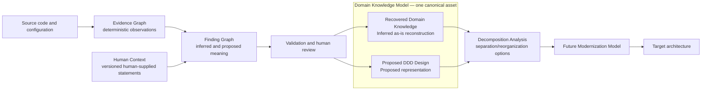
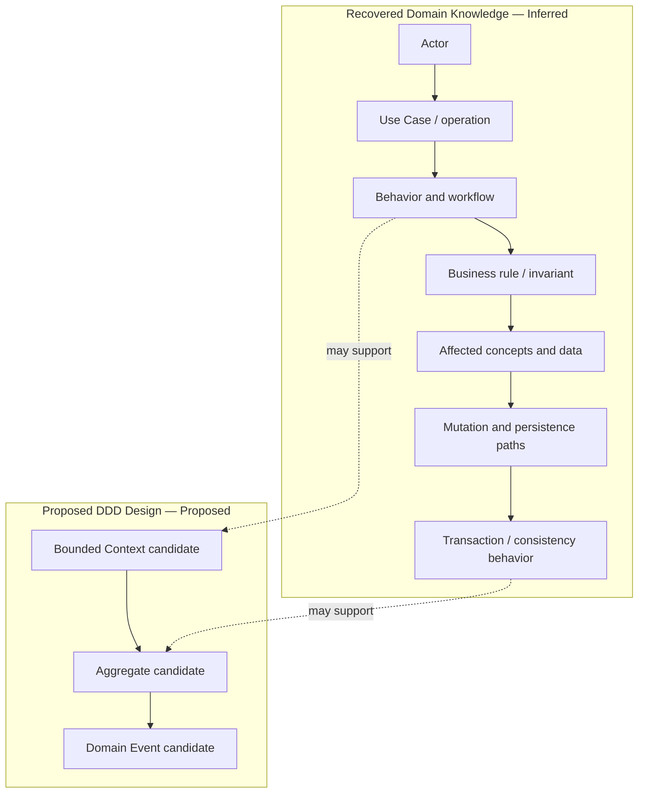
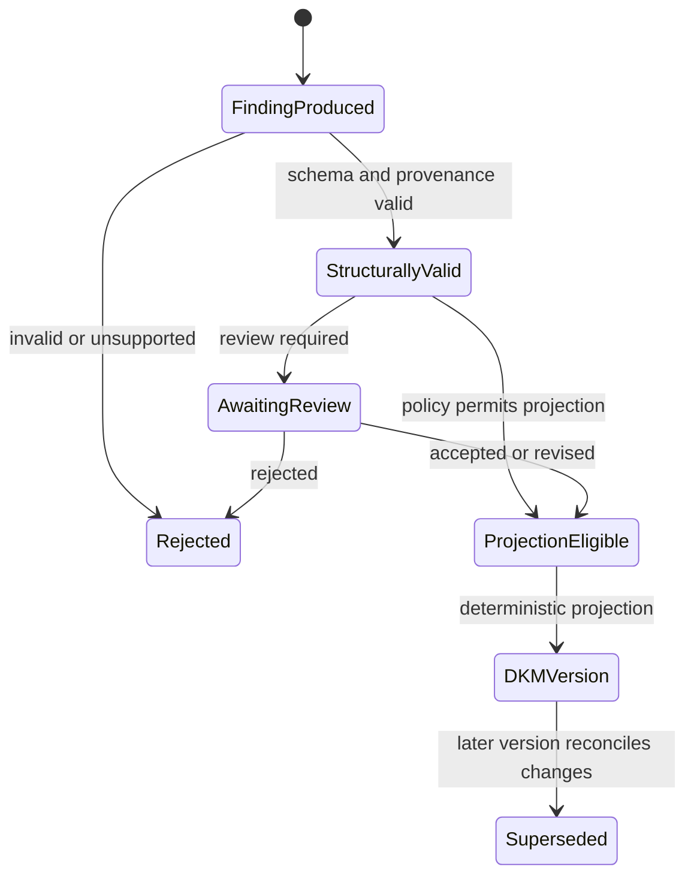

# Domain Knowledge Architecture

## Status and scope

**PLANNED V1.** The persistent Domain Knowledge Model (DKM) is approved product architecture but is not implemented by the current M0/M1 slice. The implemented analysis pipeline stops at a deterministic Evidence Graph; Milestone 0 also produces a separate validated semantic feasibility artifact that is not projected into that graph. This document defines the knowledge boundary, semantic views, and categories; it does not prescribe a physical database schema.

The DKM is one durable, queryable intermediate asset projected from validated semantic findings. It contains both evidence-backed reconstruction and explicitly labeled DDD recommendations; it is neither a copy of the Evidence Graph nor generated narrative. Every concept and relationship retains a path through source findings to supporting and contradictory Evidence IDs and, where used, separately versioned Human Context IDs.

## Source-model neutrality

> DomainLens shall not require or assume that an analyzed application was originally designed using Domain-Driven Design. DDD concepts may be recovered, inferred, or proposed from implementation evidence even when corresponding DDD constructs do not explicitly exist in the source system.

The source may be traditional N-tier, transaction-script based, anemic, service-oriented,
procedural, a tightly coupled monolith, partially domain-oriented, or explicitly DDD. A declaration
named `AggregateRoot`, `Entity`, `ValueObject`, `DomainEvent`, or `BoundedContext` is not proof that
the named DDD role exists, and none of those names is a prerequisite. DomainLens reconstructs
knowledge from supported behavior, business rules, invariants, data relationships, mutation paths,
transaction/consistency boundaries, workflows, state transitions, service operations, persistence,
messages, security policies, dependencies, and coupling.

## Position in the knowledge flow



Reverse DDD asks what domain knowledge can be reconstructed and how that domain can be represented
using DDD. Decomposition Analysis asks how the existing application could be separated or
reorganized. Modernization asks what future implementation architecture should be built. These
questions use a traceable progression, but their outputs must not be merged or written back as
Observed evidence.

## One canonical model, two semantic views

The view is a semantic discriminator within each DKM version, not a second database or an
independent model lifecycle:

| DKM view | Question answered | Required epistemic classification | Must not imply |
|---|---|---|---|
| **Recovered Domain Knowledge** | What business concepts, behavior, rules, relationships, and boundaries does the existing system appear to embody? | `Inferred` for semantic claims, linked to separate `Observed` evidence | That matching source names are sufficient proof, or that recovery is a recommendation |
| **Proposed DDD Design** | How could the recovered domain be usefully represented with DDD concepts? | `Proposed` | That the DDD construct exists in the source, even when the proposal is accepted |

An explicitly DDD source can yield recovered knowledge about an existing aggregate or context when
behavior and relationships support that interpretation. The same concept kind can instead be a
proposal when DomainLens recommends a representation that is not present. Claim intent and support,
not vocabulary, determine the view. A finding that combines an as-is claim and a recommendation
must be split into atomic findings before projection.

Both views retain source Finding IDs, supporting and contradictory Evidence IDs, separately typed
Human Context IDs/revisions where used, classification, assumptions, Support, Coverage,
Completeness, linked Resolution Quality, alternatives, review state, producer versions, and
revision history. Calibrated Confidence is retained only when the evaluation-readiness and product-
exposure gate is met; otherwise it is unavailable/not calibrated or omitted by the eventual schema.
Human acceptance changes review state only: Recovered Domain Knowledge remains
`Inferred`, and Proposed DDD Design remains `Proposed`.

### Example

| Layer | Example conclusion |
|---|---|
| Observed evidence | `CustomerService.UpdateAddress` calls `CustomerManager.UpdateAddress`, changes `Customer` and `Address`, and persists them together. |
| Recovered Domain Knowledge (`Inferred`) | Customer is an important domain concept, and Address participates in the Customer lifecycle. |
| Proposed DDD Design (`Proposed`) | Model Customer as an Aggregate Root and Address as a Value Object within the Customer aggregate. |

The proposal remains a proposal even if the code contains similarly named classes or a reviewer
accepts it. Acceptance records approval to use the interpretation; it does not rewrite history.

## Knowledge categories

The approved V1 model covers the following categories. Category, semantic view, epistemic
classification, and review state are separate. Business behavior and implementation relationships
usually populate Recovered Domain Knowledge. Strategic or tactical DDD concepts may be recovered
when the existing behavior supports them, or proposed as a design representation; the view and
classification make that difference explicit.

### Business architecture

- Business Capabilities
- Actors
- Use Cases
- Domain Vocabulary / Ubiquitous Language
- Domains
- Subdomains classified as Core, Supporting, or Generic

#### Domain Vocabulary / Ubiquitous Language

Domain Vocabulary is a first-class DKM concept that can represent:

- business terms and candidate definitions;
- synonyms, aliases, abbreviations and acronyms;
- source usages and evidence locations;
- usage by business capability, bounded-context candidate or other semantic scope;
- conflicting and context-specific meanings; and
- terms whose meaning remains ambiguous or unresolved.

An attributable human explanation of a business term may be supplied as Human Context and linked
to the vocabulary finding that used it. It is not an Observed definition or Evidence Graph record,
and its exact revision and provenance remain visible alongside source usages.

Vocabulary follows the same evidence boundary as every semantic concept:

```text
Observed identifier, text, contract or usage
    -> Inferred domain term and candidate meaning
        -> possible bounded-context interpretation or Proposed normalized language
```

For example, `Account` may mean a login/user account in an identity context, a customer billing
account in billing, and a financial account in banking. A stable difference in meaning, rules,
ownership and workflows can support a bounded-context boundary; the repeated word alone cannot
prove one. Comments and names may guide retrieval, but vocabulary meaning cannot be derived
deterministically from identifiers alone.

### Strategic DDD

- Bounded Contexts and Context Maps
- Upstream/Downstream relationships
- Shared Kernel
- Customer/Supplier
- Conformist
- Published Language
- Anti-Corruption Layer

### Tactical DDD

- Aggregates and Aggregate Roots
- Entities and Value Objects
- Domain Services
- Repositories
- Factories

### Behavior

- Commands and Domain Events
- Handlers
- Business Rules and Invariants
- Policies
- Workflows and business processes
- State Transitions and Lifecycles
- Decisions
- Preconditions and Postconditions
- Validation Rules

### Application and integration

- Application Services
- APIs and Operations
- DTOs and Contracts
- Messages and Integration Events
- External Systems
- Synchronous and asynchronous relationships

### Security of the analyzed system

- Authentication
- Authorization
- Roles and Permissions
- Security Policies
- Sensitive Data Rules

These concepts describe security behavior found or interpreted in the analyzed application. They are distinct from the controls that protect DomainLens itself, which are defined in [Security Architecture](09-security-architecture.md).

### Data and consistency

- Data Ownership
- Persistence
- Transaction Boundaries
- Consistency Boundaries
- Shared Data

### Cross-cutting architecture knowledge

- Dependencies and Coupling
- Calls and Side Effects
- Configuration
- Scheduled Processes
- Error and Exception Behavior
- Audit Requirements
- Concurrency and Locking
- Caching
- Transaction Consistency

These entries describe the analyzed system, not the DomainLens deployment described in [Runtime Architecture](03-runtime-architecture.md) and [Deployment Architecture](10-deployment-architecture.md).

## Relationship model

Concepts are useful for architecture discovery only when their relationships remain explicit. V1
must preserve implementation-centered relationships before reasoning maps them to DDD concepts:



Other first-class relationships include ownership versus consumption of data, context-to-context dependencies, application-service orchestration, message producers/consumers, external calls, and shared-table or shared-store coupling. Project, namespace, package, and database boundaries may support these interpretations, but do not automatically become business or bounded-context boundaries.

## Concept and relationship records

A logical DKM record needs enough information to remain reviewable and reproducible:

- stable concept or relationship identity within a DKM version;
- concept/relationship kind and normalized names;
- semantic view (`RecoveredDomainKnowledge` or `ProposedDddDesign`);
- source Finding IDs and their classification (`Inferred` or `Proposed` for model-produced claims);
- supporting and contradictory Evidence IDs;
- separate supporting and contradictory Human Context IDs/revisions where used;
- Support, Coverage, Completeness, assumptions, alternatives, known limitations, and
  summaries of the linked evidence's deterministic Resolution Quality;
- calibrated Confidence only after an applicable versioned calibration method and expert-reviewed
  corpus exist, calibration has been evaluated, and product exposure is approved;
- validation and human-review state, independent of classification;
- producer, analyzer/model/skill/prompt versions as applicable;
- creation, revision, supersession, and DKM-version lineage.

The exact schema, cardinalities, and Confidence rubric are **OPEN DECISIONS**. Whatever representation is selected must preserve atomic claims and the distinction between Evidence and Human Context provenance rather than collapsing several claims into an untraceable paragraph. Validation must enforce `RecoveredDomainKnowledge` with `Inferred` semantic findings and `ProposedDddDesign` with `Proposed` findings; Observed implementation facts remain in the Evidence Graph and are referenced rather than copied into a stronger semantic claim. Human Context remains a separate record type and does not introduce another epistemic classification.

Coverage, Support, Confidence, Completeness and Resolution Quality have distinct meanings defined
by the [Quality and Evaluation Strategy](../quality/01-evaluation-strategy.md). High Support with
low Coverage must remain distinguishable from medium Support with high Coverage. Confidence is not
populated or exposed until its full gate is met; raw model self-confidence and renamed Support are
never substitutes. A missing finding or missing evidence within the analyzed scope is not evidence
that a concept does not exist.

## Projection and revision

Validated findings are candidates for projection into a DKM version. Projection must be deterministic application behavior over validated records, not an unreviewed model side effect. It must retain the semantic-view discriminator and findings that disagree so users can inspect uncertainty rather than receiving a falsely unified answer.

Human review changes a finding's review state and may create a revised or superseding finding. It never changes an `Inferred` claim into `Observed`, changes a `Proposed` claim into `Inferred` or `Observed`, or moves Proposed DDD Design into the recovered view. Absence of evidence is also not evidence that a rule, policy, or concept does not exist.

Human Context is revised independently of review state and findings. A corrected or superseding
record preserves its predecessor; it does not rewrite the sealed ContextPack, finding, or DKM
version that cited the earlier revision. Policy may mark dependents stale and initiate new reasoning
and projection, but the invalidation and conflict rules remain open.



The exact eligibility policy for unreviewed, rejected, superseded, or contradictory findings is an **OPEN DECISION**. All such findings must remain queryable in their revision history even if they do not contribute to the active projection.

## Persistence and presentation

The DKM is one structured, versioned platform asset. Persistence records each item's semantic view,
classification, Evidence and Human Context provenance, and review state. Explorer views, diagrams, Markdown, APIs, and explanations are
projections of it, not its canonical storage format, and must visibly distinguish recovered/as-is
knowledge from proposed DDD design. A combined presentation may correlate the views but cannot omit
their labels or imply that an accepted proposal existed in source. Each analysis run references the
repository snapshot, Evidence Graph, Human Context revisions, Finding Graph, and DKM version used, enabling later comparison
and re-analysis without rewriting historical results.

## Boundary with decomposition and modernization

| Stage | Governing question | Relationship to the DKM |
|---|---|---|
| Reverse DDD — recovery | What domain knowledge can be reconstructed from this system? | Produces the Recovered Domain Knowledge view. |
| Reverse DDD — DDD representation | How can that domain be represented using DDD? | Produces the Proposed DDD Design view. |
| Decomposition Analysis | Given that knowledge, how could the existing application be separated or reorganized? | Consumes a DKM version and produces separate options/trade-offs. |
| Modernization | What should the future implementation architecture become? | Consumes DKM and decomposition outputs in a later model. |

Proposed DDD Design is not moved into Decomposition Analysis merely because both are
recommendations. A proposed aggregate models domain semantics; a decomposition option recommends
changes to application boundaries, deployment, code, data, or ownership. Both retain their own
classification, validation, review, and revision lineage.

See [Evidence Architecture](05-evidence-architecture.md) for the immutable factual base, [Agent and Reasoning Architecture](07-agent-reasoning-architecture.md) for finding production, and [Persistence Architecture](08-persistence-architecture.md) for lifecycle and storage boundaries.

## Open decisions

- Concrete concept/relationship schema, cardinalities, naming/identity rules, and view-discriminator representation.
- Representation, rubrics, aggregation, and calibration for Confidence, Support, Coverage, and Completeness across knowledge categories; Confidence remains unavailable until its readiness and exposure gate is met.
- Projection eligibility, cross-view relationship, and conflict/reconciliation rules.
- DKM version lineage and cross-run/cross-snapshot logical identity.
- Human-review requirements by claim type and consequence.
- Final `Human Context` versus `Domain Assertion` name, physical schema, status/validation,
  conflict and supersession semantics, stale-dependent handling, how it may affect Support, and
  whether it may support a finding without repository evidence. Identity attribution remains
  conditional on the approved identity model.
- The later schema for decomposition alternatives and modernization models.

Related decisions: [ADR-003](../adr/003-separate-evidence-graph-from-finding-graph.md), [ADR-005](../adr/005-persist-domain-knowledge-model-as-canonical-intermediate-asset.md), and [ADR-010](../adr/010-separate-decomposition-from-domain-knowledge-reconstruction.md).
