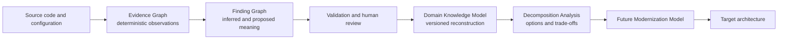
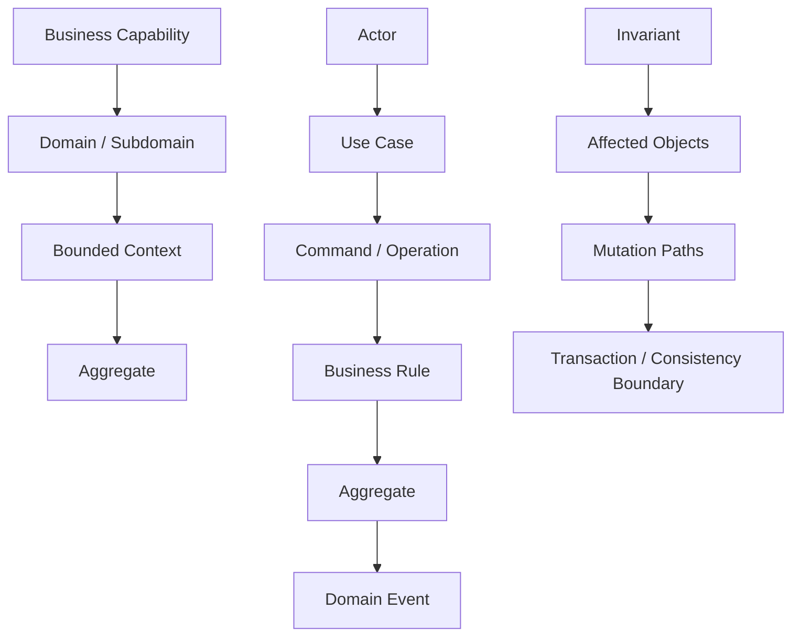
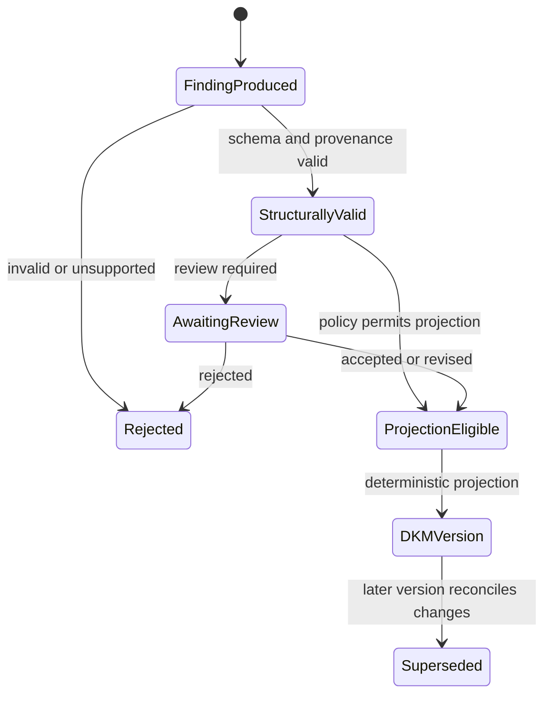

# Domain Knowledge Architecture

## Status and scope

**PLANNED V1.** The persistent Domain Knowledge Model (DKM) is approved product architecture but is not implemented by Scanner 0.1. The current implementation stops at a deterministic Evidence Graph. This document defines the knowledge boundary and categories; it does not prescribe a physical database schema.

The DKM is the durable, queryable description of the analyzed system that DomainLens has reconstructed from validated semantic findings. It is neither a copy of the Evidence Graph nor generated narrative. Every source-backed concept and relationship retains a path through findings to supporting and contradictory evidence.

## Position in the knowledge flow

The DKM describes what DomainLens discovered and how well it is supported. Decomposition Analysis asks how that reconstructed system might be separated or changed. Decomposition and modernization outputs must therefore reference a DKM version and supporting findings; they must not be written back as Observed evidence.

## Knowledge categories

The approved V1 model covers the following categories. The category determines meaning, not claim certainty: a candidate Aggregate and a candidate Security Policy may each be Inferred or Proposed and carry different review states.

### Business architecture

- Business Capabilities
- Actors
- Use Cases
- Domains
- Subdomains classified as Core, Supporting, or Generic

### Strategic DDD

- Bounded Contexts and Context Maps
- Upstream/Downstream relationships
- Shared Kernel
- Customer/Supplier
- Conformist
- Published Language
- Anti-Corruption Layer

### Tactical DDD

- Aggregates and Aggregate Roots
- Entities and Value Objects
- Domain Services
- Repositories
- Factories

### Behavior

- Commands and Domain Events
- Handlers
- Business Rules and Invariants
- Policies
- Workflows and business processes
- State Transitions and Lifecycles
- Decisions
- Preconditions and Postconditions
- Validation Rules

### Application and integration

- Application Services
- APIs and Operations
- DTOs and Contracts
- Messages and Integration Events
- External Systems
- Synchronous and asynchronous relationships

### Security of the analyzed system

- Authentication
- Authorization
- Roles and Permissions
- Security Policies
- Sensitive Data Rules

These concepts describe security behavior found or interpreted in the analyzed application. They are distinct from the controls that protect DomainLens itself, which are defined in [Security Architecture](09-security-architecture.md).

### Data and consistency

- Data Ownership
- Persistence
- Transaction Boundaries
- Consistency Boundaries
- Shared Data

### Cross-cutting architecture knowledge

- Dependencies and Coupling
- Calls and Side Effects
- Configuration
- Scheduled Processes
- Error and Exception Behavior
- Audit Requirements
- Concurrency and Locking
- Caching
- Transaction Consistency

These entries describe the analyzed system, not the DomainLens deployment described in [Runtime Architecture](03-runtime-architecture.md) and [Deployment Architecture](10-deployment-architecture.md).

## Relationship model

Concepts are useful for architecture discovery only when their relationships remain explicit. V1 must preserve at least these cross-layer chains:

Other first-class relationships include ownership versus consumption of data, context-to-context dependencies, application-service orchestration, message producers/consumers, external calls, and shared-table or shared-store coupling. Project, namespace, package, and database boundaries may support these interpretations, but do not automatically become business or bounded-context boundaries.

## Concept and relationship records

A logical DKM record needs enough information to remain reviewable and reproducible:

- stable concept or relationship identity within a DKM version;
- concept/relationship kind and normalized names;
- source Finding IDs and their classification (`Inferred` or `Proposed` for model-produced claims);
- supporting and contradictory Evidence IDs;
- support, coverage, confidence, assumptions, alternatives, and known limitations;
- validation and human-review state, independent of classification;
- producer, analyzer/model/skill/prompt versions as applicable;
- creation, revision, supersession, and DKM-version lineage.

The exact schema, cardinalities, and confidence rubric are **OPEN DECISIONS**. Whatever representation is selected must preserve atomic claims and provenance rather than collapsing several claims into an untraceable paragraph.

## Projection and revision

Validated findings are candidates for projection into a DKM version. Projection must be deterministic application behavior over validated records, not an unreviewed model side effect. It must retain findings that disagree so users can inspect uncertainty rather than receiving a falsely unified answer.

Human review changes a finding's review state and may create a revised or superseding finding. It never changes an Inferred or Proposed claim into Observed evidence. Absence of evidence is also not evidence that a rule, policy, or concept does not exist.

The exact eligibility policy for unreviewed, rejected, superseded, or contradictory findings is an **OPEN DECISION**. All such findings must remain queryable in their revision history even if they do not contribute to the active projection.

## Persistence and presentation

The DKM is a structured, versioned platform asset. Explorer views, diagrams, Markdown, and explanations are projections of it, not its canonical storage format. Each analysis run references the repository snapshot, Evidence Graph, Finding Graph, and DKM version used, enabling later comparison and re-analysis without rewriting historical results.

See [Evidence Architecture](05-evidence-architecture.md) for the immutable factual base, [Agent and Reasoning Architecture](07-agent-reasoning-architecture.md) for finding production, and [Persistence Architecture](08-persistence-architecture.md) for lifecycle and storage boundaries.

## Open decisions

- Concrete concept/relationship schema, cardinalities, and naming/identity rules.
- Confidence, support, coverage, and completeness semantics across knowledge categories.
- Projection eligibility and conflict/reconciliation rules.
- DKM version lineage and cross-run/cross-snapshot logical identity.
- Human-review requirements by claim type and consequence.
- The later schema for decomposition alternatives and modernization models.

Related decisions: [ADR-003](../adr/003-separate-evidence-graph-from-finding-graph.md), [ADR-005](../adr/005-persist-domain-knowledge-model-as-canonical-intermediate-asset.md), and [ADR-010](../adr/010-separate-decomposition-from-domain-knowledge-reconstruction.md).
