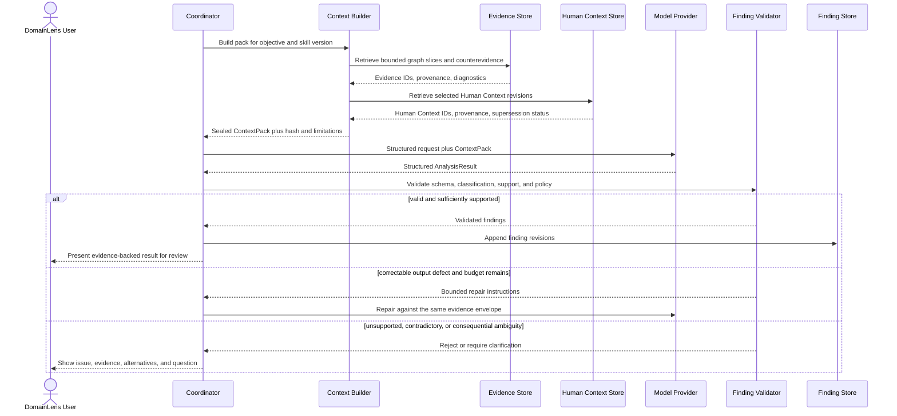

# Agent and Reasoning Architecture

## Status and scope

**PLANNED V1.** Scanner 0.1 contains no model invocation, coordinator, ContextPack, semantic finding, or reasoning skill. V1 adds a fixed, allowlisted orchestration workflow over persisted deterministic evidence. Dynamic agent creation, MCP, A2A, and open-ended multi-agent coordination are **FUTURE**, not V1 prerequisites.

The reasoning architecture enforces the governing rule:

> Code establishes evidence. AI interprets evidence. The agent orchestrates the process.

Reasoning is source-model neutral. Skills must not assume that the application used DDD, require
DDD marker types, or treat names such as `AggregateRoot`, `Entity`, `ValueObject`, `DomainEvent`,
or `BoundedContext` as sufficient proof. Those names may be included as weak, contextual evidence;
reconstruction must be grounded in relevant behavior, rules, invariants, data/mutation/transaction
relationships, workflows, state, operations, persistence, messages, security, dependencies, and
coupling.

## Responsibility boundaries

| Layer | Owns | Must not own |
|---|---|---|
| Deterministic application code | Repository/snapshot handling; analyzers; Evidence Graph; retrieval limits; pipeline state; permissions; schemas; provenance; validation; persistence; authorized tool execution | Unvalidated semantic interpretation masquerading as fact |
| Coordinator/orchestration | Select approved stage and skill; build task request; invoke deterministic capabilities and provider adapter; manage retries, pauses, and review | Arbitrary tool selection, self-created capabilities, or bypass of policy gates |
| Reasoning skill | Trusted, versioned contract for objective, evidence recipe, instructions, output schema, support rubric, and validation/repair policy | Direct repository access, permissions, persistence mutation, or executable code supplied by a repository |
| Model reasoning | Interpret the supplied ContextPack; identify alternatives, contradictions, and questions; return structured Inferred/Proposed findings | Create Observed evidence, access the repository, invoke tools, elevate permissions, or commit results directly |
| Human participation | Supply attributable domain context; challenge, accept, reject, or request re-analysis of findings | Rewrite deterministic evidence, conflate context with review state or model interpretation, or change claim classification merely by acceptance |

## V1 coordinator

The Pipeline Coordinator follows application-owned state and an allowlist of capabilities. It does not ask a model to invent the workflow. For a reasoning task it:

1. Selects a trusted skill and version for an explicit objective.
2. Requests a task-specific ContextPack from the Context Builder.
3. Constructs a structured request containing the objective, bounded evidence, prior findings, separately typed Human Context when applicable, constraints, and required response schema.
4. Invokes a model through a provider adapter with no repository or general-purpose tool access.
5. Validates syntax, schema, provenance, support, classification, and policy.
6. Runs a bounded repair/retry path for correctable output errors.
7. Persists valid finding revisions and routes consequential ambiguity to human review.

The initial skill set is:

- `domain-discovery` — reconstructs evidence-backed business/system knowledge, including Domain
  Vocabulary and context-specific meanings, without assuming a source design style and emits
  `Inferred` findings for the Recovered Domain Knowledge view.
- `ddd-modeling` — interprets existing DDD behavior when support exists and proposes strategic or tactical DDD representations over selected evidence and prior valid findings. Recommendations emit `Proposed` findings for the Proposed DDD Design view.
- `explain-finding` — reconstructs a concise explanation from a finding, its evidence/counterevidence, assumptions, and limitations.
- `semantic-evidence-review` — tests a semantic claim for support, contradiction, missing coverage, and alternative interpretations.

Skills are repository-independent trusted assets. Repository files may inform a task only as quoted or referenced untrusted data inside the ContextPack.

## ContextPack architecture

A ContextPack is the sealed, versioned input envelope for one reasoning objective. The model never receives unrestricted repository access. A pack should include only the minimum relevant material:

- pack schema version, pack ID/hash, objective, requested finding types, and token budget;
- repository snapshot, Evidence Graph, analyzer, and rule version references;
- selected Evidence IDs, graph slices, source snippets/spans, content hashes, and resolution quality;
- relevant prior finding revision IDs and their semantic-view, classification, and review-state metadata;
- selected versioned Human Context IDs, supplied statements, scope, provenance, and revision or
  supersession status, clearly typed as human-provided context rather than source evidence;
- evidence about behavior, rules/invariants, data/mutations/transactions, workflows/state, operations, persistence, messages/integrations, security, dependencies, and coupling appropriate to the objective;
- identifier/text usages and semantic scopes relevant to Domain Vocabulary reasoning, without
  treating names or comments as deterministic business definitions;
- explicit counterevidence, conflicting paths, diagnostics, and coverage limitations;
- retrieval recipe, filters, traversal depth, ranking/selection reasons, and excluded material;
- summaries with links to their source evidence;
- pruning/compression decisions and information-loss warnings;
- task constraints and the structured output contract.

These are distinct input channels. Deterministic evidence, prior findings, counterevidence, analysis
limitations, and Human Context must retain their own identifiers and provenance in the sealed pack.
A human statement cannot be represented as an Evidence ID, and repository text or comments cannot
be represented as trusted Human Context. The exact canonical name and physical schema for the
Human Context record remain an **OPEN DECISION**.

### Retrieval and reduction

V1 retrieval begins with deterministic and inspectable methods:

1. exact identifiers and explicit graph relationships;
2. bounded neighborhood traversal from the task subject;
3. project, namespace, type, operation, configuration, and analyzer-specific filters;
4. lexical search and trusted skill recipes;
5. deterministic de-duplication, relevance limits, and token budgeting;
6. evidence-linked summarization only when raw material cannot fit;
7. deliberate search for counterevidence and missing coverage.

No vector database is required for V1. Semantic or vector retrieval may be introduced later only if evaluation demonstrates a material improvement that justifies its cost, operational complexity, and explainability trade-offs.

Summaries never replace retained provenance. If pruning removes potentially relevant evidence, that limitation travels with the pack and any resulting finding.

## Structured reasoning contract

The conceptual request/response boundary is:

```text
ReasoningRequest
  objective
  skill/version
  contextPackId/hash
  deterministic evidence references
  prior finding references
  human context references
  constraints and requested output schema

AnalysisResult
  atomic findings[]
    semanticView: RecoveredDomainKnowledge | ProposedDddDesign
    classification: Inferred | Proposed
    concept/relationship type and subjects
    supporting and counter evidence references
    human context references
    reasoning, assumptions, alternatives
    support, coverage, completeness
    calibratedConfidence? (only after calibration and product-exposure approval)
    linked evidence resolution-quality summary
    contradictions and unresolved questions
  task limitations
  producer/model/skill/prompt versions
```

The exact wire schema and scoring rubric are **OPEN DECISIONS**. The invariants are non-negotiable:

- model-created findings cannot be classified as `Observed`;
- `RecoveredDomainKnowledge` describes the existing business/system and uses `Inferred` for semantic claims;
- a DDD recommendation uses `ProposedDddDesign` and remains `Proposed`, including after human acceptance;
- a claim that both reconstructs an as-is condition and recommends a design must be split into atomic findings; and
- every source-backed assertion must reference evidence present in the sealed pack;
- every human-context-backed assertion must reference a Human Context revision present in the
  sealed pack and must not present that record as deterministic source evidence; and
- a finding may reference both deterministic Evidence IDs and Human Context IDs while retaining
  its `Inferred` or `Proposed` classification as appropriate.

### Reasoning quality dimensions

Reasoning and validation must keep the following dimensions separate:

- **Coverage** describes how much relevant source/artifact/evidence space the analysis could
  examine for the task.
- **Support** describes how strongly the available deterministic evidence and explicitly
  attributed Human Context support one atomic claim without conflating those provenance sources.
- **Confidence**, if available, is a calibrated interpretation of support, counterevidence,
  evidence quality, coverage, and model uncertainty. It is not Support, and a model's self-reported
  confidence is never accepted as calibrated Confidence.
- **Completeness** describes how complete the requested reasoning dimension is believed to be under
  the declared scope and known limitations.
- **Resolution Quality** (`Exact`, `Partial`, `Ambiguous`, `Unresolved`) belongs to deterministic
  evidence and relationships; it is not semantic confidence.

High Support with low Coverage and medium Support with high Coverage must remain distinguishable.
“Not found within analyzed scope” cannot be converted to “does not exist.” Measurement methods,
scales and thresholds are **OPEN DECISIONS** documented in the
[Quality and Evaluation Strategy](../quality/01-evaluation-strategy.md).

Confidence must remain unavailable or not calibrated—and may be omitted from user-facing
presentation—until all of the following exist: a versioned calibration method, an applicable
expert-reviewed evaluation corpus, evaluated calibration results, and an approved product decision
to expose Confidence. Until that gate is met, neither the model nor application code may populate a
pseudo-confidence value, and Support must not be relabeled as Confidence.

## Invocation, validation, and review



### Validation gates

Validation is deterministic wherever possible:

- parse and validate the declared response schema;
- reject unknown Evidence IDs, unknown Human Context IDs, or references outside the ContextPack;
- reject model-created `Observed` classifications;
- reject an invalid semantic-view/classification pairing or a Proposed DDD item presented as recovered/as-is knowledge;
- require atomic claims, supported subjects, producer/version metadata, and limitations;
- verify that quoted snippets and claimed relationships correspond to supplied evidence;
- verify that cited Human Context corresponds to the supplied revision and is never labeled as
  Evidence Graph evidence;
- retain counterevidence and reject populated or exposed Confidence until the calibration and
  product-exposure gate is satisfied;
- enforce allowed concept/relationship types and policy constraints;
- append a new revision rather than overwrite reviewed history.

The non-negotiable gates also prohibit treating coverage metrics or Human Context as source
evidence, using raw model confidence to repair missing deterministic evidence, substituting Support
for Confidence, or presenting a Proposed DDD finding as Recovered Domain Knowledge.

Repair is bounded and auditable. A failed repair budget leads to a failed/rejected stage or human clarification, not silent acceptance. The precise retry categories, counts, and support thresholds are **OPEN DECISIONS**.

## Human context, challenge, and re-analysis

A user can ask why a concept was inferred, inspect its code evidence, supply domain clarification,
challenge assumptions, and request re-analysis. When supplied context affects reasoning, the
application persists a durable, versioned Human Context record rather than embedding an unattributed
statement only in a prompt or review event. Conceptual provenance includes a context/assertion ID,
analysis or repository scope, the question or clarification request, the supplied statement,
timestamp, applicable concepts or findings, and revision/supersession lineage. An actor, session, or
principal reference is included only according to whatever identity model is eventually approved;
this record does not itself require authentication or multi-tenancy.

Human Context is neither an Evidence Graph observation nor a finding or review state. It remains
distinguishable from deterministic source evidence and model interpretation, may be included as its
own typed input in a sealed ContextPack, and may be referenced by a resulting finding. Correction or
supersession creates a new Human Context revision without rewriting history. Its exact name, status
and validation semantics are open; it does not introduce a new epistemic classification.

For challenge and re-analysis, the coordinator builds a new ContextPack containing the challenged
finding, deterministic evidence, counterevidence, limitations, and any applicable Human Context
revisions. The outcome is a new finding revision with traceable links to the prior finding and each
input category. A separate review transition records any accept, reject, challenge, or supersede
decision. Accepting an `Inferred` recovery does not make it `Observed`; accepting a `Proposed` DDD
design does not make it `Inferred`, `Observed`, or recovered.

## Security boundary

Repository source, comments, documentation, configuration, generated text, extracted strings, and
Human Context statements are untrusted data. They cannot become system or skill instructions. The
provider adapter receives no repository credentials, filesystem tools, shell, network permissions,
or persistence authority. Model output is data until all gates pass.

Source-code egress, provider retention, deployment region, redaction, and consent policy must be resolved before model-backed V1 production use and before private repositories are supported. See [Security Architecture](09-security-architecture.md).

## Open decisions

- Model provider, deployment/region, retention, source-egress, and provider-version policy.
- Structured Finding and ContextPack schemas, semantic-view encoding, IDs, versioning, and canonical hashing.
- Human Context versus Domain Assertion naming; physical schema; status/validation semantics;
  scope and finding links; identity reference under an approved identity model; and
  revision/supersession behavior.
- Coverage/Support/Completeness rubrics and thresholds for validation or human escalation,
  including aggregation of linked Resolution Quality.
- Confidence calibration method, applicable expert-reviewed corpora, per-finding-type evaluation
  and update cadence, and whether the product should expose calibrated Confidence at all.
- Repairable-error categories, retry budget, timeout, and fallback behavior.
- ContextPack token budgets, graph recipes, summarization rules, and persistence lifetime.
- Counterevidence search recipes and evaluation datasets.
- Evaluation threshold that would justify future semantic/vector retrieval.
- Human-review gates by finding consequence and the handling of unanswered clarification.

Related decisions: [ADR-004](../adr/004-separate-deterministic-evidence-from-ai-interpretation.md), [ADR-008](../adr/008-no-vector-database-required-for-v1.md), and [ADR-009](../adr/009-no-dynamic-agents-mcp-or-a2a-required-for-v1.md). See also [Analysis Pipeline](04-analysis-pipeline.md), [Evidence Architecture](05-evidence-architecture.md), and [Domain Knowledge Architecture](06-domain-knowledge-architecture.md).
