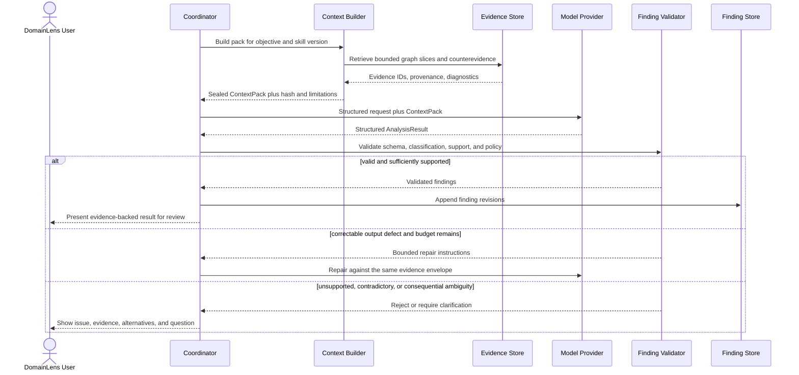

# Agent and Reasoning Architecture

## Status and scope

**PLANNED V1.** Scanner 0.1 contains no model invocation, coordinator, ContextPack, semantic finding, or reasoning skill. V1 adds a fixed, allowlisted orchestration workflow over persisted deterministic evidence. Dynamic agent creation, MCP, A2A, and open-ended multi-agent coordination are **FUTURE**, not V1 prerequisites.

The reasoning architecture enforces the governing rule:

> Code establishes evidence. AI interprets evidence. The agent orchestrates the process.

## Responsibility boundaries

| Layer | Owns | Must not own |
|---|---|---|
| Deterministic application code | Repository/snapshot handling; analyzers; Evidence Graph; retrieval limits; pipeline state; permissions; schemas; provenance; validation; persistence; authorized tool execution | Unvalidated semantic interpretation masquerading as fact |
| Coordinator/orchestration | Select approved stage and skill; build task request; invoke deterministic capabilities and provider adapter; manage retries, pauses, and review | Arbitrary tool selection, self-created capabilities, or bypass of policy gates |
| Reasoning skill | Trusted, versioned contract for objective, evidence recipe, instructions, output schema, support rubric, and validation/repair policy | Direct repository access, permissions, persistence mutation, or executable code supplied by a repository |
| Model reasoning | Interpret the supplied ContextPack; identify alternatives, contradictions, and questions; return structured Inferred/Proposed findings | Create Observed evidence, access the repository, invoke tools, elevate permissions, or commit results directly |
| Human review | Clarify meaning; challenge, accept, reject, or request re-analysis of findings | Rewrite deterministic evidence or change claim classification merely by acceptance |

## V1 coordinator

The Pipeline Coordinator follows application-owned state and an allowlist of capabilities. It does not ask a model to invent the workflow. For a reasoning task it:

1. Selects a trusted skill and version for an explicit objective.
2. Requests a task-specific ContextPack from the Context Builder.
3. Constructs a structured request containing the objective, bounded evidence, existing findings, constraints, and required response schema.
4. Invokes a model through a provider adapter with no repository or general-purpose tool access.
5. Validates syntax, schema, provenance, support, classification, and policy.
6. Runs a bounded repair/retry path for correctable output errors.
7. Persists valid finding revisions and routes consequential ambiguity to human review.

The initial skill set is:

- `domain-discovery` — identifies evidence-backed business capabilities, actors, use cases, domains, subdomains, and candidate boundaries.
- `ddd-modeling` — proposes strategic and tactical DDD concepts and relationships over selected evidence and prior valid findings.
- `explain-finding` — reconstructs a concise explanation from a finding, its evidence/counterevidence, assumptions, and limitations.
- `semantic-evidence-review` — tests a semantic claim for support, contradiction, missing coverage, and alternative interpretations.

Skills are repository-independent trusted assets. Repository files may inform a task only as quoted or referenced untrusted data inside the ContextPack.

## ContextPack architecture

A ContextPack is the sealed, versioned input envelope for one reasoning objective. The model never receives unrestricted repository access. A pack should include only the minimum relevant material:

- pack schema version, pack ID/hash, objective, requested finding types, and token budget;
- repository snapshot, Evidence Graph, analyzer, and rule version references;
- selected Evidence IDs, graph slices, source snippets/spans, content hashes, and resolution quality;
- relevant accepted or unresolved finding revisions;
- explicit counterevidence, conflicting paths, diagnostics, and coverage limitations;
- retrieval recipe, filters, traversal depth, ranking/selection reasons, and excluded material;
- summaries with links to their source evidence;
- pruning/compression decisions and information-loss warnings;
- task constraints and the structured output contract.

### Retrieval and reduction

V1 retrieval begins with deterministic and inspectable methods:

1. exact identifiers and explicit graph relationships;
2. bounded neighborhood traversal from the task subject;
3. project, namespace, type, operation, configuration, and analyzer-specific filters;
4. lexical search and trusted skill recipes;
5. deterministic de-duplication, relevance limits, and token budgeting;
6. evidence-linked summarization only when raw material cannot fit;
7. deliberate search for counterevidence and missing coverage.

No vector database is required for V1. Semantic or vector retrieval may be introduced later only if evaluation demonstrates a material improvement that justifies its cost, operational complexity, and explainability trade-offs.

Summaries never replace retained provenance. If pruning removes potentially relevant evidence, that limitation travels with the pack and any resulting finding.

## Structured reasoning contract

The conceptual request/response boundary is:

```text
ReasoningRequest
  objective
  skill/version
  contextPackId/hash
  evidence references and existing findings
  constraints and requested output schema

AnalysisResult
  atomic findings[]
    classification: Inferred | Proposed
    concept/relationship type and subjects
    supporting and counter evidence references
    reasoning, assumptions, alternatives, confidence/support/coverage
    contradictions and unresolved questions
  task limitations
  producer/model/skill/prompt versions
```

The exact wire schema and scoring rubric are **OPEN DECISIONS**. The invariant is non-negotiable: model-created findings cannot be classified as Observed, and every source-backed assertion must reference evidence present in the sealed pack.

## Invocation, validation, and review



### Validation gates

Validation is deterministic wherever possible:

- parse and validate the declared response schema;
- reject unknown Evidence IDs or references outside the ContextPack;
- reject model-created `Observed` classifications;
- require atomic claims, supported subjects, producer/version metadata, and limitations;
- verify that quoted snippets and claimed relationships correspond to supplied evidence;
- retain counterevidence and prevent unsupported high-confidence claims;
- enforce allowed concept/relationship types and policy constraints;
- append a new revision rather than overwrite reviewed history.

Repair is bounded and auditable. A failed repair budget leads to a failed/rejected stage or human clarification, not silent acceptance. The precise retry categories, counts, and support thresholds are **OPEN DECISIONS**.

## Human challenge and re-analysis

A user can ask why a concept was inferred, inspect its code evidence, supply domain clarification, challenge assumptions, and request re-analysis. The coordinator builds a new ContextPack that includes the challenged finding, its evidence, its counterevidence, and the human statement identified as human input. The outcome is a new finding revision with a traceable relationship to the prior one.

Human input is authoritative only for the decision/review state the product allows. It remains distinguishable from source evidence and model interpretation.

## Security boundary

Repository source, comments, documentation, configuration, generated text, and extracted strings are untrusted data. They cannot become system or skill instructions. The provider adapter receives no repository credentials, filesystem tools, shell, network permissions, or persistence authority. Model output is data until all gates pass.

Source-code egress, provider retention, deployment region, redaction, and consent policy must be resolved before model-backed V1 production use and before private repositories are supported. See [Security Architecture](09-security-architecture.md).

## Open decisions

- Model provider, deployment/region, retention, source-egress, and provider-version policy.
- Structured Finding and ContextPack schemas, IDs, versioning, and canonical hashing.
- Support/confidence/coverage rubric and thresholds for validation or human escalation.
- Repairable-error categories, retry budget, timeout, and fallback behavior.
- ContextPack token budgets, graph recipes, summarization rules, and persistence lifetime.
- Counterevidence search recipes and evaluation datasets.
- Evaluation threshold that would justify future semantic/vector retrieval.
- Human-review gates by finding consequence and the handling of unanswered clarification.

Related decisions: [ADR-004](../adr/004-separate-deterministic-evidence-from-ai-interpretation.md), [ADR-008](../adr/008-no-vector-database-required-for-v1.md), and [ADR-009](../adr/009-no-dynamic-agents-mcp-or-a2a-required-for-v1.md). See also [Analysis Pipeline](04-analysis-pipeline.md), [Evidence Architecture](05-evidence-architecture.md), and [Domain Knowledge Architecture](06-domain-knowledge-architecture.md).
