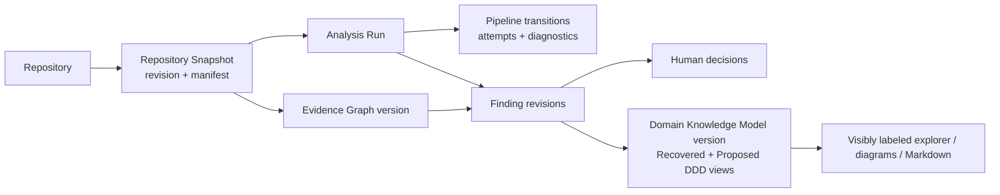

# Persistence Architecture

## Status and scope

**CURRENT — Scanner 0.1:** canonical Evidence Graph JSON is written to a caller-selected file; the CLI can reopen and validate that file. There is no application database, durable pipeline state, Finding Graph, human-review store, or Domain Knowledge Model.

**PLANNED V1:** persistence is an application boundary for analysis state and versioned architecture knowledge. V1 may begin with lightweight storage, but domain-facing contracts must permit later migration to Azure-managed relational and artifact storage without changing evidence semantics. This document is storage-product neutral.

## Persisted concepts

| Concept | Purpose | Lifecycle expectation |
|---|---|---|
| Repository | Stable submitted-repository identity and intake metadata | Mutable metadata with auditable changes |
| Repository Snapshot | Immutable analysis input, selected revision metadata, manifest, and content identity | Immutable/versioned |
| Analysis Run | Coordinates one requested analysis against a snapshot and configuration | Mutable operational state, then historical record |
| Pipeline State | Stage/checkpoint status, attempts, leases, pause/cancel state, and timestamps | Mutable with append-only transition history |
| Evidence and Evidence Graph | Deterministic observations, provenance, nodes, edges, diagnostics, and canonical document identity | Immutable per graph version; superseded, never rewritten |
| Findings and revisions | Atomic semantic interpretations/proposals with support, contradictions, validation, and lineage | Append-only revisions and status transitions |
| Human decisions | Clarifications, challenges, accept/reject actions, rationale, and actor/time | Append-only audit history |
| Domain Knowledge Model | One structured asset projected from validated findings, with a required semantic-view discriminator for Recovered Domain Knowledge versus Proposed DDD Design | Immutable/versioned model and query projections; not separate stores |
| Diagnostics | Analyzer, pipeline, validation, worker, and model issues plus coverage limits | Append-only per attempt/run |
| Version stamps | Analyzer/rule, schema, skill, prompt, model/provider, coordinator, and application versions | Immutable references on produced artifacts |

Repository source retention is distinct from evidence retention. A snapshot may be represented by an immutable source artifact, a selected Git revision plus content manifest, or both; the exact V1 retention strategy is an **OPEN DECISION**. Scanner 0.1 currently derives snapshot identity from its bounded content manifest and deliberately does not record a Git revision.

Persistent records, artifacts, analysis operations, and workspaces must be access-controlled and
isolated according to the approved identity, ownership, and authorization model. Identifiers are
references, not authorization tokens. The authentication requirement/provider, identity and
ownership model, anonymous access, roles/permissions, sharing, and tenancy remain open; if
multi-tenancy is selected, tenant scope and isolation become mandatory within that model.

## Aggregate and reference boundaries

The persistence model should preserve the following references without requiring all data to reside in one physical database:

Generated reports and Markdown are replaceable projections. They must not be the only persisted representation of evidence, findings, decisions, or domain knowledge, and they must not silently combine Proposed DDD Design with recovered/as-is knowledge.

## Immutability, revision, and provenance

Immutable/versioned artifacts include snapshot manifests and source hashes, canonical Evidence Graph documents, individual finding revisions, human decisions, DKM versions, and the version stamps needed to reproduce them. Correction creates a new version with lineage rather than altering the historical artifact.

Mutable operational records include a run's current stage, progress, worker lease/heartbeat, cancellation request, retry counters, and current review assignment. Each meaningful transition should also append an immutable event or audit record so failures and resumptions can be reconstructed.

Semantic view, review state, and claim classification remain separate. Accepting a finding updates review history and may cause a new DKM projection; it does not change an `Inferred` claim into `Observed`, change a `Proposed` claim into `Inferred` or `Observed`, or move Proposed DDD Design into the recovered view.

## Transaction and publication boundaries

Persistence adapters must prevent partially published artifacts from appearing complete. At minimum:

- a stage attempt writes to an attempt-scoped area and publishes its result only after validation;
- a canonical Evidence Graph is addressable only after hash and graph-integrity validation succeeds;
- a finding revision references an existing ContextPack/evidence set and producer versions;
- a DKM version references the exact eligible finding revisions used for projection and retains each record's recovered/proposed semantic view and epistemic classification;
- the pipeline checkpoint advances only after required artifacts are durably published;
- idempotency keys prevent retries from duplicating logical results;
- cancellation preserves completed immutable artifacts and records why later work stopped.

Whether these guarantees use one relational transaction, an outbox, optimistic concurrency, or coordinated artifact publication is an **OPEN DECISION**.

## Storage abstraction

Application contracts should express repositories, snapshots, run state, evidence documents, finding revisions, knowledge-model versions, semantic views, and audit history without exposing a particular Azure SDK or database type. Queries and presentation models must preserve the view discriminator even if a practical deployment separates:

- large immutable source/evidence/context artifacts;
- relational/queryable metadata and graph projections;
- transient worker workspace;
- telemetry and audit retention.

This is a conceptual split, not a selected topology. Concrete products, schemas, indexing strategy, graph query approach, and migration tooling require later evaluation.

## Consistency and concurrency

V1 must support restartable work and concurrent readers while an analysis is progressing. Design constraints include:

- compare-and-set or lease semantics for a single active owner of a stage attempt;
- monotonic pipeline transition/version numbers;
- immutable artifact references from checkpoints;
- optimistic concurrency for human-review updates;
- deterministic handling of duplicate completion messages;
- an explicit active DKM version rather than in-place mutation, with Recovered Domain Knowledge and Proposed DDD Design as tagged projections of that version;
- repository, snapshot/run, and the applicable ownership/session/principal/authorization context on every stored record or artifact; tenant scope is added only if multi-tenancy is selected.

The exact concurrency model and transaction isolation are **OPEN DECISIONS**.

## Retention, privacy, and migration

Retention policies must separately cover source snapshots, snippets, Evidence Graphs, ContextPacks, model inputs/outputs, findings, DKM versions, diagnostics, and audit records. Encryption, deletion, legal and ownership/access isolation, backup/restore, geographic residency, and tenant isolation if multi-tenancy is selected are unresolved V1 design mechanisms. Private repository support additionally requires approved credential and source-egress policy.

Schema and producer versions travel with stored artifacts. Readers must reject unsupported versions or run an explicit migration; they must not reinterpret old data silently. Migration from lightweight V1 persistence to managed Azure storage should preserve canonical artifact bytes/identities and revision lineage.

## Open decisions

- Persistence engine(s), graph/query projections, and artifact-versus-relational split.
- Physical schemas, indexes, transaction boundaries, outbox/event strategy, and isolation level.
- Run lease, idempotency, duplicate-delivery, and optimistic-concurrency mechanisms.
- Evidence, Finding, ContextPack, and DKM schema migration/compatibility policy, including semantic-view preservation.
- Snapshot/source storage and retention, including Git object, submodule, and LFS handling.
- Encryption, keys, backup/restore, region, ownership/access partitioning, conditional tenant isolation if multi-tenancy is selected, deletion, and audit retention.
- DKM active-version and cross-run reconciliation rules.

See [Analysis Pipeline](04-analysis-pipeline.md), [Evidence Architecture](05-evidence-architecture.md), [Domain Knowledge Architecture](06-domain-knowledge-architecture.md), and [Observability and Operations](12-observability-and-operations.md). Related decision: [ADR-005](../adr/005-persist-domain-knowledge-model-as-canonical-intermediate-asset.md).
