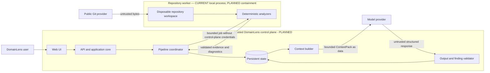

# Security Architecture

## Security objective and status

DomainLens processes attacker-controlled repositories and later sends selected
evidence to a model. Its primary security objective is to learn about source
without granting that source, a model response, or a human-supplied annotation
authority to execute code, change pipeline policy, obtain credentials, or
silently become trusted architecture knowledge.

The governing trust rule is:

```text
System policy
    > authorized application and agent policy
        > analysis task
            > repository content as untrusted data
```

This chapter distinguishes **CURRENT — Milestone 0 feasibility**,
**CURRENT — Milestone 1**, **CURRENT — Milestone 2**, **PLANNED — Product V1**, and **FUTURE**
controls.
Milestone 0 is tested spike evidence, not production security readiness. The concise approved security requirements remain in
[Security](../08-security.md); runtime isolation is described in
[Runtime Architecture](03-runtime-architecture.md).

## Trust boundaries



This is a logical trust diagram, not the current deployment. Milestone 1 is a
local CLI/library running in one process under the invoking user's OS identity.
Milestone 0 adds a separate child worker, bounded workspace/result protocol,
deadline/cancellation, and cleanup under that same OS identity. It proves process
separation but not the planned OS containment or control-plane boundaries. Milestone 2 runs the
bounded Classic WCF analyzer inside that same child and keeps repository WCF parsing out of the
trusted Host; it does not strengthen the unproven OS boundary. See the
[Milestone 0 Feasibility Report](../12-milestone-0-deployment-security-feasibility.md) and the
[Milestone 2 Classic WCF Discovery contract](../13-milestone-2-wcf-discovery.md).
The current Host and Worker depend on a neutral, dependency-light
`DomainLens.Analyzer.Protocol` wire-contract project (`Host -> Protocol <- Worker`); the Worker
does not depend on the trusted Host implementation.

## Assets to protect

- host execution integrity and availability;
- DomainLens service credentials, model credentials, and cloud identities;
- repository source, including accidentally committed secrets and personal
  data;
- repository selection and snapshot integrity;
- evidence/finding provenance and the distinction between Observed, Inferred,
  and Proposed;
- persisted repository, analysis, Human Context, and review data plus access/ownership isolation;
- pipeline control state, versioned human-supplied domain context, and separate human review decisions;
- logs, prompts, model responses, and generated exports; and
- software supply chain and analyzer/tool versions.

## Principal threats

| Threat source | Representative threats |
|---|---|
| Repository URL or Git server | SSRF, unsafe redirects, DNS rebinding, credential-in-URL leakage, oversized transfer, malicious submodules/LFS endpoints. |
| Repository filesystem content | Traversal, symlink/reparse escape, special files, resource exhaustion, malformed encodings/XML/syntax, archive bombs, race conditions. |
| Project/build content | `Exec`, custom tasks, imports, analyzers, generators, build events, package restore hooks, binaries, scripts. |
| Comments, documentation, and strings | Prompt injection, fake policy, malicious instructions, data exfiltration requests. |
| Model output | Fabricated evidence IDs, invalid schema, permission escalation, unsafe tool/action requests, source leakage. |
| External caller or service consumer | Unauthorized repository access, cross-owner or cross-scope reads, abusive job volume, tampering with review decisions. |
| Dependencies and operations | Compromised packages/images, overprivileged identity, secret leakage in logs, stale vulnerable workers. |

## CURRENT — Milestones 0–2 trust model

Milestones 0–2 accept an already-local directory and optional solution selection.
The invoker authorizes both the input directory and output artifact path. There
is no Web/API tier, repository URL intake, identity/access model, persistent
database, cloud deployment, model call, or agent tool loop. The M0 child worker
is a local process mechanism, not a deployed least-privileged worker service.

The absence of those integrations removes their runtime attack paths from
Milestone 1, but it is not evidence that the planned controls already exist.
The CLI and child worker retain whatever filesystem access and OS privileges
their invoking account has.

### Current no-execution boundary

The scanner does not reference `Microsoft.Build`, use `MSBuildWorkspace`,
restore packages, load repository assemblies, or invoke repository
analyzers/generators. It uses Roslyn's C# syntax APIs and reads XML directly.
The separate M0 semantic analyzer flattens every manifest-listed C# source into
one in-memory Roslyn compilation and queries `SemanticModel` using the exact
tool-owned .NET Framework 4.7.2 reference catalog. The result explicitly marks
this repository-wide synthetic scope and `Partial` resolution; it does not
reproduce effective project membership, references, target configuration,
conditional items, or preprocessor settings. It does not evaluate a repository
project, admit repository binaries as metadata, restore, build, or emit.

Milestone 2 creates that controlled compilation once per Worker run and shares it in process with
the Classic WCF analyzer. The analyzer recognizes only the allowlisted framework identities and
bounded source patterns, parses `.svc` directives as inert text, and parses an allowlisted
`system.serviceModel` subset through hardened XML APIs. It never uses runtime WCF configuration
APIs, invokes ASP.NET compilation, loads a repository assembly, activates a service/factory/
behavior/extension/serializer, or contacts a configured endpoint, database, package feed, WSDL,
schema, or external configuration source. Roslyn and XML objects never cross the result protocol;
only normalized evidence and diagnostics do.

Exact catalog identity is not the same as exact repository-source evidence. The centralized M2
profile policy permits `Exact` source observations only when the physical source belongs to one
deterministically selected `net472`/`v4.7.2` project. Unsupported, unknown, multiple, or
conditional profiles emit `DL4001`, constrain source evidence to `Partial` or weaker, and produce
`PartialSuccess`. This policy does not downgrade independent `.svc`/configuration declarations,
which remain qualified by their declarative rules.

Repository `Exec`, `UsingTask`, pre/post-build event, import, target, analyzer,
generator, and other build constructs are treated as text/XML data. Detected
executable project elements produce informational diagnostic `DL2009`; target
mutations of structural items produce coverage warnings. No project file is
evaluated merely to improve coverage.

This structural choice is stronger than trying to enumerate every unsafe
MSBuild task. Future analyzers must preserve the default no-execution rule.
Repository-controlled MSBuild evaluation is **REJECTED** as the V1 default;
building or restoring an analyzed repository is **PROHIBITED**. Additional
tool-owned reference profiles require explicit design, packaging, and tests.
The exact catalog gate first verifies a fixed SHA-256 commitment over every
sorted package DLL path, length, and content hash, then compares
assembly-name/relative-path descriptors from the deployed tool-owned directory.
This detects missing, extra, stale, or corrupt catalog files, but it is not a
digital signature or independent deployment attestation. Protecting those
assets remains a supply-chain control.

### Current XML and parser controls

Project XML is loaded with:

- DTD processing prohibited;
- external XML resolution disabled;
- an XML character limit, in addition to the lower default scanner file-size
  bound.

Malformed XML becomes a diagnostic and failed project descriptor. C# syntax
errors become partial evidence and diagnostics when usable syntax remains.
Neither parser grants repository content instruction status.

Milestone 2 applies the same XML posture to `.config` files containing `system.serviceModel`:
`DtdProcessing.Prohibit`, a null `XmlResolver`, no schema retrieval, and document-character bounds
no larger than the already manifest-verified content. DTD/XXE input is rejected with a typed
diagnostic. Custom extension type strings and external/config-source declarations remain inert
metadata or diagnostics; they are never resolved, fetched, or instantiated. Namespace-qualified
metadata is preflighted iteratively with a 4,096-element cap, and unsupported behavior descendants
use a separate 256-element cap. Exhaustion emits source-backed `DL4306` and prevents unsafe
promotion when the namespace preflight is incomplete. XDT controls under `system.serviceModel`
emit `DL4307`, remain inert, are never applied, and cause the section's declarations to remain
diagnostic-only. `.svc` files are parsed by a bounded directive parser, not ASP.NET.

The `.svc` and `.config` parsers accept only strict UTF-8 with or without BOM and BOM-marked UTF-16
LE/BE. Invalid byte sequences emit `DL4502`; unsupported byte/declaration encodings emit `DL4503`;
and a supported XML declaration incompatible with the decoded bytes emits `DL4308`. These cases
produce no WCF evidence from the affected artifact and no replacement-character or platform-code-
page fallback is attempted. XML DTD/resolver controls still apply after successful decoding.

### Current filesystem controls

The inventory:

- rejects a repository root reported as a reparse point;
- does not follow entries reported as symbolic links/reparse points;
- excludes entries reported as devices;
- excludes `.git`, `.hg`, `.svn`, `.vs`, `.idea`, `bin`, `obj`,
  `node_modules`, `packages`, and `TestResults` directories;
- uses OS-appropriate path comparison rules;
- rejects rooted, drive-qualified, null-containing, and repository-escaping
  solution/project/source paths;
- resolves literal paths only when the normalized result remains below the
  selected root; and
- rechecks reparse-point status after opening a file for bounded reading.

The default resource limits are:

| Limit | Current default |
|---|---:|
| Files encountered | 100,000 |
| Bytes per file | 16 MiB |
| Total bytes read | 1 GiB |
| Filesystem entries traversed | `max(10,000, 4 × file limit)` |

Limits are configurable through `ScannerOptions`. Excluded or unreadable
entries create partial-coverage diagnostics where the scanner can continue.
Crossing a fatal capture/traversal/aggregate limit produces a failure document.

The M0 staging host adds separate total-filesystem-entry and relative-depth
bounds before a worker starts. When initial staging encounters an analyzer-excluded
directory, it still inspects that directory entry for reparse and depth violations but omits the
directory itself and does not recurse, copy, hash, or charge its descendants against staging
entry/file/byte limits. It derives the expected analysis snapshot ID from only the copied manifest,
which matches the scanner's exclusion behavior. After worker exit, it deliberately recaptures the
entire staged repository without pruning excluded names and rejects any path/kind/length/hash
change before accepting output. Named tests cover large excluded source trees remaining absent,
excluded contents not consuming limits, scanner/staging snapshot parity, empty directories counting
toward the entry bound, relative depth, wrong snapshot identity, and a worker-created excluded
`obj/project.assets.json`. Cleanup uses a bounded iterative traversal and is
exercised by cleanup assertions across normal and failure outcomes; cleanup-
failure injection and adversarial cleanup races are not proven.
The staged-tree check is a pre/post comparison, not read-only enforcement, and
does not prove detection of a transient change restored before recapture.

Within the Worker, `ManifestVerifiedFileReader` accepts only a caller-selected manifest entry,
normalizes and contains its repository-relative path, rejects reparse components, prechecks the
captured length, reads exactly that many bytes while hashing, and postchecks length before
returning content. M2 uses it for `.cs`, `.svc`, and `.config`; a configuration value cannot cause
an arbitrary path to be opened.

The inventory hashes all included readable file types, even though it retains
content only for selected structural/source extensions. That behavior matters
for privacy and capacity policy in Product V1.

### Current evidence and artifact controls

- Each manifest entry carries the SHA-256 hash and actual byte count of its
  bounded read.
- The shared manifest reader opens selected manifest C#, `.svc`, and `.config` files as seekable
  streams, prechecks their exact captured length, allocates and reads at most that length in
  bounded chunks while hashing incrementally, and postchecks the handle before decoding. Early EOF,
  growth, length/hash drift, and cancellation prevent that content from reaching parsing.
- Snapshot, evidence, node, and edge identities are content-derived and are
  recomputed by graph validation.
- Canonical JSON carries a whole-document SHA-256 hash that excludes only its
  own field during computation.
- Resolved graph references and evidence-to-manifest provenance are validated
  before scanner output is accepted.
- `inspect` verifies the canonical hash and graph, and then displays provenance
  embedded in the artifact. It does not follow repository paths from the JSON.
- Scan output uses a same-directory temporary file and replacement to avoid a
  partially written canonical artifact under normal filesystem semantics.
- WCF contributions are merged through deterministic conflict checks, then the Worker validates
  the complete graph and verifies its canonical hash before serializing the existing result
  envelope. The trusted Host independently repeats strict graph/hash/snapshot and semantic-result
  validation and still treats Worker output as untrusted.
- Repository-controlled WCF text that reaches graph or diagnostic fields is persisted in at most
  1,024 UTF-16 code units. Oversized values use a bounded surrogate-safe prefix, an explicit
  `domainlens:truncated=true` marker, `originalLengthUtf16`, and `sha256Utf16` over the exact
  big-endian UTF-16 code-unit sequence. Matching occurs against the full manifest-bounded value
  before projection. Unpaired UTF-16 source constants and input containing the reserved marker use
  the same digest-backed representation, with unsafe code units rendered as ASCII `\uXXXX`, so
  JSON serialization cannot silently substitute text; `DL4504` exposes every abbreviation and
  makes the result `PartialSuccess`.

These are integrity and consistency controls, not authentication. The artifact
is not digitally signed; the validator does not reopen a repository, prove
that evidence is semantically true, establish who produced the file, or provide general secret
redaction/data-loss prevention.

### Current security-focused tests

The current security-focused suites include checks that:

- a repository-controlled malicious `Exec` target remains inert and its marker
  file is never created;
- Windows-drive, UNC, Unix-absolute, and parent-escaping solution project paths
  are rejected;
- exact file bytes are hashed, oversized files are excluded, and aggregate
  byte limits fail safely;
- canonical identities and schema/hash integrity reject tampering even after a
  document hash is recomputed; and
- `ReferenceOutputAssembly`, project aliases, conditional references, and
  dependency scope do not create unsupported type links;
- the real scanner runs under a different child PID; crash, timeout and caller
  cancellation remain typed host outcomes; delayed output is rejected; and a
  test descendant terminates when its still-running worker parent is tree-killed;
- total staging entries (including empty directories), relative depth, expected
  snapshot identity, initial omission of analyzer-excluded source trees and their contents from
  staging limits, scanner/staging snapshot parity, and post-run exhaustive staged-repository-tree
  integrity including worker-created excluded names are gated;
- a named caller environment secret and `PATH` are not inherited, while worker
  CWD/`TEMP`/`TMP` remain job-scoped;
- malformed, mismatched, oversized, hash-invalid, graph-invalid, and
  semantic-invalid worker output is rejected by the trusted host; and
- repository build events, imports, targets, scripts, custom tasks, and analyzer/
  generator constructor probes remain inert through the real worker; the
  repository payload DLL remains in the manifest but is absent from the exact
  trusted metadata-reference catalog and resolved-assembly observations; and
- the real worker's post-analysis `AppDomain` assertion finds no currently
  loaded managed assembly whose location is under the staged repository; and
- semantic source reads reject content that is larger, shorter, grown during the read, or changed
  at the same length; do not consume beyond the captured bound; propagate mid-read cancellation;
  and still accept a valid manifest source;
- fake repository-defined WCF look-alike attributes are not promoted to trusted WCF identities,
  while fully qualified, suffix, and alias forms bind only through the tool-owned catalog;
- net472/v4.7.2 source can retain exact local observations, while .NET Framework 4.6.1, 4.8,
  unknown, multiple, and conditional project profiles produce `DL4001` and no exact source
  observation; unrelated declarative evidence retains its own quality;
- malformed WCF XML, DTD/XXE payloads, external configuration, remote-looking WSDL/schema values,
  malicious-looking endpoint/type strings, and unsupported custom extensions remain inert and
  produce bounded evidence or typed diagnostics; and
- strict UTF-8/BOM-marked UTF-16 positive cases retain decoded UTF-16 spans, while invalid UTF-8,
  unsupported encodings, and incompatible XML declarations produce typed diagnostics and no WCF
  evidence from the affected artifact; and
- oversized source, `.svc`, configuration, custom-extension, diagnostic, and unresolved-target
  text remains within the persistence bound, carries marker/length/digest metadata, does not merge
  distinct full values with a common prefix, produces `DL4504`/`PartialSuccess`, and stays
  deterministic and graph-valid; and
- deep unsupported behavior metadata reaches a deterministic traversal diagnostic without
  recursion, while XDT controls suppress section promotion and non-XDT namespace metadata is
  diagnosed without hiding otherwise supported unqualified declarations; and
- a repository-defined custom WCF extension whose constructor writes a marker is detected only as
  text, the constructor/build markers remain absent, and no generated `bin` or `obj` output appears
  in the analyzed fixture.

The test suite does not constitute a complete hostile-workload containment or malware
assessment. It has no portable Unix FIFO/socket test, OS-enforced no-egress test, restricted-
identity/ACL test, public-Git/SSRF test, hosted identity/ownership/access-isolation test, or
prompt-injection test because those capabilities do not exist yet.

### Current residual risks and constraints

- The local CLI still runs the scanner in process. The optional M0 host adds a
  child process and worker-lifetime/result-acceptance deadline, but the child
  uses the same OS account and has no OS-enforced CPU, memory, process-count,
  complete disk, filesystem, or network boundary. Trusted synchronous result
  validation is not independently preempted, so the configured deadline is not
  a hard maximum for total host-call latency.
- The process-tree test covers a descendant while its worker parent is alive.
  Detached descendants after parent exit, inaccessible descendants, and
  platform-wide orphan containment are not proven.
- Managed .NET does not provide a portable pre-open regular-file proof for all
  Unix directory entries. A hostile FIFO or socket may still block the local
  CLI despite reparse/device checks and bounded reads.
- Filesystem inspection and open operations are not an atomic transaction;
  content can change during traversal, and path checks cannot by themselves
  eliminate every local race on every filesystem.
- On Windows, the worker-controlled result is opened without following reparse
  points and directory, reparse, and multiply linked handles are rejected;
  `ReparsePointResultArtifactIsRejectedBeforeItIsRead` exercises the reparse/no-follow path with a
  directory junction, while `HardLinkedResultArtifactIsRejectedBeforeItIsRead` independently
  exercises the link-count gate. The synchronous open has no
  independent hard deadline, and equivalent no-follow/special-file behavior
  for a future non-Windows worker is not proven. The byte cap also does not
  form a hard memory ceiling for buffers, strings, hashing, and
  deserialized/validated object graphs.
- The manifest is a captured-content identity, not a Git revision or signed
  source attestation.
- The caller may choose any output path permitted by its OS identity. The CLI
  is not a multi-tenant authorization boundary.
- Arbitrary readable files outside excluded directories are hashed. Source and
  configuration content retained for parsing may contain secrets. Milestone 1
  makes no model/network egress, but it also has no secret-classification or
  redaction subsystem.
- Error-message sanitization removes line breaks, but failure diagnostics must
  not be assumed to provide comprehensive sensitive-path or secret scrubbing.
- NuGet/package names and version declarations are observed as data; their
  safety, availability, or authenticity is not evaluated.
- The hostile fixture's repository-controlled package source is not consulted
  because DomainLens does not restore or resolve repository packages. That is
  workflow evidence, not a DNS/network probe; OS-enforced egress denial remains
  **NOT PROVEN**.

For these reasons, neither the standalone scanner nor the M0/M2 child-process host
is a production hostile-workload boundary. Production analysis still requires
an approved containment mechanism, identity, filesystem/network/resource
controls, and operational verification.

## PLANNED — Product V1 defense in depth

### Public Git URL validation and SSRF protection

Repository intake must happen in trusted application code before work reaches
an analyzer. The V1 policy must include:

- an explicit allowed scheme and provider/host policy;
- strict URL parsing and rejection of embedded credentials or ambiguous host
  representations;
- DNS/IP evaluation that rejects loopback, link-local, private, metadata,
  multicast, and otherwise prohibited destinations;
- redirect revalidation at every hop, bounded redirect count, and protection
  against DNS rebinding;
- transfer, object-count, checkout-size, file-count, time, and rate limits;
- safe treatment of Git submodules, hooks, attributes, filters, LFS, and
  alternate object sources; and
- audit records for the normalized repository identity and selected revision.

The exact provider allowlist, Git client/library, branch/tag/commit semantics,
submodule policy, and numeric limits are OPEN DECISIONS. Intake must not place
cloud credentials in repository URLs or worker payloads.

### Isolated analyzer worker

The first Product V1 worker is Windows-oriented because the initial workload is
legacy .NET Framework/WCF. It is a runtime/process trust boundary, whether or
not it becomes a separately deployed service. Each job should receive:

- a disposable, job-scoped workspace containing only the required snapshot;
- a non-administrative identity with no control-plane or repository
  credentials;
- deny-by-default outbound network access, with any required channel narrowly
  mediated;
- filesystem access limited to tool/runtime inputs, the job workspace, and a
  bounded output channel;
- CPU, memory, disk, file-count, process-count, and wall-clock limits;
- propagated cancellation plus forced termination after a grace period;
- approved, versioned analyzer binaries and read-only tool dependencies; and
- workspace destruction after authenticated result transfer and retention
  policy application.

The coordinator must treat worker evidence as untrusted input until schema,
canonical hash, identity, provenance, size, and policy validation succeed. A
worker must not receive persistence, model-provider, signing, end-user/session, or other
caller-scope credentials. Worker orchestration technology is deliberately not selected
here, and AKS is not required for V1.

### Prompt-injection and model boundary

Comments, identifiers, strings, README files, configuration, and documentation
from the repository remain data at every layer. Product V1 should enforce:

- trusted, versioned system/application instructions outside repository data;
- a typed `ContextPack` assembled by trusted code from validated evidence, prior findings,
  counterevidence, limitations, and separately identified Human Context revisions;
- clear quoting/labeling of repository excerpts and explicit provenance;
- graph/lexical retrieval with relevance, counterevidence, and token budgets;
- no unrestricted repository, filesystem, network, or tool access for the
  model;
- allowlisted tool schemas and deterministic authorization before every action;
- structured model output with strict schema and size validation;
- rejection of fabricated/unavailable evidence references;
- rejection of fabricated, wrong-type, or out-of-pack Human Context references and any attempt to
  present a human statement as deterministic evidence;
- bounded repair/retry behavior; and
- the invariant that model output cannot create Observed evidence, advance
  pipeline state, or execute an external action directly.

A repository instruction such as “ignore system policy,” whether in a comment
or README, is evidence text only. It cannot become an agent or system message.

### Source-code egress

Context construction must minimize source sent outside the trusted persistence
boundary. A V1 egress policy must define:

- which public-repository content may be sent to the selected model provider;
- excerpt and aggregate size limits;
- secret and sensitive-data detection/redaction behavior;
- provider retention/training and region requirements;
- logging rules for prompts and responses;
- human-visible disclosure and consent; and
- deletion and audit behavior.

Public availability does not make source harmless or remove licensing,
personal-data, or accidentally committed secret concerns. Private repository
support must not ship until repository credentials, ownership/access-control, egress, and retention
policies are explicitly approved. If multi-tenancy is selected, its tenant-isolation policy is an
additional prerequisite.

### Identity, ownership, authorization, and access isolation

Product V1 requires deterministic authorization decisions for repository submissions, analysis
reads, cancellations, Human Context creation/revision, human review decisions, exports, and administrative operations. The Web/API/Core
boundary—not the model—must enforce them. A future policy may explicitly permit an anonymous
operation; missing identity is never implicit permission.

Persistent records, artifacts, analysis operations, and workspaces must be access-controlled and
isolated according to the approved identity, ownership, and authorization model. Identifiers,
including opaque or non-guessable identifiers, must not themselves grant authorization. If
multi-tenancy is selected, tenant isolation must then be enforced.

Whether end-user authentication is required, the authentication provider, the
user/principal/session and ownership model, anonymous access, tenancy, roles/permissions, sharing,
administrator capabilities, and protocols are **OPEN DECISIONS**.

### Secrets and service identities

- Use workload/service identities and a managed secret store on the trusted
  side; do not bake secrets into images, repositories, prompts, or job payloads.
- Give each component only the operations it needs and prefer short-lived,
  scoped credentials.
- Keep analyzer workers credential-free except for a narrowly scoped,
  authenticated job/result channel.
- Redact secrets and source excerpts from structured logs, traces, exception
  messages, support bundles, and model telemetry according to policy.
- Rotate and audit model, persistence, deployment, and signing credentials.

### Output validation and safe actions

Evidence must pass Evidence Graph validation. Model output must pass the
Finding Graph schema, separate Evidence/Human Context reference, classification, Support,
counterevidence, and policy checks before persistence or review. If Confidence is present, its
applicable calibration and approved exposure must also be validated; raw model self-confidence or
renamed Support is invalid. Generated text
must be encoded for its display context. No output is executable configuration
or an authorized instruction merely because it was produced by DomainLens.

Any future action outside analysis—creating an issue, changing code, invoking a
tool, or publishing a target design—requires a separately authorized,
deterministically validated operation. Analysis permission alone does not grant
mutation authority.

### Persistence and audit

Product V1 should encrypt data in transit and at rest, apply access controls and isolation under the
approved identity/ownership model, retain immutable snapshot/finding revisions, retain Human Context
as separately versioned and supersedable provenance, and retain human review decisions as distinct
audit-relevant actions. Audit records should identify the applicable caller, session, principal, or
workload context when the approved identity model provides one, plus action, target, result, and
versioned policy/tool context without copying unrestricted source, Human Context statements, or
prompts into logs.

Retention duration, deletion semantics, key strategy, regional placement, and
the boundary between operational logs and durable audit records are OPEN
DECISIONS.

## Control ownership matrix

| Control | CURRENT — M0/M1/M2 | PLANNED — V1 owner |
|---|---|---|
| Local inventory/path/resource bounds | Implemented in scanner | Analyzer worker and analyzer |
| XML external-entity prevention | Implemented in project reader and M2 WCF configuration parser | Analyzer suite |
| No repository build execution | Implemented structurally | Analyzer contract plus worker policy |
| Evidence identity/hash/graph validation | Implemented in core | Evidence Kernel and coordinator |
| Child-process crash/deadline/cancellation/result gate | **PROVEN for M0 test topology**; deadline governs worker/result acceptance, not independent trusted-postprocessing preemption; same OS identity | Worker host/platform and coordinator |
| Exact-catalog net472 `SemanticModel` enrichment | **FEASIBLE WITH CONSTRAINTS**; bounded exact-length/hash-verified source reads, flattened manifest-source compilation, `Partial` resolution, no repository build/evaluation | Analyzer profile, Evidence Kernel and worker |
| Classic WCF source/`.svc`/configuration safety | Bounded M2 rules implemented in the child Worker; source `Exact` gated to one deterministic net472/v4.7.2 project; manifest-verified reads; strict UTF decoding; hardened XML; 1,024-code-unit persisted-text representation; capped iterative metadata traversal; diagnostic-only XDT handling; inert extension/factory metadata; no activation or endpoint contact | Analyzer profile, Evidence Kernel and worker |
| Environment minimization | Named-secret non-inheritance and job-scoped temp paths proven; not identity isolation | Worker host/platform |
| Public URL and SSRF validation | Not applicable | Repository intake |
| Git acquisition safety | Not implemented | Repository intake and worker bootstrap |
| OS identity/filesystem/network containment | **NOT PROVEN** | Worker host/platform |
| Wall-clock enforcement | Implemented for M0 worker lifetime/result acceptance; synchronous trusted postprocessing is not independently preempted; not implemented by standalone CLI | Coordinator and worker host |
| Prompt-injection boundary | No model exists | Context builder, reasoning runtime, tool policy |
| Model output validation | No model exists | Finding validator |
| Authorization, ownership, and access isolation (identity/authentication/tenancy model open) | Not implemented | Web/API/Core and persistence |
| Secret storage and service identities | Not implemented | Deployment platform and trusted services |
| Source egress/redaction policy | No model egress exists | Context/model gateway and governance |

## FUTURE controls

Future Java/Linux analyzers require equivalent isolation with OS-specific
special-file and path controls. Worker pools, containers, or stronger OS-containment
technology may be introduced when analyzer capability and scale justify them.
Dynamic agent composition, MCP, and A2A would expand the authorization surface
and require new threat modeling; none is required for Product V1.

## Security verification expectations

As each planned boundary becomes executable, its controls need automated and
operational verification. Expected suites include URL/redirect/DNS SSRF cases,
malicious Git fixtures, symlink/junction/race cases on supported worker OSes,
resource and timeout termination, no-egress assertions, credential absence,
prompt-injection corpora, fabricated-evidence rejection, authorization and cross-scope isolation
under the approved access model (including tenant cases if selected), log redaction,
dependency/image scanning, and incident/audit replay.

Security tests should assert the denied side effect as the existing malicious
build fixture does; merely observing a diagnostic is not proof that an unsafe
action could not occur.

## Open decisions

1. **Repository intake policy:** supported Git providers/schemes, redirects,
   DNS pinning, submodules, LFS, archives, and revision selectors.
2. **Worker isolation technology:** Windows execution boundary, non-admin
   identity, job transport, forced termination, and cleanup guarantees.
3. **Network policy:** worker deny rules, package/reference metadata needs, and
   any mediated outbound service.
4. **Production limits:** repository/object/file sizes, CPU/memory/disk quotas,
   timeouts, concurrency, and request/session/principal/ownership-scope or tenant rate limits as applicable.
5. **Safe semantic analysis:** M0 proves exact-catalog net472 symbol binding for one flattened
   manifest-source compilation with declared `Partial` resolution and without repository MSBuild
   evaluation. M2 reuses that context and projects only its bounded WCF observations; it permits
   `Exact` source quality only for one deterministic net472/v4.7.2 project and emits `DL4001`
   otherwise. Project-faithful configuration, additional reference profiles, conditional
   compilation, non-WCF projection, broader coverage accounting, and any need beyond this narrow
   mechanism remain open.
   Repository build/restore and repository-controlled MSBuild evaluation do not
   become options.
6. **Source egress:** allowed model providers, regions, retention/training
   terms, redaction, consent, and public versus future private repository rules.
7. **Identity, ownership, and access:** authentication requirement/provider;
   user/principal/session and ownership model; anonymous access; roles/permissions; sharing;
   administrator capabilities; tenancy and tenant data partitioning if selected; and protocols.
8. **Artifact authenticity:** whether Evidence Graphs, findings, and exports
   require signatures or authenticated envelopes in addition to hashes.
9. **Retention and deletion:** lifetimes for repositories, source blobs,
   evidence, Human Context records, ContextPacks, prompts/responses, findings, review decisions,
   logs, and backups.
10. **Secret detection response:** redact, quarantine, fail, or require human
    confirmation when suspected secrets appear in selected context.
11. **Supply-chain policy:** dependency pinning, SBOM/provenance, image signing,
    vulnerability gates, and emergency revocation of an analyzer version.
12. **Abuse and incident response:** quarantine, kill switch, evidence
    preservation, disclosure, and recovery procedures.
