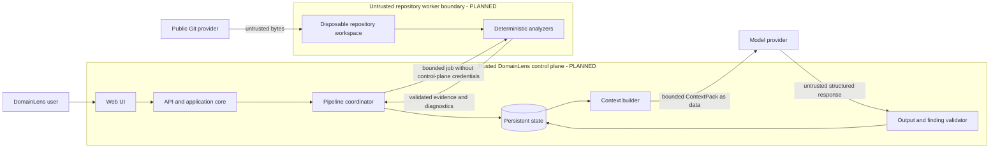

# Security Architecture

## Security objective and status

DomainLens processes attacker-controlled repositories and later sends selected
evidence to a model. Its primary security objective is to learn about source
without granting that source, a model response, or a human-supplied annotation
authority to execute code, change pipeline policy, obtain credentials, or
silently become trusted architecture knowledge.

The governing trust rule is:

```text
System policy
    > authorized application and agent policy
        > analysis task
            > repository content as untrusted data
```

This chapter distinguishes **CURRENT — Milestone 1**, **PLANNED — Product V1**,
and **FUTURE** controls. The concise approved security requirements remain in
[Security](../08-security.md); runtime isolation is described in
[Runtime Architecture](03-runtime-architecture.md).

## Trust boundaries



This is a logical trust diagram, not the current deployment. Milestone 1 is a
local CLI/library running in one process under the invoking user's OS identity.
It implements safe parsing controls but not the planned worker or control-plane
isolation boundaries.

## Assets to protect

- host execution integrity and availability;
- DomainLens service credentials, model credentials, and cloud identities;
- repository source, including accidentally committed secrets and personal
  data;
- repository selection and snapshot integrity;
- evidence/finding provenance and the distinction between Observed, Inferred,
  and Proposed;
- persisted customer data and tenant separation;
- pipeline control state and human decisions;
- logs, prompts, model responses, and generated exports; and
- software supply chain and analyzer/tool versions.

## Principal threats

| Threat source | Representative threats |
|---|---|
| Repository URL or Git server | SSRF, unsafe redirects, DNS rebinding, credential-in-URL leakage, oversized transfer, malicious submodules/LFS endpoints. |
| Repository filesystem content | Traversal, symlink/reparse escape, special files, resource exhaustion, malformed encodings/XML/syntax, archive bombs, race conditions. |
| Project/build content | `Exec`, custom tasks, imports, analyzers, generators, build events, package restore hooks, binaries, scripts. |
| Comments, documentation, and strings | Prompt injection, fake policy, malicious instructions, data exfiltration requests. |
| Model output | Fabricated evidence IDs, invalid schema, permission escalation, unsafe tool/action requests, source leakage. |
| Service user or tenant | Unauthorized repository access, cross-tenant reads, abusive job volume, tampering with review decisions. |
| Dependencies and operations | Compromised packages/images, overprivileged identity, secret leakage in logs, stale vulnerable workers. |

## CURRENT — Milestone 1 trust model

Milestone 1 accepts an already-local directory and optional solution selection.
The invoker authorizes both the input directory and output artifact path. There
is no Web/API tier, repository URL intake, identity/tenant model, persistent
database, cloud deployment, model call, agent tool loop, or isolated analyzer
worker in the current code.

The absence of those integrations removes their runtime attack paths from
Milestone 1, but it is not evidence that the planned controls already exist.
The CLI process retains whatever filesystem access and OS privileges its
invoking account has.

### Current no-execution boundary

The scanner does not reference `Microsoft.Build`, use `MSBuildWorkspace`,
compile source, restore packages, load repository assemblies, start processes,
or invoke repository analyzers/generators. It uses Roslyn's C# **syntax** APIs
and reads XML directly.

Repository `Exec`, `UsingTask`, pre/post-build event, import, target, analyzer,
generator, and other build constructs are treated as text/XML data. Detected
executable project elements produce informational diagnostic `DL2009`; target
mutations of structural items produce coverage warnings. No project file is
evaluated merely to improve coverage.

This structural choice is stronger than trying to enumerate every unsafe
MSBuild task. Future analyzers must preserve the default no-execution rule. If
semantic project evaluation is later needed, its safe mechanism and isolation
policy require a separate approved design; Product V1 must not silently switch
to building untrusted repositories.

### Current XML and parser controls

Project XML is loaded with:

- DTD processing prohibited;
- external XML resolution disabled;
- an XML character limit, in addition to the lower default scanner file-size
  bound.

Malformed XML becomes a diagnostic and failed project descriptor. C# syntax
errors become partial evidence and diagnostics when usable syntax remains.
Neither parser grants repository content instruction status.

### Current filesystem controls

The inventory:

- rejects a repository root reported as a reparse point;
- does not follow entries reported as symbolic links/reparse points;
- excludes entries reported as devices;
- excludes `.git`, `.hg`, `.svn`, `.vs`, `.idea`, `bin`, `obj`,
  `node_modules`, `packages`, and `TestResults` directories;
- uses OS-appropriate path comparison rules;
- rejects rooted, drive-qualified, null-containing, and repository-escaping
  solution/project/source paths;
- resolves literal paths only when the normalized result remains below the
  selected root; and
- rechecks reparse-point status after opening a file for bounded reading.

The default resource limits are:

| Limit | Current default |
|---|---:|
| Files encountered | 100,000 |
| Bytes per file | 16 MiB |
| Total bytes read | 1 GiB |
| Filesystem entries traversed | `max(10,000, 4 × file limit)` |

Limits are configurable through `ScannerOptions`. Excluded or unreadable
entries create partial-coverage diagnostics where the scanner can continue.
Crossing a fatal capture/traversal/aggregate limit produces a failure document.

The inventory hashes all included readable file types, even though it retains
content only for selected structural/source extensions. That behavior matters
for privacy and capacity policy in Product V1.

### Current evidence and artifact controls

- Each manifest entry carries the SHA-256 hash and actual byte count of its
  bounded read.
- Snapshot, evidence, node, and edge identities are content-derived and are
  recomputed by graph validation.
- Canonical JSON carries a whole-document SHA-256 hash that excludes only its
  own field during computation.
- Resolved graph references and evidence-to-manifest provenance are validated
  before scanner output is accepted.
- `inspect` verifies the canonical hash and graph, and then displays provenance
  embedded in the artifact. It does not follow repository paths from the JSON.
- Scan output uses a same-directory temporary file and replacement to avoid a
  partially written canonical artifact under normal filesystem semantics.

These are integrity and consistency controls, not authentication. The artifact
is not digitally signed; the validator does not reopen a repository, prove
that evidence is semantically true, or establish who produced the file.

### Current security-focused tests

The 23-test suite includes checks that:

- a repository-controlled malicious `Exec` target remains inert and its marker
  file is never created;
- Windows-drive, UNC, Unix-absolute, and parent-escaping solution project paths
  are rejected;
- exact file bytes are hashed, oversized files are excluded, and aggregate
  byte limits fail safely;
- canonical identities and schema/hash integrity reject tampering even after a
  document hash is recomputed; and
- `ReferenceOutputAssembly`, project aliases, conditional references, and
  dependency scope do not create unsupported type links.

The test suite does not constitute a complete sandbox or malware assessment.
It currently has no portable Unix FIFO/socket test and no live isolated-worker,
SSRF, authentication, tenant-isolation, or prompt-injection test because those
capabilities do not exist yet.

### Current residual risks and constraints

- The local CLI has no process/container boundary from the invoking host and no
  self-imposed wall-clock timeout. It accepts cancellation when its caller
  supplies a token.
- Managed .NET does not provide a portable pre-open regular-file proof for all
  Unix directory entries. A hostile FIFO or socket may still block the local
  CLI despite reparse/device checks and bounded reads.
- Filesystem inspection and open operations are not an atomic transaction;
  content can change during traversal, and path checks cannot by themselves
  eliminate every local race on every filesystem.
- The manifest is a captured-content identity, not a Git revision or signed
  source attestation.
- The caller may choose any output path permitted by its OS identity. The CLI
  is not a multi-tenant authorization boundary.
- Arbitrary readable files outside excluded directories are hashed. Source and
  configuration content retained for parsing may contain secrets. Milestone 1
  makes no model/network egress, but it also has no secret-classification or
  redaction subsystem.
- Error-message sanitization removes line breaks, but failure diagnostics must
  not be assumed to provide comprehensive sensitive-path or secret scrubbing.
- NuGet/package names and version declarations are observed as data; their
  safety, availability, or authenticity is not evaluated.

For these reasons, the standalone scanner should not be described as an
adversarial-code sandbox. Production analysis requires the planned isolated
worker and OS-enforced deadline.

## PLANNED — Product V1 defense in depth

### Public Git URL validation and SSRF protection

Repository intake must happen in trusted application code before work reaches
an analyzer. The V1 policy must include:

- an explicit allowed scheme and provider/host policy;
- strict URL parsing and rejection of embedded credentials or ambiguous host
  representations;
- DNS/IP evaluation that rejects loopback, link-local, private, metadata,
  multicast, and otherwise prohibited destinations;
- redirect revalidation at every hop, bounded redirect count, and protection
  against DNS rebinding;
- transfer, object-count, checkout-size, file-count, time, and rate limits;
- safe treatment of Git submodules, hooks, attributes, filters, LFS, and
  alternate object sources; and
- audit records for the normalized repository identity and selected revision.

The exact provider allowlist, Git client/library, branch/tag/commit semantics,
submodule policy, and numeric limits are OPEN DECISIONS. Intake must not place
cloud credentials in repository URLs or worker payloads.

### Isolated analyzer worker

The first Product V1 worker is Windows-oriented because the initial workload is
legacy .NET Framework/WCF. It is a runtime/process trust boundary, whether or
not it becomes a separately deployed service. Each job should receive:

- a disposable, job-scoped workspace containing only the required snapshot;
- a non-administrative identity with no control-plane or repository
  credentials;
- deny-by-default outbound network access, with any required channel narrowly
  mediated;
- filesystem access limited to tool/runtime inputs, the job workspace, and a
  bounded output channel;
- CPU, memory, disk, file-count, process-count, and wall-clock limits;
- propagated cancellation plus forced termination after a grace period;
- approved, versioned analyzer binaries and read-only tool dependencies; and
- workspace destruction after authenticated result transfer and retention
  policy application.

The coordinator must treat worker evidence as untrusted input until schema,
canonical hash, identity, provenance, size, and policy validation succeed. A
worker must not receive persistence, model-provider, signing, or other tenant
credentials. Worker orchestration technology is deliberately not selected
here, and AKS is not required for V1.

### Prompt-injection and model boundary

Comments, identifiers, strings, README files, configuration, and documentation
from the repository remain data at every layer. Product V1 should enforce:

- trusted, versioned system/application instructions outside repository data;
- a typed `ContextPack` assembled by trusted code from validated evidence;
- clear quoting/labeling of repository excerpts and explicit provenance;
- graph/lexical retrieval with relevance, counterevidence, and token budgets;
- no unrestricted repository, filesystem, network, or tool access for the
  model;
- allowlisted tool schemas and deterministic authorization before every action;
- structured model output with strict schema and size validation;
- rejection of fabricated/unavailable evidence references;
- bounded repair/retry behavior; and
- the invariant that model output cannot create Observed evidence, advance
  pipeline state, or execute an external action directly.

A repository instruction such as “ignore system policy,” whether in a comment
or README, is evidence text only. It cannot become an agent or system message.

### Source-code egress

Context construction must minimize source sent outside the trusted persistence
boundary. A V1 egress policy must define:

- which public-repository content may be sent to the selected model provider;
- excerpt and aggregate size limits;
- secret and sensitive-data detection/redaction behavior;
- provider retention/training and region requirements;
- logging rules for prompts and responses;
- human-visible disclosure and consent; and
- deletion and audit behavior.

Public availability does not make source harmless or remove licensing,
personal-data, or accidentally committed secret concerns. Private repository
support must not ship until repository credentials, egress, retention, and
tenant authorization policies are explicitly approved.

### Identity, authorization, and tenant isolation

Product V1 requires deterministic authorization for repository submissions,
analysis reads, cancellations, human decisions, exports, and administrative
operations. The Web/API/Core boundary—not the model—must enforce it. Persistent
records and object/workspace storage must be tenant-scoped, and identifiers
must not be authorization tokens.

Authentication provider, role vocabulary, sharing policy, tenancy model, and
whether anonymous public-repository scans are permitted are OPEN DECISIONS.

### Secrets and service identities

- Use workload/service identities and a managed secret store on the trusted
  side; do not bake secrets into images, repositories, prompts, or job payloads.
- Give each component only the operations it needs and prefer short-lived,
  scoped credentials.
- Keep analyzer workers credential-free except for a narrowly scoped,
  authenticated job/result channel.
- Redact secrets and source excerpts from structured logs, traces, exception
  messages, support bundles, and model telemetry according to policy.
- Rotate and audit model, persistence, deployment, and signing credentials.

### Output validation and safe actions

Evidence must pass Evidence Graph validation. Model output must pass the
Finding Graph schema, evidence-reference, classification, confidence,
counterevidence, and policy checks before persistence or review. Generated text
must be encoded for its display context. No output is executable configuration
or an authorized instruction merely because it was produced by DomainLens.

Any future action outside analysis—creating an issue, changing code, invoking a
tool, or publishing a target design—requires a separately authorized,
deterministically validated operation. Analysis permission alone does not grant
mutation authority.

### Persistence and audit

Product V1 should encrypt data in transit and at rest, apply tenant-aware
access, retain immutable snapshot/finding revisions and human decisions, and
record security-relevant state transitions. Audit records should identify the
actor or workload identity, action, target, result, and versioned policy/tool
context without copying unrestricted source or prompts into logs.

Retention duration, deletion semantics, key strategy, regional placement, and
the boundary between operational logs and durable audit records are OPEN
DECISIONS.

## Control ownership matrix

| Control | CURRENT — M1 | PLANNED — V1 owner |
|---|---|---|
| Local inventory/path/resource bounds | Implemented in scanner | Analyzer worker and analyzer |
| XML external-entity prevention | Implemented in project reader | Analyzer suite |
| No repository build execution | Implemented structurally | Analyzer contract plus worker policy |
| Evidence identity/hash/graph validation | Implemented in core | Evidence Kernel and coordinator |
| Public URL and SSRF validation | Not applicable | Repository intake |
| Git acquisition safety | Not implemented | Repository intake and worker bootstrap |
| OS process/network isolation | Not implemented | Worker host/platform |
| Wall-clock enforcement | Not implemented by CLI | Coordinator and worker host |
| Prompt-injection boundary | No model exists | Context builder, reasoning runtime, tool policy |
| Model output validation | No model exists | Finding validator |
| Authentication/authorization/tenancy | Not implemented | Web/API/Core and persistence |
| Secret storage and service identities | Not implemented | Deployment platform and trusted services |
| Source egress/redaction policy | No model egress exists | Context/model gateway and governance |

## FUTURE controls

Future Java/Linux analyzers require equivalent isolation with OS-specific
special-file and path controls. Worker pools, containers, or stronger sandbox
technology may be introduced when analyzer capability and scale justify them.
Dynamic agent composition, MCP, and A2A would expand the authorization surface
and require new threat modeling; none is required for Product V1.

## Security verification expectations

As each planned boundary becomes executable, its controls need automated and
operational verification. Expected suites include URL/redirect/DNS SSRF cases,
malicious Git fixtures, symlink/junction/race cases on supported worker OSes,
resource and timeout termination, no-egress assertions, credential absence,
prompt-injection corpora, fabricated-evidence rejection, tenant authorization,
log redaction, dependency/image scanning, and incident/audit replay.

Security tests should assert the denied side effect as the existing malicious
build fixture does; merely observing a diagnostic is not proof that an unsafe
action could not occur.

## Open decisions

1. **Repository intake policy:** supported Git providers/schemes, redirects,
   DNS pinning, submodules, LFS, archives, and revision selectors.
2. **Worker isolation technology:** Windows execution boundary, non-admin
   identity, job transport, forced termination, and cleanup guarantees.
3. **Network policy:** worker deny rules, package/reference metadata needs, and
   any mediated outbound service.
4. **Production limits:** repository/object/file sizes, CPU/memory/disk quotas,
   timeouts, concurrency, and user/tenant rate limits.
5. **Safe semantic analysis:** whether and how MSBuild/project semantics can be
   obtained without executing repository-controlled tasks, analyzers, restore,
   generators, or binaries.
6. **Source egress:** allowed model providers, regions, retention/training
   terms, redaction, consent, and public versus future private repository rules.
7. **Identity and tenancy:** authentication provider, authorization roles,
   sharing, administrator capabilities, and tenant data partitioning.
8. **Artifact authenticity:** whether Evidence Graphs, findings, and exports
   require signatures or authenticated envelopes in addition to hashes.
9. **Retention and deletion:** lifetimes for repositories, source blobs,
   evidence, ContextPacks, prompts/responses, findings, logs, and backups.
10. **Secret detection response:** redact, quarantine, fail, or require human
    confirmation when suspected secrets appear in selected context.
11. **Supply-chain policy:** dependency pinning, SBOM/provenance, image signing,
    vulnerability gates, and emergency revocation of an analyzer version.
12. **Abuse and incident response:** quarantine, kill switch, evidence
    preservation, disclosure, and recovery procedures.
