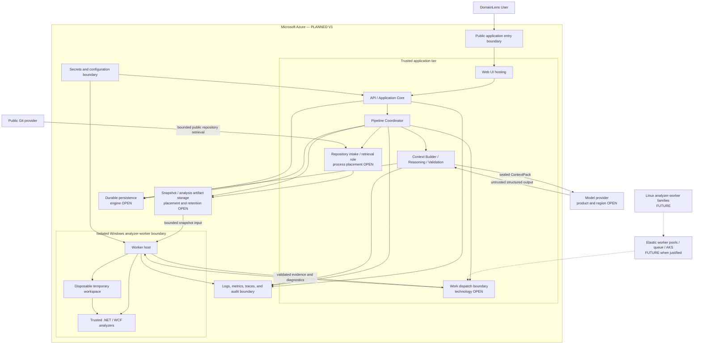

# Deployment Architecture

## Status and scope

Microsoft Azure is the accepted primary deployment platform for DomainLens Product V1. This
document defines conceptual deployment roles and their security relationships. It intentionally
does not choose an Azure product, SKU, region, topology, or orchestration technology where the
requirements do not yet justify one.

- **CURRENT — Milestone 0 feasibility:** DomainLens has a local Windows-oriented child-worker
  spike with bounded staging/results, worker-lifetime/result-acceptance deadline and cancellation,
  trusted result gates, cleanup, and a narrow net472 semantic analyzer. Synchronous trusted
  postprocessing is not independently preempted. This is not an Azure deployment or production
  containment mechanism.
- **CURRENT — Milestone 1:** DomainLens remains a .NET 10 CLI/library solution with CI. No Web UI,
  API host, analyzer-worker service, durable application store, or Azure infrastructure is
  implemented.
- **PLANNED — Product V1:** Azure-hosted UI and trusted application tier, a separately isolated Windows-capable analyzer worker, durable persistence, temporary analysis storage, model connectivity, configuration/secrets, and operational telemetry.
- **FUTURE:** Linux analyzer workers, queues and worker pools for concurrency, containerization where useful, and AKS only when measured scale or scheduling/isolation requirements warrant it.

Azure is a deployment target, not a dependency direction. DomainLens application code should use
application-owned ports for Git, persistence, model, work dispatch, secrets/configuration, and
observability so vendor-specific SDKs remain in adapters.

## Conceptual Azure topology

This is a role diagram, not a resource diagram. Boxes inside Azure may share a deployable unit when
their trust, scaling, failure, and release characteristics permit it. The isolated analyzer-worker
boundary is the exception: it must remain separate from the trusted application process before
hosted untrusted-repository analysis is enabled.

Milestone 0 does not select a resource behind any box. Its passing child-process tests establish
that the job/result protocol is feasible, while same-account execution, absent network denial, and
missing CPU/memory/process/disk containment make that mechanism insufficient for hosted hostile
input. Restricted-identity/job-object hosting, Windows process-isolated containers, and Hyper-V-
isolated containers or disposable VMs remain comparison categories, not decisions. See the
[Milestone 0 Feasibility Report](../12-milestone-0-deployment-security-feasibility.md).

## Deployment roles

| Role | PLANNED V1 responsibility | Boundary and scaling concern | Not decided here |
|---|---|---|---|
| Public application entry | Terminates the product's public request boundary and routes approved client traffic. | Internet-facing policy, request limits, transport security, and application protection. | Gateway, edge, WAF, DNS, and certificate products. |
| Web UI hosting | Serves the native V1 user experience for submission, progress, clarification, review, and exploration. | May scale with user traffic independently from analyzer jobs. | UI framework and Azure hosting service. |
| API / Application Core hosting | Runs use cases, authorization, queries, policy enforcement, and application adapters. | Trusted boundary; must not load or execute repository content. | Web host, process count, autoscale, and public/private split. |
| Pipeline Coordinator | Maintains durable stage state, dispatches fixed work, handles cancellation/retry/review pauses, and records outcomes. | Requires concurrency control and idempotent stage contracts. | Workflow engine, scheduler, and whether initially co-hosted with the API. |
| Repository intake / retrieval | Validates a public repository URL/ref and retrieves bounded content for an identifiable snapshot. | Network-facing untrusted input; every redirect/address and all returned bytes remain subject to policy. | Whether retrieval shares the application host, uses a dedicated process, or runs in another isolated boundary. |
| Work dispatch boundary | Transfers bounded jobs and results between the Coordinator and isolated workers. | Must tolerate worker termination and prevent untrusted output from bypassing validation. | Queue/broker use, delivery semantics, leasing, and result transport. |
| Windows analyzer worker | Analyzes untrusted legacy .NET/WCF snapshots using trusted, allowlisted analyzers under OS-enforced limits. | Separate process/isolation zone, no broad credentials, restricted network, disposable workspace. | VM/container/job technology and pool size. |
| Persistence | Stores repository/snapshot/run state, Evidence Graph, separately versioned Human Context, Finding Graph/revisions, human review decisions, Domain Knowledge Model, diagnostics, and producer versions. | Durable, backed up, access-controlled, and abstracted behind application ports; Human Context remains separate from evidence and review state. | Initial lightweight engine and later Azure-managed relational service. |
| Snapshot / artifact storage | Holds immutable manifests and any approved snapshot or analysis artifacts according to retention policy. | Potentially sensitive source content; encryption, lifecycle, and deletion are required design inputs. | Whether source is retained, storage product, and database/blob split. |
| Temporary workspace | Provides bounded per-job repository storage that is removed after the terminal worker outcome unless an approved diagnostic policy says otherwise. | Must be isolated across jobs and inaccessible to the trusted application filesystem. | Local/attached storage type, encryption mechanism, and disposal verification. |
| Model connectivity | Invokes a configured model through a provider adapter using sealed ContextPacks and receives structured candidate output. | Source egress, region, retention, quotas, and credentials require explicit policy. | Azure-hosted versus other provider, model/deployment, region, and fallback policy. |
| Secrets and configuration | Supplies least-privileged application configuration and workload identity material. | Workers must not receive broad storage, model, repository, or application-user credentials. | Secret-store product, workload identity topology, and rotation cadence. |
| Observability | Collects correlated, redacted logs, metrics, traces, diagnostics, and audit events. | Telemetry must not become an uncontrolled source-code egress path. | Backend, retention, sampling, alerts, and SLOs. |

## Network and trust posture

The deployment should distinguish at least three policies:

1. **Public ingress** to the approved Web/API boundary only.
2. **Trusted application traffic** among the application tier and its persistence, configuration,
   model, telemetry, and dispatch adapters under least privilege.
3. **Worker traffic** limited to explicitly required job input, result output, health/control, and
   telemetry. General outbound access is denied unless an analyzer profile establishes a reviewed
   need.

Public Git retrieval must apply URL, protocol, redirect, DNS/address, ref, size, timeout, and
content policy before repository data reaches an analysis workspace. The component that performs
the network fetch and its network segment remain open decisions; the security obligation does not.

## Data placement and lifecycle

Temporary repository workspaces are disposable. Durable records include repository identity,
snapshot/manifest identity, Analysis Run state, validated evidence, findings and revisions, human
decisions, Domain Knowledge Model versions, diagnostics, and analyzer/model/skill versions.

Source retention is not assumed. Product design must decide whether snapshot bytes are retained,
for how long, in which region, and under what deletion or re-analysis policy. A manifest and content
hash alone do not authorize indefinite source storage. See the
[persistence architecture](08-persistence-architecture.md) and
[security architecture](09-security-architecture.md).

## Availability, scale, and evolution

V1 should start with the fewest deployment units consistent with the trust boundary and required
durability. Logical modules in the trusted application are not microservices by default.

Analyzer jobs have materially different resource, operating-system, duration, and failure
characteristics from interactive API traffic. The worker boundary supports independent isolation
and, when needed, scaling without forcing early distribution of every application module.

Evolution should follow demonstrated needs:

1. Add durable dispatch when recovery or concurrency requires it.
2. Add multiple Windows workers or worker profiles when queue time or resource variance requires it.
3. Add Linux worker families when non-Windows analyzers enter scope.
4. Containerize roles where it improves repeatability or isolation and the workload supports it.
5. Consider AKS only when worker diversity, scheduling, concurrency, or operational control makes its complexity worthwhile.

None of these FUTURE steps changes the normalized evidence contract or grants analyzers permission
to execute repository-controlled code.

## .NET host baseline

DomainLens production and test projects target **.NET 10 LTS**. Analyzer fixtures deliberately
represent other frameworks, including legacy .NET Framework and earlier .NET target frameworks;
their target versions describe analyzed systems and must not be upgraded to match the DomainLens
host.

The Windows worker may require framework-specific reference assets and trusted analysis tooling.
Milestone 0 demonstrates one exact tool-owned reference catalog through the private
`Microsoft.NETFramework.ReferenceAssemblies.net472` 1.0.3 package. Compiler-readable reference
DLL descriptors are reconstructed and validated by trusted code; repository metadata cannot add
to that catalog. Those assets are part of the DomainLens deployment, not resolved from the
analyzed repository. They do not change the .NET 10 host decision and do not authorize evaluating
MSBuild or restoring/building an analyzed repository.

## Open decisions

- **OPEN DECISION — Azure services:** the hosting, dispatch, persistence, artifact, secrets, and observability products and SKUs.
- **OPEN DECISION — topology:** region strategy, availability zones, disaster recovery, backup objectives, and data residency.
- **OPEN DECISION — network architecture:** public/private endpoints, virtual network layout, DNS policy, outbound filtering, and model/Git connectivity.
- **OPEN DECISION — application deployables:** which trusted modules initially co-host and the criteria for later separation.
- **OPEN DECISION — worker host:** restricted-identity/job-object process, Windows process- or
  Hyper-V-isolated container, disposable VM, or another containment mechanism, including network,
  ACL, quota, patching, compatibility, and image/provenance requirements. M0 does not choose one.
- **OPEN DECISION — dispatch semantics:** queue or scheduler selection, delivery guarantees, leases, deduplication, and poison-job handling.
- **OPEN DECISION — persistence path:** lightweight V1 implementation, Azure-managed relational migration trigger, and artifact/database split.
- **OPEN DECISION — capacity policy:** concurrency limits, autoscale signals, quotas, per-tenant fairness if tenancy is introduced, and cost controls.
- **OPEN DECISION — AKS threshold:** measurable conditions that would justify adopting AKS; AKS is not a default requirement.

## Related architecture

- [System Context](01-system-context.md)
- [Logical Architecture](02-logical-architecture.md)
- [Runtime and Process Architecture](03-runtime-architecture.md)
- [Persistence Architecture](08-persistence-architecture.md)
- [Security Architecture](09-security-architecture.md)
- [Observability and Operations](12-observability-and-operations.md)
- [Deployment direction](../09-deployment.md)
- [Milestone 0 Feasibility Report](../12-milestone-0-deployment-security-feasibility.md)

Related accepted decisions: [ADR-001](../adr/001-azure-primary-deployment-platform.md),
[ADR-002](../adr/002-modular-architecture-with-isolated-analyzer-worker.md), and
[ADR-007](../adr/007-dotnet-10-lts-for-domainlens-host.md).
