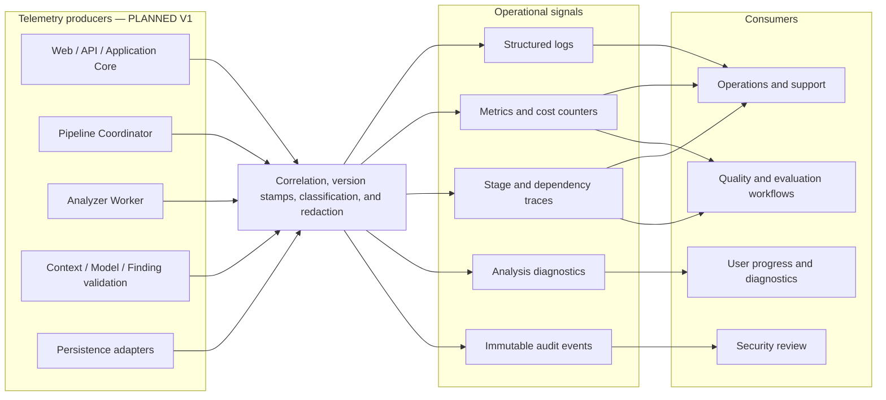

# Observability and Operations

## Status and scope

This document defines the operational information DomainLens should expose so an analysis can be
understood, supported, audited, and cost-managed. It does not select a telemetry product or claim
that planned operational capabilities already exist.

- **CURRENT — Milestone 1:** the local CLI reports deterministic analysis status, snapshot ID, canonical hash, graph counts, diagnostic count, and output path. The analysis artifact contains typed diagnostics and analyzer provenance. There is no hosted Analysis Run, distributed trace, model call, worker service, cost metric, alert, or operational dashboard.
- **PLANNED — Product V1:** run-scoped structured logs, metrics, traces, diagnostics, audit records, version lineage, worker and model telemetry, retry history, and user-visible progress.
- **FUTURE:** cross-worker fleet optimization, richer cost/quality analytics, and operational capabilities driven by additional analyzer families and scale.

Observability data reports what DomainLens did. It is not deterministic source evidence about the
analyzed system, and it does not belong in the Evidence Graph merely because it is factual.

## Operational model

“Enrichment” means trusted application instrumentation adds known correlation and version fields
and applies redaction policy. It does not mean an LLM rewrites telemetry.

## Correlation and identity

Product V1 needs an **Analysis Run ID** that follows the end-to-end user request across pipeline
stages, worker attempts, model invocations, review pauses, and persistence. This is distinct from:

- the **Repository Snapshot ID**, which identifies captured repository content;
- an individual **stage attempt**, which records one execution and retry history;
- a **worker job/attempt correlation value**, which scopes isolated analyzer execution;
- a **model invocation correlation value**, which scopes one structured reasoning request/response;
- evidence, node, edge, finding, Domain Knowledge Model version, and human-decision identities.

Milestone 1 implements Snapshot IDs and canonical evidence identities, but not Analysis Run IDs.
The exact identifier formats and propagation mechanism are open decisions. Correlation identifiers
must not encode source paths, secrets, user tokens, or other sensitive data.

## Signal responsibilities

| Signal | Purpose | Representative PLANNED fields | Boundary |
|---|---|---|---|
| Structured log | Explain discrete application, pipeline, worker, adapter, and validation events. | Timestamp, severity, event code, Analysis Run ID, stage, attempt, component, outcome, duration, redacted properties. | Not a canonical model and not a substitute for durable stage state. Source snippets and model prompts are excluded by default. |
| Metric | Track rates, latency, capacity, reliability, coverage, model use, and cost. | Runs/stages started/completed/failed/cancelled, queue time, duration, bytes/files, evidence counts, diagnostic counts, worker resource indicators, tokens, model latency, estimated cost. | Aggregated and low-cardinality; repository paths, symbol names, prompts, and source content are not metric dimensions. |
| Trace | Correlate a request and its stage/dependency spans across trusted and isolated boundaries. | Analysis Run, intake, snapshot, analyzer dispatch, worker execution, persistence, context build, model invocation, finding validation, review transition. | Span payloads follow the same source/secret redaction policy as logs. |
| Analysis diagnostic | Explain coverage, ambiguity, unsupported constructs, validation failure, or other result limitations to users and later reasoning. | Stable code, severity, safe message, relevant artifact/evidence references, analyzer/rule/version, stage. | Part of durable analysis results where applicable; not equivalent to an operational incident. |
| Audit event | Record security- and governance-relevant actions and state transitions. | Actor/workload identity, action, subject ID, prior/new review or pipeline state, policy decision, version, time, outcome. | Append-only according to policy; does not include source content unless explicitly required and approved. |

## Required operational views

### Analysis progress

The user-visible progress model should reflect durable pipeline state rather than infer progress from
log messages. It should show the current stage, completed stages, partial-coverage diagnostics,
review pauses, cancellation, retry activity where useful, and terminal outcome. A worker heartbeat
or log stream alone is not authoritative state.

### Pipeline-stage timing

Measure queue time and execution time separately for intake, snapshotting, discovery/planning,
deterministic analyzers, Evidence Graph validation, context construction, model invocation, finding
validation, human waiting, Domain Knowledge projection, and persistence. Human wait time must not
be reported as compute latency.

### Worker health and failure

Capture dispatch delay, worker profile/version, analyzer versions, resource-profile name, start and
termination reason, cancellation/timeout/resource-limit outcomes, output-validation result, and
workspace-cleanup outcome. Do not log raw command lines or repository-supplied strings without
redaction because they can contain secrets, control characters, or prompt-injection text.

### Model invocation tracing

For each model call, persist or emit policy-approved metadata sufficient to reproduce and evaluate
the interaction without automatically retaining source code or complete prompts:

- Analysis Run, finding/reasoning task, skill and prompt-contract version;
- ContextPack version/hash, evidence reference count, pruning/truncation/limitation summary;
- model provider/deployment/version where exposed;
- request/output schema versions;
- input/output token counts, latency, retry/repair count, and estimated cost;
- structured-output parse/validation result and rejection reasons; and
- resulting candidate/revision identifiers when accepted.

Prompt, response, source snippet, and chain-of-thought retention are not implied by “tracing.” Their
capture requires an explicit source-egress, privacy, retention, and access policy. DomainLens must
not request or store hidden model reasoning as an operational requirement.

### Version lineage

Durable results should retain versions that can change meaning or reproducibility:

- DomainLens application and Evidence Model schema;
- repository snapshot and manifest;
- analyzer/extractor and rule versions;
- Analysis Plan version/configuration;
- ContextPack recipe and schema;
- skill and prompt-contract version;
- model provider/deployment/version when available;
- Finding schema and validator version; and
- Domain Knowledge Model schema/projection version.

Version stamps belong with the durable record they qualify. Logs may repeat them for diagnosis but
must not be their sole source.

## Diagnostics versus incidents

An analyzer diagnostic such as an unresolved type or unevaluated MSBuild condition may correctly
produce partial evidence without indicating a DomainLens service incident. Conversely, a worker
crash, queue outage, persistence failure, or invalid model response can be an operational failure
without changing already accepted Evidence Graph content.

Operations should classify at least:

- expected coverage diagnostics;
- validation/policy rejection;
- transient dependency failure;
- worker timeout, cancellation, or resource enforcement;
- non-transient analyzer/application defect;
- persistence or orchestration conflict; and
- security-significant event.

The exact taxonomy is an open decision, but retry and alert behavior must be based on typed
classification rather than matching log message text.

## Retry and repair behavior

Retries must preserve attempt history and idempotency boundaries. They must not overwrite earlier
evidence or finding revisions without lineage.

- Deterministic stages may be retried only against the same identifiable inputs, plan, analyzer versions, and configuration when equivalence is claimed.
- A worker job retry creates a distinct attempt correlation value even when it belongs to the same pipeline stage.
- A model structured-output repair or retry records the initiating validation failure, skill/model/version, and new invocation identity.
- Human-directed re-analysis creates a new finding revision or analysis step; it does not edit deterministic evidence in place.
- Non-retryable policy or validation failures surface explicitly rather than consuming a generic retry budget.

Retry limits, backoff, poison-job handling, and operator intervention thresholds remain open.

## Audit trail

The audit trail should make consequential actions answerable: who or what started/cancelled a run,
which snapshot and versions were used, which worker and model operations occurred, why a finding
revision was accepted/rejected/challenged, and what projection entered a Domain Knowledge Model
version.

Semantic view, review status, and finding classification are independent. An audit event that
records human acceptance must not relabel an `Inferred` finding as `Observed`, relabel a
`Proposed` finding as `Inferred` or `Observed`, or report Proposed DDD Design as recovered/as-is
knowledge.

## Data protection and telemetry hygiene

- Treat repository names, URLs, paths, symbols, source snippets, comments, configuration values, prompts, responses, exception text, and user clarification as potentially sensitive and untrusted.
- Use structured allowlisted properties rather than serializing arbitrary objects or model payloads.
- Sanitize control characters and bound event/property sizes before export.
- Redact secrets before telemetry leaves its producing boundary; a downstream telemetry backend is not the primary secret filter.
- Keep high-cardinality identifiers out of metric dimensions.
- Apply role-based access, retention, encryption, and regional policy to logs, traces, and audit data.
- Ensure telemetry failures do not bypass analysis validation or silently change pipeline state.

## Service objectives and alerting

No SLO, SLA, alert threshold, retention period, or cost budget has been approved. V1 design should
define objectives only after expected repository sizes, analysis duration, concurrency, model use,
and human-review behavior are measured.

Candidate objective areas include intake availability, time to first progress, queue delay, stage
completion, cancellation responsiveness, worker cleanup, result durability, model validation
success, and user-visible evidence navigation. These are areas for measurement, not baseline target
values.

## Open decisions

- **OPEN DECISION — telemetry backend:** Azure or other products for logs, metrics, traces, dashboards, and audit storage.
- **OPEN DECISION — correlation schema:** identifier formats, propagation headers/envelopes, and cardinality constraints.
- **OPEN DECISION — event taxonomy:** stable event/diagnostic/error codes and operational failure classification.
- **OPEN DECISION — retention and access:** retention periods, residency, encryption, support/security access, deletion, and legal/audit requirements.
- **OPEN DECISION — redaction:** approved property allowlists, secret/source detection, URL/path handling, and whether any prompt/response capture is permitted.
- **OPEN DECISION — SLOs and alerts:** objective definitions, thresholds, escalation routes, maintenance windows, and synthetic checks.
- **OPEN DECISION — retries:** per-stage budgets, backoff, idempotency keys, poison-job handling, and operator repair workflow.
- **OPEN DECISION — token and cost governance:** budgets, attribution, quotas, forecasts, and stop/degrade behavior.
- **OPEN DECISION — sampling:** which traces/logs may be sampled and which audit/security events must never be sampled.

## Related architecture

- [Analysis Pipeline](04-analysis-pipeline.md)
- [Agent and Reasoning Architecture](07-agent-reasoning-architecture.md)
- [Persistence Architecture](08-persistence-architecture.md)
- [Security Architecture](09-security-architecture.md)
- [Deployment Architecture](10-deployment-architecture.md)
- [Repository Structure Scanner 0.1](../11-milestone-1-repository-scanner.md)

Related accepted decisions: [ADR-002](../adr/002-modular-architecture-with-isolated-analyzer-worker.md),
[ADR-004](../adr/004-separate-deterministic-evidence-from-ai-interpretation.md), and
[ADR-005](../adr/005-persist-domain-knowledge-model-as-canonical-intermediate-asset.md).
